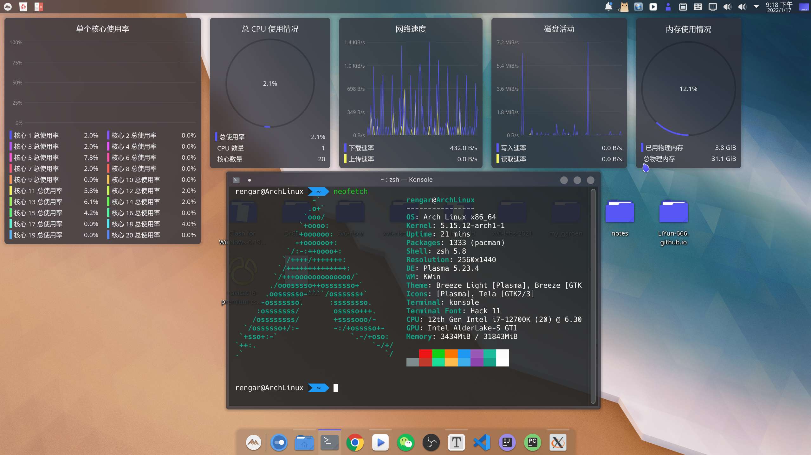

Today I wanna share with you guys about my desktop environment:

It is Arch Linux OS. I install KDE and use Layan global theme. Konsole is changed by oh-my-zsh. Other plugins... I just forgot... forgive me please. You can search "how to beautify your KDE" if you get interested in it. Arch Wiki shows you how to install softwares such as Wechat, Google Chrome, develop tools...

If you're curious about how I configure in detail, welcome to communicate with me. My QQ is : 2389231032.
