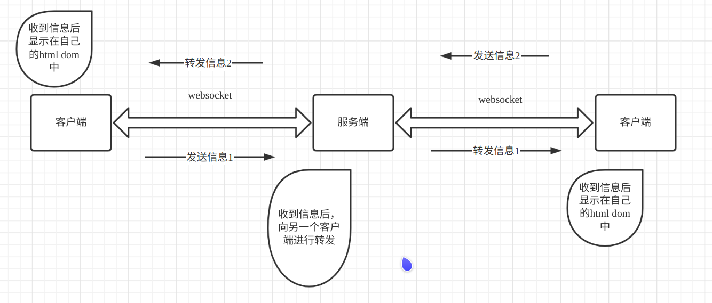
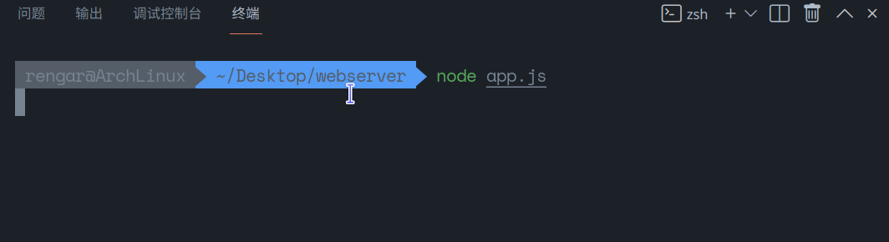
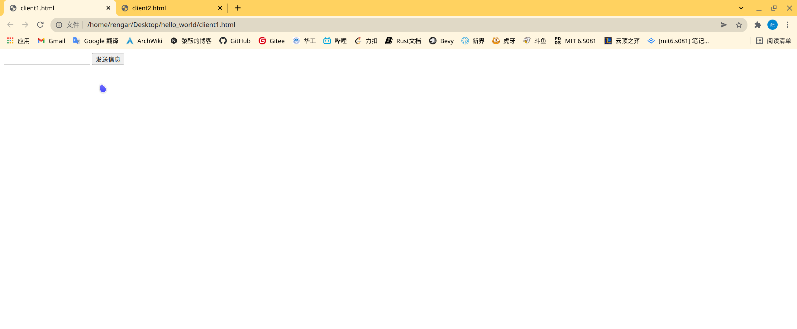
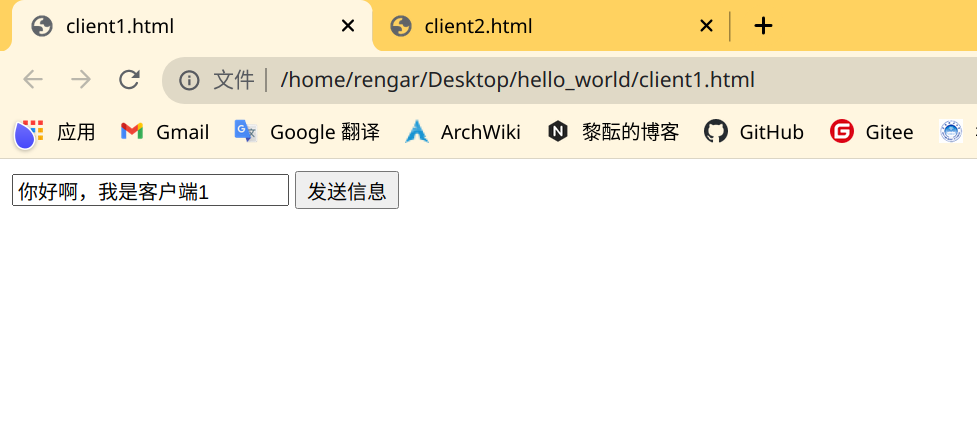
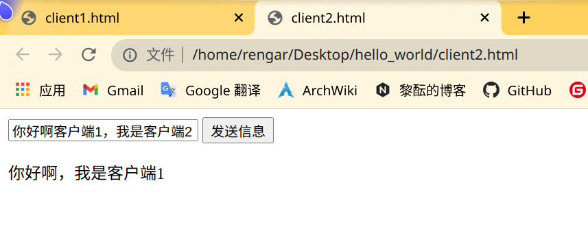
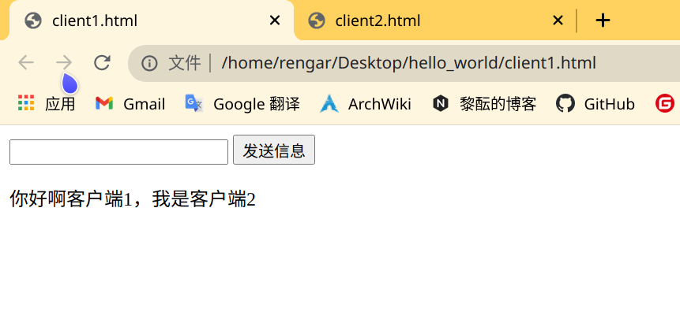

## 背景

因为之前开发过软件工程的大作业，是一个商品交易系统，前端是微信小程序，当时时间比较紧凑，没有搭后台，直接用的云开发，然后在 js 中直接操作云环境的数据库。因为本来准备开发一个聊天的功能的，当时没来得及去学 WebSocket ，就直接强行 发消息=向数据库插入数据、查信息=向数据库查询数据，所以性能低下就不说了，也不能实现真正的即时通讯、即时聊天功能，今天好好的学习了一下 WebSocket ，写了两个客户端通讯的 demo 出来，稍微改一下也可以是多客户端，变成群聊。 Websocket 前端就直接选择了浏览器 javascript （微信小程序的话可以参考官方文档的 websocket ），后端的话纠结了挺久的，本来是打算 c++、python、java、rust 都试着写一份的，但是在看 c++ 的环境搭建的时候就把我劝退了（ python 好像可以 pip 安装 websocket 包，可能会容易一点），所以最终还是选择用 node.js 写个 websocket server demo 出来。

<!--more-->

## 通讯图





## 客户端

因为是双人通讯，所以写了两个一样的客户端出来进行聊天。使用了 jquery 绑定提交按钮事件进行发送信息。

+ ws.onopen 是连接成功后的回调函数

+ ws.onmessage 是客户端接收到数据后的执行函数
+ ws.onclose 是断开连接后的执行函数

输入信息后，点击发送按钮就可以向服务端发送信息。调用的 ws.send() 函数，把发送的 json 对象做了 JSON.stringify() 处理再进行发送。 

### 客户端1 client1.html

```html
<!DOCTYPE HTML>
<html>

<head>
    <script src="https://cdn.staticfile.org/jquery/1.10.2/jquery.min.js"></script>
    <script type="text/javascript">


        $(function () {

            var ws = new WebSocket("ws://localhost:8080/");

            ws.onopen = function () {
            };

            ws.onmessage = function (event) {
                var received_msg = JSON.parse(event.data).content;
                var text = document.createElement("p");
                var t = document.createTextNode(received_msg);
                text.appendChild(t);
                document.body.appendChild(text);
            };

            ws.onclose = function () {
            };

            $("#submit").click(function () {
                var msg = document.getElementById("input").value;
                var msg_json = {
                    "user": "client1",
                    "content": msg
                };
                ws.send(JSON.stringify(msg_json));
                document.getElementById("input").value = "";
            });

        });
    </script>
</head>

<body>

    <input id="input" type="text">
    <button id="submit" type="button">发送信息</button>


</body>

</html>
```

### 客户端2 client2.html

```html
<!DOCTYPE HTML>
<html>

<head>
    <script src="https://cdn.staticfile.org/jquery/1.10.2/jquery.min.js"></script>
    <script type="text/javascript">


        $(function () {

            var ws = new WebSocket("ws://localhost:8080/");

            ws.onopen = function () {
            };

            ws.onmessage = function (event) {
                var received_msg = JSON.parse(event.data).content;
                var text = document.createElement("p");
                var t = document.createTextNode(received_msg);
                text.appendChild(t);
                document.body.appendChild(text);
            };

            ws.onclose = function () {
            };

            $("#submit").click(function () {
                var msg = document.getElementById("input").value;
                var msg_json = {
                    "user": "client2",
                    "content": msg
                };
                ws.send(JSON.stringify(msg_json));
                document.getElementById("input").value = "";
            });

        });
    </script>
</head>

<body>

    <input id="input" type="text">
    <button id="submit" type="button">发送信息</button>


</body>

</html>
```


## 服务端

服务端的 wss.on('connection') 记录了所连接的客户端的 id，与客户端 connection 建立连接时，把连接的对象 ws push 进 sockets 中，当收到来自客户端的信息时(ws.on('message'))，选择不是当前连接的客户端进行转发信息，从而实现两个客户端的通讯。收到客户端的信息时需要 JSON.parse() 处理一下，再 JSON.stringify() 处理才能转发，我还不知道为什么不能直接转发，有知道的小伙伴可以联系我告诉我哈哈。

### 服务端 app.js

```javascript
// app.js

const WebSocket = require('ws')

const wss = new WebSocket.Server({ port: 8080 })

var user_count = 0
var sockets = []
var sockets_id = []

wss.on('connection', ws => {

  sockets.push(ws)
  let id = user_count++
  sockets_id.push(id)

  ws.on('message', message => {

    let { user, content } = JSON.parse(message);
    for (let index = 0; index < sockets.length; index++) {
      if (id != sockets_id[index]) {
        sockets[index].send(JSON.stringify({ user, content }))
      }
    }

  })
})
```


## 结果演示

1. 先在终端运行 app.js。



2. 打开 client1.html，client2.html。



3. 在客户端1 输入信息，点击发送。



4. 客户端2 已经接受到来自客户端1 的信息，发送信息给客户端1。



5. 客户端1 也可以成功接受来自客户端2 的信息。



6. 以上成功的完成了通讯。本次博客也到此结束了，感谢大家！

