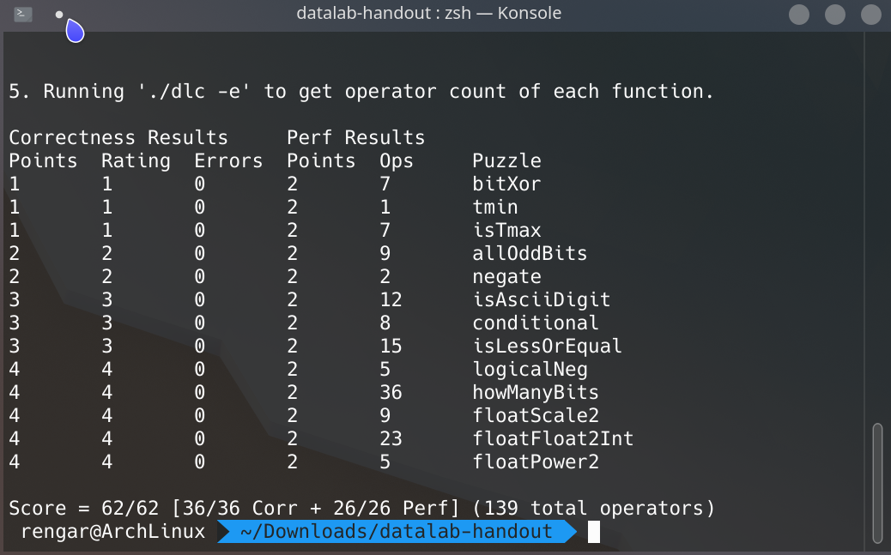

本次实验借鉴了很多网上的代码以及思路，通过本次实验我更好地理解了计算机数据的概念和原理。

## **int bitXor(int x, int y)**
> 用 ~ 和 & 实现两数的异或

思路：排除同时为 1 或同时为 0。
``` c
/* 
 * bitXor - x^y using only ~ and & 
 *   Example: bitXor(4, 5) = 1
 *   Legal ops: ~ &
 *   Max ops: 14
 *   Rating: 1
 */
int bitXor(int x, int y) {
  return ~(~x & ~y) & ~(x & y);
}
```
<!--more-->

## **int tmin(void)**
> 获取最小的整数

思路：根据补码的定义，32位整数的最小值就是 1 << 31。
``` c
/* 
 * tmin - return minimum two's complement integer 
 *   Legal ops: ! ~ & ^ | + << >>
 *   Max ops: 4
 *   Rating: 1
 */
int tmin(void) {
  return 1 << 31;
}
```

## **int isTmax(int x)**
> 是否是补码最大值

思路：补码最大值 + 1 按位取反 与 x 异或得到 0，但是需要排除 x = -1 的情况。
``` c
/*
 * isTmax - returns 1 if x is the maximum, two's complement number,
 *     and 0 otherwise 
 *   Legal ops: ! ~ & ^ | +
 *   Max ops: 10
 *   Rating: 1
 */
int isTmax(int x) {
  int tmp = !(~x); // tmp = 1 when x = -1, or else tmp = 0
  return !(((~(x + 1)) ^ x) | tmp);
}
```

## **int allOddBits(int x)**
> 判断所有奇数位是否都为1

思路：构造一个奇数位全为 1，偶数位全为 0 的 mask 即可。
``` c
/* 
 * allOddBits - return 1 if all odd-numbered bits in word set to 1
 *   where bits are numbered from 0 (least significant) to 31 (most significant)
 *   Examples allOddBits(0xFFFFFFFD) = 0, allOddBits(0xAAAAAAAA) = 1
 *   Legal ops: ! ~ & ^ | + << >>
 *   Max ops: 12
 *   Rating: 2
 */
int allOddBits(int x) {
  int mask = 0xAA + (0xAA << 8) + (0xAA << 16) + (0xAA << 24);
  return !((mask & x) ^ mask);
}
```

## **int negate(int x)**
> 返回 x 的相反数

思路：x 的相反数为 ~x + 1。
``` c
/* 
 * negate - return -x 
 *   Example: negate(1) = -1.
 *   Legal ops: ! ~ & ^ | + << >>
 *   Max ops: 5
 *   Rating: 2
 */
int negate(int x) {
  return ~x + 1;
}
```

## **int isAsciiDigit(int x)**
> 判断是否 x >= 0x30 && x <= 0x39 (也就是Ascii中的 '0' ~ '9')

思路：先让 x - 0x30，则
0x00: 0000 0000 0000 0000 0000 0000 0000 0000
0x09: 0000 0000 0000 0000 0000 0000 0000 1001
首先保证高位全部为 0，然后倒数第 4 位为 0 就一定满足条件，倒数第 4 位为 1 时需要保证 倒数第 2 3 位为 0 即可。
``` c
/* 
 * isAsciiDigit - return 1 if 0x30 <= x <= 0x39 (ASCII codes for characters '0' to '9')
 *   Example: isAsciiDigit(0x35) = 1.
 *            isAsciiDigit(0x3a) = 0.
 *            isAsciiDigit(0x05) = 0.
 *   Legal ops: ! ~ & ^ | + << >>
 *   Max ops: 15
 *   Rating: 3
 */
int isAsciiDigit(int x) {
  int new_x = x + ~0x30 + 1; // new_x = x - 0x30
  int high = ~0xf;           // high = 0xfffffff0
  int condition1 = !(new_x & high); // 判断高位是否全部为 0
  int condition2 = !(new_x & 0x6) | !(new_x & 0x8); // 判断低四位是否满足条件
  return condition1 & condition2;
}
```

## **int conditional(int x, int y, int z)**
> 实现 x ? y : z 运算符

思路：构造一个比特位全为 1 或全为 0 的数，并与 x 形成对应关系。
即当 x = 0 时，这个数比特位全为 0，否则全为 1；
或者当 x != 0 时，这个数比特位全为 0，否则全为 1。
两种都可以，任选一种即可。
``` c
/* 
 * conditional - same as x ? y : z 
 *   Example: conditional(2,4,5) = 4
 *   Legal ops: ! ~ & ^ | + << >>
 *   Max ops: 16
 *   Rating: 3
 */
int conditional(int x, int y, int z) {
  x = !!x;
  x = ~x + 1; // 成功构造出这个数
  return (x & y) | (~x & z);
}
```

## **int isLessOrEqual(int x, int y)**
> 如果 x <= y，则返回 1，否则返回 0

思路：x，y 同号则判断 x - y 的符号位，异号则符号位为 1 的数较小。
``` c
/* 
 * isLessOrEqual - if x <= y  then return 1, else return 0 
 *   Example: isLessOrEqual(4,5) = 1.
 *   Legal ops: ! ~ & ^ | + << >>
 *   Max ops: 24
 *   Rating: 3
 */
int isLessOrEqual(int x, int y) {
  int diff = !(((~x + 1 + y) >> 31) & 1); // diff = 1 when x <= y
  int signx = (x >> 31) & 1;
  int signy = (y >> 31) & 1;
  int bitXor = signx ^ signy; // bitXor = 1 时，直接判断符号，否则判断 diff
  return (!(bitXor) & diff) | (bitXor & signx);
}
```

## **int logicalNeg(int x)**
> 实现 ! 运算符，即当 x = 0 时返回 0，否则返回 1

思路：x ^ (x的相反数)，只有 x = 0 时会得到 0，其余都是 0xffffffff，再让结果 +1 即可。
``` c
/* 
 * logicalNeg - implement the ! operator, using all of 
 *              the legal operators except !
 *   Examples: logicalNeg(3) = 0, logicalNeg(0) = 1
 *   Legal ops: ~ & ^ | + << >>
 *   Max ops: 12
 *   Rating: 4 
 */
int logicalNeg(int x) {
  return ((x | (~x + 1)) >> 31) + 1;
}
```

##  **int howManyBits(int x)**
> 最少可以用几位比特来表示 x

思路：x 为正数时，从最高位开始寻找直到找到 1，则 1 及其后面的位再加上符号位就是能表示 x 的最少比特位；
而x 为负数时，从最高位开始寻找直到找到 0。
所以将负数按位取反，把两种情况合并成一种，然后依次判断高位，地位是否存在 1。
``` c
/* howManyBits - return the minimum number of bits required to represent x in
 *             two's complement
 *  Examples: howManyBits(12) = 5
 *            howManyBits(298) = 10
 *            howManyBits(-5) = 4
 *            howManyBits(0)  = 1
 *            howManyBits(-1) = 1
 *            howManyBits(0x80000000) = 32
 *  Legal ops: ! ~ & ^ | + << >>
 *  Max ops: 90
 *  Rating: 4
 */
int howManyBits(int x) {
  int b16, b8, b4, b2, b1, b0;
  int sign = (x >> 31);
  x = (sign & ~x) | (~sign & x); // 如果 x 为正则不变，否则按位取反(这样好找最高位为 1 的，原来是最高位为 0 的，这样也将符号位去掉了)

  // 不断缩小范围
  b16 = !!(x >> 16) << 4; // 高十六位是否有 1
  x = x >> b16;           // 如果有(至少需要 16 位)，则将原数右移 16 位
  b8 = !!(x >> 8) << 3;   // 剩余位高 8 位是否有 1
  x = x >> b8;            // 如果有(至少需要 16 + 8 = 24 位)，则右移 8 位
  b4 = !!(x >> 4) << 2;   // 同理
  x = x >> b4;
  b2 = !!(x >> 2) << 1;
  x = x >> b2;
  b1 = !!(x >> 1);
  x = x >> b1;
  b0 = x;
  return b16 + b8 + b4 + b2 + b1 + b0 + 1; // +1 表示加上符号位
}
```

##  **unsigned floatScale2(unsigned uf)**
> 返回 uf * 2，把 unsigned 当作 32 位浮点数

思路：分情况讨论
如果阶码为 0，表示 0 和无穷小，直接让尾码左移一位再加上符号位(会平滑过度到规格化值)；
如果阶码为 0xff，表示无穷大和 NaN (not a number)，返回本身即可；
其余情况则让阶码 + 1 即可。
``` c
/* 
 * floatScale2 - Return bit-level equivalent of expression 2*f for
 *   floating point argument f.
 *   Both the argument and result are passed as unsigned int's, but
 *   they are to be interpreted as the bit-level representation of
 *   single-precision floating point values.
 *   When argument is NaN, return argument
 *   Legal ops: Any integer/unsigned operations incl. ||, &&. also if, while
 *   Max ops: 30
 *   Rating: 4
 */
unsigned floatScale2(unsigned uf) {
  if ((uf & 0x7F800000) == 0) // 1.非规格化值，阶码为0，表示0和无穷小，直接左移一位再加上符号位(会平滑过度到规格化值)
    uf = ((uf & 0x007FFFFF) << 1) | (0x80000000 & uf);
  else if ((uf & 0x7F800000) != 0x7F800000) // 2.规格化值，直接让阶码 +1
    uf = uf + 0x00800000;
  return uf; // 3.特殊值，表示无穷大和不存在的值NaN，直接返回
}
```

##  **int floatFloat2Int(unsigned uf)**
> 浮点数 uf 转换成 int 整数

思路：阶码大于等于 31，超出整数范围，溢出，返回 0x80000000；
阶码小于 0，返回 0；
阶码大于等于 23 小于 31，则直接让尾码左移；
阶码大于等于 0  小于 23，让尾码右移。
``` c
/* 
 * floatFloat2Int - Return bit-level equivalent of expression (int) f
 *   for floating point argument f.
 *   Argument is passed as unsigned int, but
 *   it is to be interpreted as the bit-level representation of a
 *   single-precision floating point value.
 *   Anything out of range (including NaN and infinity) should return
 *   0x80000000u.
 *   Legal ops: Any integer/unsigned operations incl. ||, &&. also if, while
 *   Max ops: 30
 *   Rating: 4
 */
int floatFloat2Int(unsigned uf) {
  int exp = (uf & 0x7F800000) >> 23;
  int frac = (uf & 0x007FFFFF) | 0x00800000; // 1 + frac
  int sign = !!(uf >> 31);
  int bias = (1 << 7) - 1;
  int ret = 0; // 用来返回

  if (exp - bias >= 31) return 0x80000000u; // 1.溢出
  if (exp - bias < 0) return 0; // 2.小于1，返回0

  // 3.一般正常情况
  if(exp - bias > 23) ret = frac << (exp - bias - 23);
  else ret = frac >> (23 - (exp - bias));
  if(sign) ret = ~ret + 1; // 负数

  return ret;
}
```

##  **unsigned floatPower2(int x)**
> 返回 2 ** x，即 2 的 x 次方

思路：根据 ieee 浮点数的定义即可。
``` c
/* 
 * floatPower2 - Return bit-level equivalent of the expression 2.0^x
 *   (2.0 raised to the power x) for any 32-bit integer x.
 *
 *   The unsigned value that is returned should have the identical bit
 *   representation as the single-precision floating-point number 2.0^x.
 *   If the result is too small to be represented as a denorm, return
 *   0. If too large, return +INF.
 * 
 *   Legal ops: Any integer/unsigned operations incl. ||, &&. Also if, while 
 *   Max ops: 30 
 *   Rating: 4
 */
unsigned floatPower2(int x) {
  int INF = 0xff<<23;
  int exp = x + 127;
  if(exp <= 0) return 0;
  if(exp >= 255) return INF;
  return exp << 23;
}
```

## **最后测试实验：**
1. 首先 dlc 检验编码规范

2. btest 验证答案正确性

3. driver.pl 测试总分

