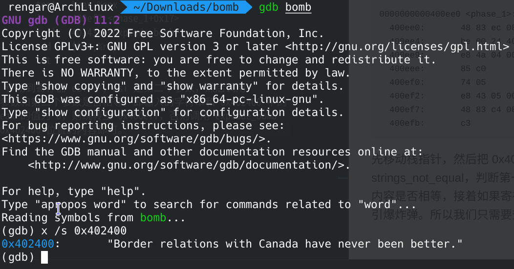

> 我知道我們以前是朋友，告訴我，我是誰。
> 很多人問我為什麼選擇拆彈，在他心裡，正義凌駕在他的生命之上。
> -------------------------------------------------------《拆弹专家 2》


拆炸弹作为一种高难度的工作，往往承担着高风险，即使是拆弹专家，最后也付出了自己的生命。本次实验需要我们输入`6个特定的字符串`才能够拆除炸弹，否则炸弹将会爆炸。我们将采取逆向的方式找出特定的字符串。

<!--more-->
## step 0
先使用 objdump 反编译出来汇编代码：
> objdump -d bomb > bomb.asm

使用 VScode 的 x86 and x86_64 Assembly 插件帮助我们浏览汇编代码。

可以发现有 1000 多行的汇编代码，其中包括 `.init .plt .text .fini` 这几个 section。`.init` 是进程初始化节，`.fini` 是进程终止节，`.plt` 是进程链接表。我们直接将重心放在 `.text` 节---代码节。

刚开始 `start` 是程序入口，我们直接往下看到 `main` 函数。

``` asm
0000000000400da0 <main>:
  400da0:	53                   	push   %rbx
  400da1:	83 ff 01             	cmp    $0x1,%edi
  400da4:	75 10                	jne    400db6 <main+0x16>
  400da6:	48 8b 05 9b 29 20 00 	mov    0x20299b(%rip),%rax        # 603748 <stdin@GLIBC_2.2.5>
  400dad:	48 89 05 b4 29 20 00 	mov    %rax,0x2029b4(%rip)        # 603768 <infile>
  400db4:	eb 63                	jmp    400e19 <main+0x79>
  400db6:	48 89 f3             	mov    %rsi,%rbx
  400db9:	83 ff 02             	cmp    $0x2,%edi
  400dbc:	75 3a                	jne    400df8 <main+0x58>
  400dbe:	48 8b 7e 08          	mov    0x8(%rsi),%rdi
  400dc2:	be b4 22 40 00       	mov    $0x4022b4,%esi
  400dc7:	e8 44 fe ff ff       	call   400c10 <fopen@plt>
  400dcc:	48 89 05 95 29 20 00 	mov    %rax,0x202995(%rip)        # 603768 <infile>
  400dd3:	48 85 c0             	test   %rax,%rax
  400dd6:	75 41                	jne    400e19 <main+0x79>
  400dd8:	48 8b 4b 08          	mov    0x8(%rbx),%rcx
  400ddc:	48 8b 13             	mov    (%rbx),%rdx
  400ddf:	be b6 22 40 00       	mov    $0x4022b6,%esi
  400de4:	bf 01 00 00 00       	mov    $0x1,%edi
  400de9:	e8 12 fe ff ff       	call   400c00 <__printf_chk@plt>
  400dee:	bf 08 00 00 00       	mov    $0x8,%edi
  400df3:	e8 28 fe ff ff       	call   400c20 <exit@plt>
  400df8:	48 8b 16             	mov    (%rsi),%rdx
  400dfb:	be d3 22 40 00       	mov    $0x4022d3,%esi
  400e00:	bf 01 00 00 00       	mov    $0x1,%edi
  400e05:	b8 00 00 00 00       	mov    $0x0,%eax
  400e0a:	e8 f1 fd ff ff       	call   400c00 <__printf_chk@plt>
  400e0f:	bf 08 00 00 00       	mov    $0x8,%edi
  400e14:	e8 07 fe ff ff       	call   400c20 <exit@plt>
  400e19:	e8 84 05 00 00       	call   4013a2 <initialize_bomb>
  400e1e:	bf 38 23 40 00       	mov    $0x402338,%edi
  400e23:	e8 e8 fc ff ff       	call   400b10 <puts@plt>
  400e28:	bf 78 23 40 00       	mov    $0x402378,%edi
  400e2d:	e8 de fc ff ff       	call   400b10 <puts@plt>
  400e32:	e8 67 06 00 00       	call   40149e <read_line>
  400e37:	48 89 c7             	mov    %rax,%rdi
  400e3a:	e8 a1 00 00 00       	call   400ee0 <phase_1>
  400e3f:	e8 80 07 00 00       	call   4015c4 <phase_defused>
  400e44:	bf a8 23 40 00       	mov    $0x4023a8,%edi
  400e49:	e8 c2 fc ff ff       	call   400b10 <puts@plt>
  400e4e:	e8 4b 06 00 00       	call   40149e <read_line>
  400e53:	48 89 c7             	mov    %rax,%rdi
  400e56:	e8 a1 00 00 00       	call   400efc <phase_2>
  400e5b:	e8 64 07 00 00       	call   4015c4 <phase_defused>
  400e60:	bf ed 22 40 00       	mov    $0x4022ed,%edi
  400e65:	e8 a6 fc ff ff       	call   400b10 <puts@plt>
  400e6a:	e8 2f 06 00 00       	call   40149e <read_line>
  400e6f:	48 89 c7             	mov    %rax,%rdi
  400e72:	e8 cc 00 00 00       	call   400f43 <phase_3>
  400e77:	e8 48 07 00 00       	call   4015c4 <phase_defused>
  400e7c:	bf 0b 23 40 00       	mov    $0x40230b,%edi
  400e81:	e8 8a fc ff ff       	call   400b10 <puts@plt>
  400e86:	e8 13 06 00 00       	call   40149e <read_line>
  400e8b:	48 89 c7             	mov    %rax,%rdi
  400e8e:	e8 79 01 00 00       	call   40100c <phase_4>
  400e93:	e8 2c 07 00 00       	call   4015c4 <phase_defused>
  400e98:	bf d8 23 40 00       	mov    $0x4023d8,%edi
  400e9d:	e8 6e fc ff ff       	call   400b10 <puts@plt>
  400ea2:	e8 f7 05 00 00       	call   40149e <read_line>
  400ea7:	48 89 c7             	mov    %rax,%rdi
  400eaa:	e8 b3 01 00 00       	call   401062 <phase_5>
  400eaf:	e8 10 07 00 00       	call   4015c4 <phase_defused>
  400eb4:	bf 1a 23 40 00       	mov    $0x40231a,%edi
  400eb9:	e8 52 fc ff ff       	call   400b10 <puts@plt>
  400ebe:	e8 db 05 00 00       	call   40149e <read_line>
  400ec3:	48 89 c7             	mov    %rax,%rdi
  400ec6:	e8 29 02 00 00       	call   4010f4 <phase_6>
  400ecb:	e8 f4 06 00 00       	call   4015c4 <phase_defused>
  400ed0:	b8 00 00 00 00       	mov    $0x0,%eax
  400ed5:	5b                   	pop    %rbx
  400ed6:	c3                   	ret    
  400ed7:	90                   	nop
  400ed8:	90                   	nop
  400ed9:	90                   	nop
  400eda:	90                   	nop
  400edb:	90                   	nop
  400edc:	90                   	nop
  400edd:	90                   	nop
  400ede:	90                   	nop
  400edf:	90                   	nop
```

> 400e37:	48 89 c7             	mov    %rax,%rdi
> 400e3a:	e8 a1 00 00 00       	call   400ee0 <phase_1>

可以看到在调用 `phase_1` 之前，将 `rax` 寄存器的值(输入的字符串)移动到了 `rdi` 寄存器中，`rdi` 寄存器保存着第一个参数，即输入的字符串。

## step 1
接着调用 phase_1：
``` asm
0000000000400ee0 <phase_1>:
  400ee0:	48 83 ec 08          	sub    $0x8,%rsp
  400ee4:	be 00 24 40 00       	mov    $0x402400,%esi
  400ee9:	e8 4a 04 00 00       	call   401338 <strings_not_equal>
  400eee:	85 c0                	test   %eax,%eax
  400ef0:	74 05                	je     400ef7 <phase_1+0x17>
  400ef2:	e8 43 05 00 00       	call   40143a <explode_bomb>
  400ef7:	48 83 c4 08          	add    $0x8,%rsp
  400efb:	c3                   	ret    
```
先移动栈指针，然后把 `0x402400` 移动到寄存器 `esi` 中，`esi` 是第二个参数，然后调用 `strings_not_equal`，判断第一个参数和第二个参数是否相等，即输入的字符串和 `0x402400` 中的内容是否相等，接着如果寄存器 `eax` 的值为 `0`，则跳转至 `0x400ef7`，否则调用 `explode_bomb` 引爆炸弹。所以我们只需要查看 `0x402400` 位置的内容即可。

可以发现第一个字符串的内容为 `"Border relations with Canada have never been better."`

## step 2
``` asm
0000000000400efc <phase_2>:
  400efc:	55                   	push   %rbp
  400efd:	53                   	push   %rbx
  400efe:	48 83 ec 28          	sub    $0x28,%rsp
  400f02:	48 89 e6             	mov    %rsp,%rsi
  400f05:	e8 52 05 00 00       	call   40145c <read_six_numbers>
  400f0a:	83 3c 24 01          	cmpl   $0x1,(%rsp)
  400f0e:	74 20                	je     400f30 <phase_2+0x34>
  400f10:	e8 25 05 00 00       	call   40143a <explode_bomb>
  400f15:	eb 19                	jmp    400f30 <phase_2+0x34>
  400f17:	8b 43 fc             	mov    -0x4(%rbx),%eax
  400f1a:	01 c0                	add    %eax,%eax
  400f1c:	39 03                	cmp    %eax,(%rbx)
  400f1e:	74 05                	je     400f25 <phase_2+0x29>
  400f20:	e8 15 05 00 00       	call   40143a <explode_bomb>
  400f25:	48 83 c3 04          	add    $0x4,%rbx
  400f29:	48 39 eb             	cmp    %rbp,%rbx
  400f2c:	75 e9                	jne    400f17 <phase_2+0x1b>
  400f2e:	eb 0c                	jmp    400f3c <phase_2+0x40>
  400f30:	48 8d 5c 24 04       	lea    0x4(%rsp),%rbx
  400f35:	48 8d 6c 24 18       	lea    0x18(%rsp),%rbp
  400f3a:	eb db                	jmp    400f17 <phase_2+0x1b>
  400f3c:	48 83 c4 28          	add    $0x28,%rsp
  400f40:	5b                   	pop    %rbx
  400f41:	5d                   	pop    %rbp
  400f42:	c3                   	ret 
```
前面设置一些寄存器的值，然后调用 `read_six_numbers`，猜测是读取 6 个数字，我们将