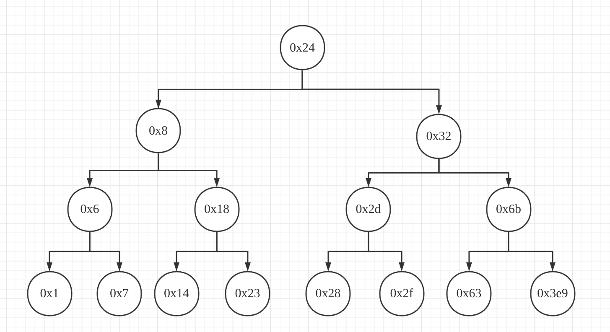

> 我知道我們以前是朋友，告訴我，我是誰。
> 很多人問我為什麼選擇拆彈，在他心裡，正義凌駕在他的生命之上。
> --《拆弹专家 2》


拆炸弹作为一种高难度的工作，往往承担着高风险，即使是拆弹专家，最后也付出了自己的生命。本次实验需要我们输入 `6个特定的字符串` 才能够拆除炸弹，否则炸弹将会爆炸。我们将采取逆向的方式找出特定的字符串。

<!--more-->
## step 0
先使用 objdump 反编译出来汇编代码：
> objdump -d bomb > bomb.asm

使用 VScode 的 x86 and x86_64 Assembly 插件帮助我们浏览汇编代码。

可以发现有 1000 多行的汇编代码，其中包括 `.init .plt .text .fini` 这几个 section。`.init` 是进程初始化节，`.fini` 是进程终止节，`.plt` 是进程链接表。我们直接将重心放在 `.text` 节---代码节。

刚开始 `start` 是程序入口，我们直接往下看到 `main` 函数。

``` asm
0000000000400da0 <main>:
  400da0:	53                   	push   %rbx
  400da1:	83 ff 01             	cmp    $0x1,%edi
  400da4:	75 10                	jne    400db6 <main+0x16>
  400da6:	48 8b 05 9b 29 20 00 	mov    0x20299b(%rip),%rax        # 603748 <stdin@GLIBC_2.2.5>
  400dad:	48 89 05 b4 29 20 00 	mov    %rax,0x2029b4(%rip)        # 603768 <infile>
  400db4:	eb 63                	jmp    400e19 <main+0x79>
  400db6:	48 89 f3             	mov    %rsi,%rbx
  400db9:	83 ff 02             	cmp    $0x2,%edi
  400dbc:	75 3a                	jne    400df8 <main+0x58>
  400dbe:	48 8b 7e 08          	mov    0x8(%rsi),%rdi
  400dc2:	be b4 22 40 00       	mov    $0x4022b4,%esi
  400dc7:	e8 44 fe ff ff       	call   400c10 <fopen@plt>
  400dcc:	48 89 05 95 29 20 00 	mov    %rax,0x202995(%rip)        # 603768 <infile>
  400dd3:	48 85 c0             	test   %rax,%rax
  400dd6:	75 41                	jne    400e19 <main+0x79>
  400dd8:	48 8b 4b 08          	mov    0x8(%rbx),%rcx
  400ddc:	48 8b 13             	mov    (%rbx),%rdx
  400ddf:	be b6 22 40 00       	mov    $0x4022b6,%esi
  400de4:	bf 01 00 00 00       	mov    $0x1,%edi
  400de9:	e8 12 fe ff ff       	call   400c00 <__printf_chk@plt>
  400dee:	bf 08 00 00 00       	mov    $0x8,%edi
  400df3:	e8 28 fe ff ff       	call   400c20 <exit@plt>
  400df8:	48 8b 16             	mov    (%rsi),%rdx
  400dfb:	be d3 22 40 00       	mov    $0x4022d3,%esi
  400e00:	bf 01 00 00 00       	mov    $0x1,%edi
  400e05:	b8 00 00 00 00       	mov    $0x0,%eax
  400e0a:	e8 f1 fd ff ff       	call   400c00 <__printf_chk@plt>
  400e0f:	bf 08 00 00 00       	mov    $0x8,%edi
  400e14:	e8 07 fe ff ff       	call   400c20 <exit@plt>
  400e19:	e8 84 05 00 00       	call   4013a2 <initialize_bomb>
  400e1e:	bf 38 23 40 00       	mov    $0x402338,%edi
  400e23:	e8 e8 fc ff ff       	call   400b10 <puts@plt>
  400e28:	bf 78 23 40 00       	mov    $0x402378,%edi
  400e2d:	e8 de fc ff ff       	call   400b10 <puts@plt>
  400e32:	e8 67 06 00 00       	call   40149e <read_line>
  400e37:	48 89 c7             	mov    %rax,%rdi
  400e3a:	e8 a1 00 00 00       	call   400ee0 <phase_1>
  400e3f:	e8 80 07 00 00       	call   4015c4 <phase_defused>
  400e44:	bf a8 23 40 00       	mov    $0x4023a8,%edi
  400e49:	e8 c2 fc ff ff       	call   400b10 <puts@plt>
  400e4e:	e8 4b 06 00 00       	call   40149e <read_line>
  400e53:	48 89 c7             	mov    %rax,%rdi
  400e56:	e8 a1 00 00 00       	call   400efc <phase_2>
  400e5b:	e8 64 07 00 00       	call   4015c4 <phase_defused>
  400e60:	bf ed 22 40 00       	mov    $0x4022ed,%edi
  400e65:	e8 a6 fc ff ff       	call   400b10 <puts@plt>
  400e6a:	e8 2f 06 00 00       	call   40149e <read_line>
  400e6f:	48 89 c7             	mov    %rax,%rdi
  400e72:	e8 cc 00 00 00       	call   400f43 <phase_3>
  400e77:	e8 48 07 00 00       	call   4015c4 <phase_defused>
  400e7c:	bf 0b 23 40 00       	mov    $0x40230b,%edi
  400e81:	e8 8a fc ff ff       	call   400b10 <puts@plt>
  400e86:	e8 13 06 00 00       	call   40149e <read_line>
  400e8b:	48 89 c7             	mov    %rax,%rdi
  400e8e:	e8 79 01 00 00       	call   40100c <phase_4>
  400e93:	e8 2c 07 00 00       	call   4015c4 <phase_defused>
  400e98:	bf d8 23 40 00       	mov    $0x4023d8,%edi
  400e9d:	e8 6e fc ff ff       	call   400b10 <puts@plt>
  400ea2:	e8 f7 05 00 00       	call   40149e <read_line>
  400ea7:	48 89 c7             	mov    %rax,%rdi
  400eaa:	e8 b3 01 00 00       	call   401062 <phase_5>
  400eaf:	e8 10 07 00 00       	call   4015c4 <phase_defused>
  400eb4:	bf 1a 23 40 00       	mov    $0x40231a,%edi
  400eb9:	e8 52 fc ff ff       	call   400b10 <puts@plt>
  400ebe:	e8 db 05 00 00       	call   40149e <read_line>
  400ec3:	48 89 c7             	mov    %rax,%rdi
  400ec6:	e8 29 02 00 00       	call   4010f4 <phase_6>
  400ecb:	e8 f4 06 00 00       	call   4015c4 <phase_defused>
  400ed0:	b8 00 00 00 00       	mov    $0x0,%eax
  400ed5:	5b                   	pop    %rbx
  400ed6:	c3                   	ret    
  400ed7:	90                   	nop
  400ed8:	90                   	nop
  400ed9:	90                   	nop
  400eda:	90                   	nop
  400edb:	90                   	nop
  400edc:	90                   	nop
  400edd:	90                   	nop
  400ede:	90                   	nop
  400edf:	90                   	nop
```

> 400e37:	48 89 c7             	mov    %rax,%rdi
> 400e3a:	e8 a1 00 00 00       	call   400ee0 <phase_1>

可以看到在调用 `phase_1` 之前，将 `rax` 寄存器的值(输入的字符串)移动到了 `rdi` 寄存器中，`rdi` 寄存器保存着第一个参数，即输入的字符串。

## step 1
接着调用 phase_1：
``` asm
0000000000400ee0 <phase_1>:
  400ee0:	48 83 ec 08          	sub    $0x8,%rsp
  400ee4:	be 00 24 40 00       	mov    $0x402400,%esi
  400ee9:	e8 4a 04 00 00       	call   401338 <strings_not_equal>
  400eee:	85 c0                	test   %eax,%eax
  400ef0:	74 05                	je     400ef7 <phase_1+0x17>
  400ef2:	e8 43 05 00 00       	call   40143a <explode_bomb>
  400ef7:	48 83 c4 08          	add    $0x8,%rsp
  400efb:	c3                   	ret    
```
先移动栈指针，然后把 `0x402400` 移动到寄存器 `esi` 中，`esi` 是第二个参数，然后调用 `strings_not_equal`，判断第一个参数和第二个参数是否相等，即输入的字符串和 `0x402400` 中的内容是否相等，接着如果寄存器 `eax` 的值为 `0`，则跳转至 `0x400ef7`，否则调用 `explode_bomb` 引爆炸弹。所以我们只需要查看 `0x402400` 位置的内容即可。

可以发现第一个字符串的内容为 `"Border relations with Canada have never been better."`

## step 2
``` asm
0000000000400efc <phase_2>:
  400efc:	55                   	push   %rbp
  400efd:	53                   	push   %rbx
  400efe:	48 83 ec 28          	sub    $0x28,%rsp
  400f02:	48 89 e6             	mov    %rsp,%rsi
  400f05:	e8 52 05 00 00       	call   40145c <read_six_numbers>
  400f0a:	83 3c 24 01          	cmpl   $0x1,(%rsp)
  400f0e:	74 20                	je     400f30 <phase_2+0x34>
  400f10:	e8 25 05 00 00       	call   40143a <explode_bomb>
  400f15:	eb 19                	jmp    400f30 <phase_2+0x34>
  400f17:	8b 43 fc             	mov    -0x4(%rbx),%eax
  400f1a:	01 c0                	add    %eax,%eax
  400f1c:	39 03                	cmp    %eax,(%rbx)
  400f1e:	74 05                	je     400f25 <phase_2+0x29>
  400f20:	e8 15 05 00 00       	call   40143a <explode_bomb>
  400f25:	48 83 c3 04          	add    $0x4,%rbx
  400f29:	48 39 eb             	cmp    %rbp,%rbx
  400f2c:	75 e9                	jne    400f17 <phase_2+0x1b>
  400f2e:	eb 0c                	jmp    400f3c <phase_2+0x40>
  400f30:	48 8d 5c 24 04       	lea    0x4(%rsp),%rbx
  400f35:	48 8d 6c 24 18       	lea    0x18(%rsp),%rbp
  400f3a:	eb db                	jmp    400f17 <phase_2+0x1b>
  400f3c:	48 83 c4 28          	add    $0x28,%rsp
  400f40:	5b                   	pop    %rbx
  400f41:	5d                   	pop    %rbp
  400f42:	c3                   	ret 
```
前面设置一些寄存器的值，`push %rbp` `push %rbx`，然后 `sub $0x28,%rsp`，并且 `mov %rsp,%rsi`，猜测是把六个数字保存在栈中，因为栈申请了 `0x28` 的大小，而且 `rsi` (第二个参数) 保存着 `rsp` 的值，然后调用 `read_six_numbers`，猜测是读取 6 个数字，存入 `rsp` 中，我们将随便输入六个数字，可以用 `1 2 3 4 5 6` 尝试一下。首先在 `0x400f0a` 处打上断点，运行，输入第一阶段的正确答案，再输入 `1 2 3 4 5 6`，此时 `x /32xb $rsp` 查看栈寄存器内容。
> (gdb) break *0x400f0a
> Breakpoint 1 at 0x400f0a
> (gdb) run
> Starting program: /home/rengar/Downloads/bomb/bomb 
> [Thread debugging using libthread_db enabled]
> Using host libthread_db library "/usr/lib/libthread_db.so.1".
> Welcome to my fiendish little bomb. You have 6 phases with
> which to blow yourself up. Have a nice day!
> Border relations with Canada have never been better.
> Phase 1 defused. How about the next one?
> 1 2 3 4 5 6
> Breakpoint 1, 0x0000000000400f0a in phase_2 ()
> (gdb) x /32xb $rsp
> 0x7fffffffdc60: 0x01    0x00    0x00    0x00    0x02    0x00    0x00    0x00
> 0x7fffffffdc68: 0x03    0x00    0x00    0x00    0x04    0x00    0x00    0x00
> 0x7fffffffdc70: 0x05    0x00    0x00    0x00    0x06    0x00    0x00    0x00
> 0x7fffffffdc78: 0x31    0x14    0x40    0x00    0x00    0x00    0x00    0x00

发现 `1 2 3 4 5 6` 被连续保存在了栈 `rsp` 中，其中 `6` 后面的 `0x00401431` 是某个函数的入口地址。断点处代码是将 `1` 和 `rsp` 比较，如果 `rsp` 不等于 `1`，则调用 `explode_bomb`，所以输入的字符串中第一个数必须是 `1`，然后跳转到 `400f30: lea 0x4(%rsp),%rbx`，将 `下一个数的地址值` 送至 `rbx` 寄存器，再将 `返回地址值` 送入 `rbp` 寄存器，然后跳转至 `400f17: mov -0x4(%rbx),%eax`，将第一个数送入 `eax`，然后 `eax` * 2，比较 `eax` 和 `rbx`，相等则跳转到 `400f25: add $0x4,%rbx`，否则引爆炸弹，所以第二个数即 `rbx` 的值必须是 2，然后 `rbx + 0x4`，`rbx` 的值变为第三个数，和 `rbp` (返回地址) 比较，不相等的话就跳转至 `400f17: mov -0x4(%rbx),%eax`，将第二个数送入 `eax`，然后 `eax` * 2，比较 `eax` 和 `rbx`，相等则跳转到 `400f25: add $0x4,%rbx`，否则引爆炸弹，所以第三个数即 `rbx` 的值必须是 4，循环往下，说明六个数的值应为 `1 2 4 8 16 32`，然后此时 `400f2e: jmp 400f3c <phase_2+0x40>`，跳转至 `400f3c: add $0x28,%rsp`，恢复 `rsp` 的位置，弹出 `rbx` `rbp`。

所以第二个字符串内容应为 `"1 2 4 8 16 32"`

## step 3
``` asm
0000000000400f43 <phase_3>:
  400f43:	48 83 ec 18          	sub    $0x18,%rsp
  400f47:	48 8d 4c 24 0c       	lea    0xc(%rsp),%rcx
  400f4c:	48 8d 54 24 08       	lea    0x8(%rsp),%rdx
  400f51:	be cf 25 40 00       	mov    $0x4025cf,%esi
  400f56:	b8 00 00 00 00       	mov    $0x0,%eax
  400f5b:	e8 90 fc ff ff       	call   400bf0 <__isoc99_sscanf@plt>
  400f60:	83 f8 01             	cmp    $0x1,%eax
  400f63:	7f 05                	jg     400f6a <phase_3+0x27>
  400f65:	e8 d0 04 00 00       	call   40143a <explode_bomb>
  400f6a:	83 7c 24 08 07       	cmpl   $0x7,0x8(%rsp)
  400f6f:	77 3c                	ja     400fad <phase_3+0x6a>
  400f71:	8b 44 24 08          	mov    0x8(%rsp),%eax
  400f75:	ff 24 c5 70 24 40 00 	jmp    *0x402470(,%rax,8)
  400f7c:	b8 cf 00 00 00       	mov    $0xcf,%eax
  400f81:	eb 3b                	jmp    400fbe <phase_3+0x7b>
  400f83:	b8 c3 02 00 00       	mov    $0x2c3,%eax
  400f88:	eb 34                	jmp    400fbe <phase_3+0x7b>
  400f8a:	b8 00 01 00 00       	mov    $0x100,%eax
  400f8f:	eb 2d                	jmp    400fbe <phase_3+0x7b>
  400f91:	b8 85 01 00 00       	mov    $0x185,%eax
  400f96:	eb 26                	jmp    400fbe <phase_3+0x7b>
  400f98:	b8 ce 00 00 00       	mov    $0xce,%eax
  400f9d:	eb 1f                	jmp    400fbe <phase_3+0x7b>
  400f9f:	b8 aa 02 00 00       	mov    $0x2aa,%eax
  400fa4:	eb 18                	jmp    400fbe <phase_3+0x7b>
  400fa6:	b8 47 01 00 00       	mov    $0x147,%eax
  400fab:	eb 11                	jmp    400fbe <phase_3+0x7b>
  400fad:	e8 88 04 00 00       	call   40143a <explode_bomb>
  400fb2:	b8 00 00 00 00       	mov    $0x0,%eax
  400fb7:	eb 05                	jmp    400fbe <phase_3+0x7b>
  400fb9:	b8 37 01 00 00       	mov    $0x137,%eax
  400fbe:	3b 44 24 0c          	cmp    0xc(%rsp),%eax
  400fc2:	74 05                	je     400fc9 <phase_3+0x86>
  400fc4:	e8 71 04 00 00       	call   40143a <explode_bomb>
  400fc9:	48 83 c4 18          	add    $0x18,%rsp
  400fcd:	c3                   	ret    
```
第 6 行调用了库函数 `sscanf`，且第 4 行 `mov $0x4025cf,%esi`，打个断点使用 gdb 查看一下 `0x4025cf` 中的内容：
> Breakpoint 1, 0x0000000000400f51 in phase_3 ()
> (gdb) x /s 0x4025cf
> 0x4025cf:       "%d %d"
> (gdb) 

有两个整数，猜测是第 2、3 行的 `rcx` 和 `rdx`。即：
> sscanf(input, "%d,%d", &a, &b)

`0x8(%rsp)` 保存着 `a`，`0xc(%rsp)` 保存着 `b`。

`400f60:	cmp $0x1,%eax` 将 `eax` 与 `1` 进行比较，此时 `eax` 存放库函数 `sscanf` 的返回值，正常来说是 2，所以 `400f63: jg 400f6a <phase_3+0x27>` 会跳转至 `0x400f6a`。`400f6a: cmpl $0x7,0x8(%rsp)` 将 `rsp+0x8` 中存放的值与 `0x7` 进行比较如果大于 0x7 则跳到 `400fad`的位置引爆炸弹。接下来 `400f71: mov 0x8(%rsp),%eax` 把 a 传送给 `eax`，然后 `400f75: jmp *0x402470(,%rax,8)` ，查看一下 `0x402470` 的内容：
> (gdb) x /32xb 0x402470
> 0x402470:       0x7c    0x0f    0x40    0x00    0x00    0x00    0x00    0x00
> 0x402478:       0xb9    0x0f    0x40    0x00    0x00    0x00    0x00    0x00
> 0x402480:       0x83    0x0f    0x40    0x00    0x00    0x00    0x00    0x00
> 0x402488:       0x8a    0x0f    0x40    0x00    0x00    0x00    0x00    0x00

可以看出是根据 `rax` 的不同跳转至不同的地方，应该是一个 `switch` 语句。第一遍输入 1 2 查看一下 `rax` 的内容：
> (gdb) print $rax    
> >$1 = 1

再输入 4 8 查看一下：
> (gdb) print $rax    
> >$2 = 4

多次尝试后发现 `rax` 的值就是第一个输入的数。所以第一个输入的数需要小于 7，然后程序会根据输入的不同跳转至不同的位置执行代码，不同的位置的代码都是一样的，把一个值送至 `eax`，然后跳转至 `400fbe: cmp 0xc(%rsp),%eax`，如果 `eax` 与输入的第二个数相等的话就跳过 `bomb`，所以这里有多个答案，选择一个即可，这里我们选择第一个输入的数为 `0`，则 `eax` 会被赋值 `0xcf`，即 `207`。

第三个字符串答案之一为 `"0 207"`

## step 4
``` asm
000000000040100c <phase_4>:
  40100c:	48 83 ec 18          	sub    $0x18,%rsp
  401010:	48 8d 4c 24 0c       	lea    0xc(%rsp),%rcx
  401015:	48 8d 54 24 08       	lea    0x8(%rsp),%rdx
  40101a:	be cf 25 40 00       	mov    $0x4025cf,%esi
  40101f:	b8 00 00 00 00       	mov    $0x0,%eax
  401024:	e8 c7 fb ff ff       	call   400bf0 <__isoc99_sscanf@plt>
  401029:	83 f8 02             	cmp    $0x2,%eax
  40102c:	75 07                	jne    401035 <phase_4+0x29>
  40102e:	83 7c 24 08 0e       	cmpl   $0xe,0x8(%rsp)
  401033:	76 05                	jbe    40103a <phase_4+0x2e>
  401035:	e8 00 04 00 00       	call   40143a <explode_bomb>
  40103a:	ba 0e 00 00 00       	mov    $0xe,%edx
  40103f:	be 00 00 00 00       	mov    $0x0,%esi
  401044:	8b 7c 24 08          	mov    0x8(%rsp),%edi
  401048:	e8 81 ff ff ff       	call   400fce <func4>
  40104d:	85 c0                	test   %eax,%eax
  40104f:	75 07                	jne    401058 <phase_4+0x4c>
  401051:	83 7c 24 0c 00       	cmpl   $0x0,0xc(%rsp)
  401056:	74 05                	je     40105d <phase_4+0x51>
  401058:	e8 dd 03 00 00       	call   40143a <explode_bomb>
  40105d:	48 83 c4 18          	add    $0x18,%rsp
  401061:	c3                   	ret   
```
前面跟 step 3 一样，输入两个数保存在 `0x8(%rsp)` `0xc(%rsp)` 中，然后：
> 40103a:	ba 0e 00 00 00       	mov    $0xe,%edx
> 40103f:	be 00 00 00 00       	mov    $0x0,%esi
> 401044:	8b 7c 24 08          	mov    0x8(%rsp),%edi
> 401048:	e8 81 ff ff ff       	call   400fce <func4>

修改三个参数寄存器，然后调用 `func4`。先看一眼 `bomb`，`eax` 不为 0 就爆炸，然后输入的第二个数不为 0 就爆炸。
> %edx: 14, %esi: 0, %edi: 输入的第一个数，%eax 需要为 0

``` asm
0000000000400fce <func4>:
  400fce:	48 83 ec 08          	sub    $0x8,%rsp
  400fd2:	89 d0                	mov    %edx,%eax
  400fd4:	29 f0                	sub    %esi,%eax
  400fd6:	89 c1                	mov    %eax,%ecx
  400fd8:	c1 e9 1f             	shr    $0x1f,%ecx
  400fdb:	01 c8                	add    %ecx,%eax
  400fdd:	d1 f8                	sar    %eax
  400fdf:	8d 0c 30             	lea    (%rax,%rsi,1),%ecx
  400fe2:	39 f9                	cmp    %edi,%ecx
  400fe4:	7e 0c                	jle    400ff2 <func4+0x24>
  400fe6:	8d 51 ff             	lea    -0x1(%rcx),%edx
  400fe9:	e8 e0 ff ff ff       	call   400fce <func4>
  400fee:	01 c0                	add    %eax,%eax
  400ff0:	eb 15                	jmp    401007 <func4+0x39>
  400ff2:	b8 00 00 00 00       	mov    $0x0,%eax
  400ff7:	39 f9                	cmp    %edi,%ecx
  400ff9:	7d 0c                	jge    401007 <func4+0x39>
  400ffb:	8d 71 01             	lea    0x1(%rcx),%esi
  400ffe:	e8 cb ff ff ff       	call   400fce <func4>
  401003:	8d 44 00 01          	lea    0x1(%rax,%rax,1),%eax
  401007:	48 83 c4 08          	add    $0x8,%rsp
  40100b:	c3                   	ret  
```
直接看有点难，可以逆向为 C 语言来看，这里参考了网上的逆向结果：
``` C
int fun(int a1, int a2, int x) // a1 = %edx a2 = %esi x = %edi
{
    int b = (a1 - a2) >> 31;  // b = 0
    int result = ((a1-a2) + b) >> 1; // result = 111 = 7
    b = result + a2;          // b = 7
    if(b == x) return 0;
    if(b < x) 
    {
        result = fun(a1, b + 1, x);
        return result * 2 + 1;
    }
    else
    {
        result = fun(b - 1, a2, x);
        return result * 2;
    }
}
```
可知最简单的一种令返回值为 0 的情况是 b == x，还有几种情况可以自行研究，这里选择 x = 7 作为答案。

第四个字符串答案之一为 `"7 0"`

## step 5
``` asm
0000000000401062 <phase_5>:
  401062:	53                   	push   %rbx
  401063:	48 83 ec 20          	sub    $0x20,%rsp
  401067:	48 89 fb             	mov    %rdi,%rbx
  40106a:	64 48 8b 04 25 28 00 	mov    %fs:0x28,%rax
  401071:	00 00 
  401073:	48 89 44 24 18       	mov    %rax,0x18(%rsp)
  401078:	31 c0                	xor    %eax,%eax
  40107a:	e8 9c 02 00 00       	call   40131b <string_length>
  40107f:	83 f8 06             	cmp    $0x6,%eax
  401082:	74 4e                	je     4010d2 <phase_5+0x70>
  401084:	e8 b1 03 00 00       	call   40143a <explode_bomb>
  401089:	eb 47                	jmp    4010d2 <phase_5+0x70>
  40108b:	0f b6 0c 03          	movzbl (%rbx,%rax,1),%ecx
  40108f:	88 0c 24             	mov    %cl,(%rsp)
  401092:	48 8b 14 24          	mov    (%rsp),%rdx
  401096:	83 e2 0f             	and    $0xf,%edx
  401099:	0f b6 92 b0 24 40 00 	movzbl 0x4024b0(%rdx),%edx
  4010a0:	88 54 04 10          	mov    %dl,0x10(%rsp,%rax,1)
  4010a4:	48 83 c0 01          	add    $0x1,%rax
  4010a8:	48 83 f8 06          	cmp    $0x6,%rax
  4010ac:	75 dd                	jne    40108b <phase_5+0x29>
  4010ae:	c6 44 24 16 00       	movb   $0x0,0x16(%rsp)
  4010b3:	be 5e 24 40 00       	mov    $0x40245e,%esi
  4010b8:	48 8d 7c 24 10       	lea    0x10(%rsp),%rdi
  4010bd:	e8 76 02 00 00       	call   401338 <strings_not_equal>
  4010c2:	85 c0                	test   %eax,%eax
  4010c4:	74 13                	je     4010d9 <phase_5+0x77>
  4010c6:	e8 6f 03 00 00       	call   40143a <explode_bomb>
  4010cb:	0f 1f 44 00 00       	nopl   0x0(%rax,%rax,1)
  4010d0:	eb 07                	jmp    4010d9 <phase_5+0x77>
  4010d2:	b8 00 00 00 00       	mov    $0x0,%eax
  4010d7:	eb b2                	jmp    40108b <phase_5+0x29>
  4010d9:	48 8b 44 24 18       	mov    0x18(%rsp),%rax
  4010de:	64 48 33 04 25 28 00 	xor    %fs:0x28,%rax
  4010e5:	00 00 
  4010e7:	74 05                	je     4010ee <phase_5+0x8c>
  4010e9:	e8 42 fa ff ff       	call   400b30 <__stack_chk_fail@plt>
  4010ee:	48 83 c4 20          	add    $0x20,%rsp
  4010f2:	5b                   	pop    %rbx
  4010f3:	c3                   	ret    
```
`40108b: movzbl (%rbx,%rax,1),%ecx` 此时 `rbx` 存放着输入的字符串位置，`rax` 为 0，将输入字符串第一个字节赋值给 `ecx`，后面三条指令把低四位放在 `edx`。`401099: movzbl 0x4024b0(%rdx),%edx` 把 `0x4024b0+rdx` 的一个字节放入 `edx` 的低 16 位中。下一行将这 16 位复制到了 `rsp+0x10+rax` 的位置中。需要循环执行 6 次。

`4010ae: movb $0x0,0x16(%rsp)` 把终止符写入 `rsp+0x16`。比较 `rsp+0x10` 和 `0x40245e` 的字符串是否相等，所以找到 `rsp+0x10` 的字符串来源，应该是 `4010a0: mov %dl,0x10(%rsp,%rax,1)`，来源是 `dl`，`dl` 的来源是 `edx`，而 `edx` 来源 `0x4024b0(%rdx)`，而 `rdx` 来源输入字符串。

我们注意到前面为什么绕来绕去的，是因为我们希望 `rdx` 存取低 4 位，字符 `'A'` 的 ASCII 码为 `1000001`，低 4 位为 1，字符 `'a'` 的 ASCII 码为 `1100001`，低 4 位也为 1，所以输入的字符串为 'b' 时，`rdx` 的值为 2，所以 `rdx` 其实存取的就是字符相对于 'a' 或者 'A' 的偏移。

接下来查看一下 `0x4024b0` 和 `0x40245e` 的字符串内容：
> (gdb) x /s 0x4024b0
> 0x4024b0 <array.3449>:  "maduiersnfotvbylSo you think you can stop the bomb with ctrl-c, do you?"
> (gdb) x /s 0x40245e
> 0x40245e:       "flyers"

根据输入的字符串相对于 `'a'` 或者 `'A'` 的偏移从 `0x4024b0` 中去获取字符，然后与 `flyers` 比较，首先 `i` 的低 4 位是 `9`，所以取出的字符是 'f'，然后 `o` 的低 4 位是 `15`，取出的字符是 `l`，所以输入 `ionefg` 就可以取出 `flyers`。

第五个字符串答案之一为 `"ionefg"`

## step 6
这一步的代码量有点大，我们逐步的分段进行分析。
### 1
``` asm
00000000004010f4 <phase_6>:
  4010f4:	41 56                	push   %r14
  4010f6:	41 55                	push   %r13
  4010f8:	41 54                	push   %r12
  4010fa:	55                   	push   %rbp
  4010fb:	53                   	push   %rbx
  4010fc:	48 83 ec 50          	sub    $0x50,%rsp
  401100:	49 89 e5             	mov    %rsp,%r13
  401103:	48 89 e6             	mov    %rsp,%rsi
  401106:	e8 51 03 00 00       	call   40145c <read_six_numbers>
  40110b:	49 89 e6             	mov    %rsp,%r14
  40110e:	41 bc 00 00 00 00    	mov    $0x0,%r12d
  401114:	4c 89 ed             	mov    %r13,%rbp
  401117:	41 8b 45 00          	mov    0x0(%r13),%eax
  40111b:	83 e8 01             	sub    $0x1,%eax
  40111e:	83 f8 05             	cmp    $0x5,%eax
  401121:	76 05                	jbe    401128 <phase_6+0x34>
  401123:	e8 12 03 00 00       	call   40143a <explode_bomb>
  401128:	41 83 c4 01          	add    $0x1,%r12d
  40112c:	41 83 fc 06          	cmp    $0x6,%r12d
  401130:	74 21                	je     401153 <phase_6+0x5f>
  401132:	44 89 e3             	mov    %r12d,%ebx
  401135:	48 63 c3             	movslq %ebx,%rax
  401138:	8b 04 84             	mov    (%rsp,%rax,4),%eax
  40113b:	39 45 00             	cmp    %eax,0x0(%rbp)
  40113e:	75 05                	jne    401145 <phase_6+0x51>
  401140:	e8 f5 02 00 00       	call   40143a <explode_bomb>
  401145:	83 c3 01             	add    $0x1,%ebx
  401148:	83 fb 05             	cmp    $0x5,%ebx
  40114b:	7e e8                	jle    401135 <phase_6+0x41>
  40114d:	49 83 c5 04          	add    $0x4,%r13
  401151:	eb c1                	jmp    401114 <phase_6+0x20>
```
前面读取 6 个数，存取在 `rsp` ~ `rsp + 24`，之后通过循环来限制输入。这一段的作用是限制输入的 6 个数均小于等于 6，且互不相等。

### 2
``` asm
  401153:	48 8d 74 24 18       	lea    0x18(%rsp),%rsi
  401158:	4c 89 f0             	mov    %r14,%rax
  40115b:	b9 07 00 00 00       	mov    $0x7,%ecx
  401160:	89 ca                	mov    %ecx,%edx
  401162:	2b 10                	sub    (%rax),%edx
  401164:	89 10                	mov    %edx,(%rax)
  401166:	48 83 c0 04          	add    $0x4,%rax
  40116a:	48 39 f0             	cmp    %rsi,%rax
  40116d:	75 f1                	jne    401160 <phase_6+0x6c>
```
这一段是让 6 个数(设为 x)变成 7 - x。

### 3
``` asm
  40116f:	be 00 00 00 00       	mov    $0x0,%esi
  401174:	eb 21                	jmp    401197 <phase_6+0xa3>
  401176:	48 8b 52 08          	mov    0x8(%rdx),%rdx
  40117a:	83 c0 01             	add    $0x1,%eax
  40117d:	39 c8                	cmp    %ecx,%eax
  40117f:	75 f5                	jne    401176 <phase_6+0x82>
  401181:	eb 05                	jmp    401188 <phase_6+0x94>

  401183:	ba d0 32 60 00       	mov    $0x6032d0,%edx
  401188:	48 89 54 74 20       	mov    %rdx,0x20(%rsp,%rsi,2)
  40118d:	48 83 c6 04          	add    $0x4,%rsi
  401191:	48 83 fe 18          	cmp    $0x18,%rsi
  401195:	74 14                	je     4011ab <phase_6+0xb7>
  401197:	8b 0c 34             	mov    (%rsp,%rsi,1),%ecx
  40119a:	83 f9 01             	cmp    $0x1,%ecx
  40119d:	7e e4                	jle    401183 <phase_6+0x8f>

  40119f:	b8 01 00 00 00       	mov    $0x1,%eax
  4011a4:	ba d0 32 60 00       	mov    $0x6032d0,%edx
  4011a9:	eb cb                	jmp    401176 <phase_6+0x82>
```
看一下 `0x6032d0` 的内容：
> Breakpoint 1, 0x0000000000401183 in phase_6 ()
> (gdb) x/24w 0x6032d0
> 0x6032d0 <node1>:       0x0000014c      0x00000001      0x006032e0      0x00000000
> 0x6032e0 <node2>:       0x000000a8      0x00000002      0x006032f0      0x00000000
> 0x6032f0 <node3>:       0x0000039c      0x00000003      0x00603300      0x00000000
> 0x603300 <node4>:       0x000002b3      0x00000004      0x00603310      0x00000000
> 0x603310 <node5>:       0x000001dd      0x00000005      0x00603320      0x00000000
> 0x603320 <node6>:       0x000001bb      0x00000006      0x00000000      0x00000000

可以看出这是一个链表，那么再来理解一下代码。首先清空 `esi`，然后跳转到 `0x401197: mov (%rsp,%rsi,1),%ecx`，读取数据进 `ecx`，如果小于等于 `1`，跳转至 `401183: mov $0x6032d0,%edx`，读取一个数进 `edx`，把 `edx` 写入 `0x20(%rsp,%rsi,2)`，从 `rsp + 0x20` 开始，写入 8 个字节，读取下一个数。如果 `ecx` 大于 1，跳转到 `401176: mov 0x8(%rdx),%rdx`，让 `rdx` 指向对应的地址，然后写入 `rsp + 0x20`。直到 6 个数都被写入，然后跳转进入 `0x4011ab`。所以总结一下这一段的代码就是根据输入，将 `0x6032d0` 这段内容写入 `rsp + 0x20`。最终 6 个数一共 48 个字节被写入 `rsp + 0x20` ~ `rsp + 0x50`。

### 4
``` asm
  4011ab:	48 8b 5c 24 20       	mov    0x20(%rsp),%rbx
  4011b0:	48 8d 44 24 28       	lea    0x28(%rsp),%rax
  4011b5:	48 8d 74 24 50       	lea    0x50(%rsp),%rsi
  4011ba:	48 89 d9             	mov    %rbx,%rcx
  4011bd:	48 8b 10             	mov    (%rax),%rdx
  4011c0:	48 89 51 08          	mov    %rdx,0x8(%rcx)
  4011c4:	48 83 c0 08          	add    $0x8,%rax
  4011c8:	48 39 f0             	cmp    %rsi,%rax
  4011cb:	74 05                	je     4011d2 <phase_6+0xde>
  4011cd:	48 89 d1             	mov    %rdx,%rcx
  4011d0:	eb eb                	jmp    4011bd <phase_6+0xc9>
  4011d2:	48 c7 42 08 00 00 00 	movq   $0x0,0x8(%rdx)
```
这一段就是重新将链表连接起来。

### 5
``` asm
  4011da:	bd 05 00 00 00       	mov    $0x5,%ebp
  4011df:	48 8b 43 08          	mov    0x8(%rbx),%rax
  4011e3:	8b 00                	mov    (%rax),%eax
  4011e5:	39 03                	cmp    %eax,(%rbx)
  4011e7:	7d 05                	jge    4011ee <phase_6+0xfa>
  4011e9:	e8 4c 02 00 00       	call   40143a <explode_bomb>
  4011ee:	48 8b 5b 08          	mov    0x8(%rbx),%rbx
  4011f2:	83 ed 01             	sub    $0x1,%ebp
  4011f5:	75 e8                	jne    4011df <phase_6+0xeb>
  4011f7:	48 83 c4 50          	add    $0x50,%rsp
  4011fb:	5b                   	pop    %rbx
  4011fc:	5d                   	pop    %rbp
  4011fd:	41 5c                	pop    %r12
  4011ff:	41 5d                	pop    %r13
  401201:	41 5e                	pop    %r14
  401203:	c3                   	ret    
```
最后一段通过 `current < current->next` 使得低四位按照递减的顺序排列，所以就是 `3(0x0000039c) 4(0x000002b3) 5(0x000001dd) 6(0x000001bb) 1(0x0000014c) 2(0x000000a8)`，因为是 `7 - x`，所以 `x` 为 `4 3 2 1 6 5`。

第六个字符串答案为 `"4 3 2 1 6 5"`

## step <u>***secret***</u>
汇编代码中每一个 `phase` 都挨在一起，然后可以发现 `phase_6` 之后竟然有一个 `secret_phase`，以及 `bomb.c` 中的注释提示：
> /* Wow, they got it!  But isn't something... missing?  Perhaps
>     * something they overlooked?  Mua ha ha ha ha! */

可以发现还有一个 `phase_secret`，但是 `bomb` 程序在输入了正确的 6 个字符串后就退出程序了，这个 `phase_secret` 程序要怎么进入呢？于是通过 `bomb.asm` (反编译出来的汇编文件)中去查找，发现在 `<phase_defused>` 中存在 `call 401242 <secret_phase>`，而通过 `bomb.c` 中可知在每一个 `phase()` 之后都会调用 `phase_defused()`，那么我们看一下这个 `phase_defused()`。
``` asm
00000000004015c4 <phase_defused>:
  4015c4:	48 83 ec 78          	sub    $0x78,%rsp
  4015c8:	64 48 8b 04 25 28 00 	mov    %fs:0x28,%rax
  4015cf:	00 00 
  4015d1:	48 89 44 24 68       	mov    %rax,0x68(%rsp)
  4015d6:	31 c0                	xor    %eax,%eax
  4015d8:	83 3d 81 21 20 00 06 	cmpl   $0x6,0x202181(%rip)        # 603760 <num_input_strings>
  4015df:	75 5e                	jne    40163f <phase_defused+0x7b>
  4015e1:	4c 8d 44 24 10       	lea    0x10(%rsp),%r8
  4015e6:	48 8d 4c 24 0c       	lea    0xc(%rsp),%rcx
  4015eb:	48 8d 54 24 08       	lea    0x8(%rsp),%rdx
  4015f0:	be 19 26 40 00       	mov    $0x402619,%esi
  4015f5:	bf 70 38 60 00       	mov    $0x603870,%edi
  4015fa:	e8 f1 f5 ff ff       	call   400bf0 <__isoc99_sscanf@plt>
  4015ff:	83 f8 03             	cmp    $0x3,%eax
  401602:	75 31                	jne    401635 <phase_defused+0x71>
  401604:	be 22 26 40 00       	mov    $0x402622,%esi
  401609:	48 8d 7c 24 10       	lea    0x10(%rsp),%rdi
  40160e:	e8 25 fd ff ff       	call   401338 <strings_not_equal>
  401613:	85 c0                	test   %eax,%eax
  401615:	75 1e                	jne    401635 <phase_defused+0x71>
  401617:	bf f8 24 40 00       	mov    $0x4024f8,%edi
  40161c:	e8 ef f4 ff ff       	call   400b10 <puts@plt>
  401621:	bf 20 25 40 00       	mov    $0x402520,%edi
  401626:	e8 e5 f4 ff ff       	call   400b10 <puts@plt>
  40162b:	b8 00 00 00 00       	mov    $0x0,%eax
  401630:	e8 0d fc ff ff       	call   401242 <secret_phase>
  401635:	bf 58 25 40 00       	mov    $0x402558,%edi
  40163a:	e8 d1 f4 ff ff       	call   400b10 <puts@plt>
  40163f:	48 8b 44 24 68       	mov    0x68(%rsp),%rax
  401644:	64 48 33 04 25 28 00 	xor    %fs:0x28,%rax
  40164b:	00 00 
  40164d:	74 05                	je     401654 <phase_defused+0x90>
  40164f:	e8 dc f4 ff ff       	call   400b30 <__stack_chk_fail@plt>
  401654:	48 83 c4 78          	add    $0x78,%rsp
  401658:	c3                   	ret    
  401659:	90                   	nop
  40165a:	90                   	nop
  40165b:	90                   	nop
  40165c:	90                   	nop
  40165d:	90                   	nop
  40165e:	90                   	nop
  40165f:	90                   	nop
```
可以看到在调用 `secret_phase` 之前判断了 `num_input_strings`，所以只有在输入了六个正确的字符串之后才会调用了。然后还调用了 `<__isoc99_sscanf@plt>`，查看 `0x402619` 内容为 `"%d %d %s"`，`0x603870` 内容为 `7 0`，有点像第四个字符串的内容。所以这段库函数为 `sscanf(0x603870,"%d %d %s",0x8(%rsp),0xc(%rsp),0x10(%rsp))`。结合后面 `4015ff: cmp $0x3,%eax` 明显 `0x603870` 还缺一个字符串。后面将字符串与 `0x402622` 对比：
> (gdb) x /s 0x603870
0x603870 <input_strings+240>:   ""
(gdb) x /s 0x402622
0x402622:       "DrEvil"

发现字符串应该是 `DrEvil`。所以应该是在第四阶段的输入后面加上这个，为什么是这样，有兴趣的朋友可以进一步阅读一下 `read_line` 和 `skip`，这里就不深究了。

进入 `secret_phase`：
``` asm
0000000000401242 <secret_phase>:
  401242:	53                   	push   %rbx
  401243:	e8 56 02 00 00       	call   40149e <read_line>
  401248:	ba 0a 00 00 00       	mov    $0xa,%edx
  40124d:	be 00 00 00 00       	mov    $0x0,%esi
  401252:	48 89 c7             	mov    %rax,%rdi
  401255:	e8 76 f9 ff ff       	call   400bd0 <strtol@plt>
  40125a:	48 89 c3             	mov    %rax,%rbx
  40125d:	8d 40 ff             	lea    -0x1(%rax),%eax
  401260:	3d e8 03 00 00       	cmp    $0x3e8,%eax
  401265:	76 05                	jbe    40126c <secret_phase+0x2a>
  401267:	e8 ce 01 00 00       	call   40143a <explode_bomb>
  40126c:	89 de                	mov    %ebx,%esi
  40126e:	bf f0 30 60 00       	mov    $0x6030f0,%edi
  401273:	e8 8c ff ff ff       	call   401204 <fun7>
  401278:	83 f8 02             	cmp    $0x2,%eax
  40127b:	74 05                	je     401282 <secret_phase+0x40>
  40127d:	e8 b8 01 00 00       	call   40143a <explode_bomb>
  401282:	bf 38 24 40 00       	mov    $0x402438,%edi
  401287:	e8 84 f8 ff ff       	call   400b10 <puts@plt>
  40128c:	e8 33 03 00 00       	call   4015c4 <phase_defused>
  401291:	5b                   	pop    %rbx
  401292:	c3                   	ret    
```
首先调用 `read_line`，然后把返回值给了 `rdi`，`strtol@plt` 应该是把字符串变为 `long` 型整数，`cmp $0x3e8,%eax` 说明需要输入一个小于等于 `0x3e8` 数。调用 `fun7` 之后把返回值与 2 进行比较，不然调用 `explode_bomb` 说明 `fun7` 返回值需是 `2`。再看看 `0x6030f0` 的内容：
``` text
(gdb) x /120xw 0x6030f0
0x6030f0 <n1>:  0x00000024      0x00000000      0x00603110      0x00000000
0x603100 <n1+16>:       0x00603130      0x00000000      0x00000000      0x00000000
0x603110 <n21>: 0x00000008      0x00000000      0x00603190      0x00000000
0x603120 <n21+16>:      0x00603150      0x00000000      0x00000000      0x00000000
0x603130 <n22>: 0x00000032      0x00000000      0x00603170      0x00000000
0x603140 <n22+16>:      0x006031b0      0x00000000      0x00000000      0x00000000
0x603150 <n32>: 0x00000016      0x00000000      0x00603270      0x00000000
0x603160 <n32+16>:      0x00603230      0x00000000      0x00000000      0x00000000
0x603170 <n33>: 0x0000002d      0x00000000      0x006031d0      0x00000000
0x603180 <n33+16>:      0x00603290      0x00000000      0x00000000      0x00000000
0x603190 <n31>: 0x00000006      0x00000000      0x006031f0      0x00000000
0x6031a0 <n31+16>:      0x00603250      0x00000000      0x00000000      0x00000000
0x6031b0 <n34>: 0x0000006b      0x00000000      0x00603210      0x00000000
0x6031c0 <n34+16>:      0x006032b0      0x00000000      0x00000000      0x00000000
0x6031d0 <n45>: 0x00000028      0x00000000      0x00000000      0x00000000
0x6031e0 <n45+16>:      0x00000000      0x00000000      0x00000000      0x00000000
0x6031f0 <n41>: 0x00000001      0x00000000      0x00000000      0x00000000
0x603200 <n41+16>:      0x00000000      0x00000000      0x00000000      0x00000000
0x603210 <n47>: 0x00000063      0x00000000      0x00000000      0x00000000
0x603220 <n47+16>:      0x00000000      0x00000000      0x00000000      0x00000000
0x603230 <n44>: 0x00000023      0x00000000      0x00000000      0x00000000
0x603240 <n44+16>:      0x00000000      0x00000000      0x00000000      0x00000000
0x603250 <n42>: 0x00000007      0x00000000      0x00000000      0x00000000
0x603260 <n42+16>:      0x00000000      0x00000000      0x00000000      0x00000000
0x603270 <n43>: 0x00000014      0x00000000      0x00000000      0x00000000
0x603280 <n43+16>:      0x00000000      0x00000000      0x00000000      0x00000000
0x603290 <n46>: 0x0000002f      0x00000000      0x00000000      0x00000000
0x6032a0 <n46+16>:      0x00000000      0x00000000      0x00000000      0x00000000
0x6032b0 <n48>: 0x000003e9      0x00000000      0x00000000      0x00000000
```
名称也提示我们了，这是一颗二叉树的结构。


下面是 `fun7`：
``` asm
0000000000401204 <fun7>:
  401204:	48 83 ec 08          	sub    $0x8,%rsp
  401208:	48 85 ff             	test   %rdi,%rdi
  40120b:	74 2b                	je     401238 <fun7+0x34>
  40120d:	8b 17                	mov    (%rdi),%edx
  40120f:	39 f2                	cmp    %esi,%edx
  401211:	7e 0d                	jle    401220 <fun7+0x1c>
  401213:	48 8b 7f 08          	mov    0x8(%rdi),%rdi
  401217:	e8 e8 ff ff ff       	call   401204 <fun7>
  40121c:	01 c0                	add    %eax,%eax
  40121e:	eb 1d                	jmp    40123d <fun7+0x39>
  401220:	b8 00 00 00 00       	mov    $0x0,%eax
  401225:	39 f2                	cmp    %esi,%edx
  401227:	74 14                	je     40123d <fun7+0x39>
  401229:	48 8b 7f 10          	mov    0x10(%rdi),%rdi
  40122d:	e8 d2 ff ff ff       	call   401204 <fun7>
  401232:	8d 44 00 01          	lea    0x1(%rax,%rax,1),%eax
  401236:	eb 05                	jmp    40123d <fun7+0x39>
  401238:	b8 ff ff ff ff       	mov    $0xffffffff,%eax
  40123d:	48 83 c4 08          	add    $0x8,%rsp
  401241:	c3                   	ret    
```
最重要的 15 行代码将 `rdi` 移到它的右子树的位置然后调用 `fun7`，返回后令 `eax = 2 * rax + 1`。如果输入的数小于结点，则会进入第 8 行，`rdi` 移到左子树，`eax = 2 * rax`。
``` C
int fun7(struct TreeNode* t, int x)
{
  if (t == NULL) return -1;
  if (x < t->value) return 2 * fun7(t->left, x);
  if (x == t->value) return 0;
  return (2 * fun7(t->right, x)) + 1;
}
```
要返回 2，根据上图的二叉树，`phase_secret` 输入的数可以是 `0x16` 和 `0x14`。

`secret_phase` 字符串答案为 `"22"` 或 `"20"`

## 拆除炸弹
至此，我们已经得到了所有的字符串答案，接下来让我们一起拆除炸弹吧。

``` text
Border relations with Canada have never been better.
1 2 4 8 16 32
0 207
7 0 DrEvil
ionefg
4 3 2 1 6 5
20
```


成功拆除炸弹！祝贺每一位 Coder。愿大家都能成为代码界的拆弹专家。

## 实验总结
本人前前后后花了 2 - 3 天完成这个实验，断断续续的，一边学习 CSAPP 的第三章的知识，一边做这个 Bomb Lab，看书的时候觉得知识很枯燥，于是就找了这个 Lab 来看，瞬间就感觉书上的知识不枯燥了。在看 Lab 期间也从网上查阅了很多别人的做法，这篇 Blog 也参考了网上的大神们，感觉学习到了不少知识。希望可以继续加油！
