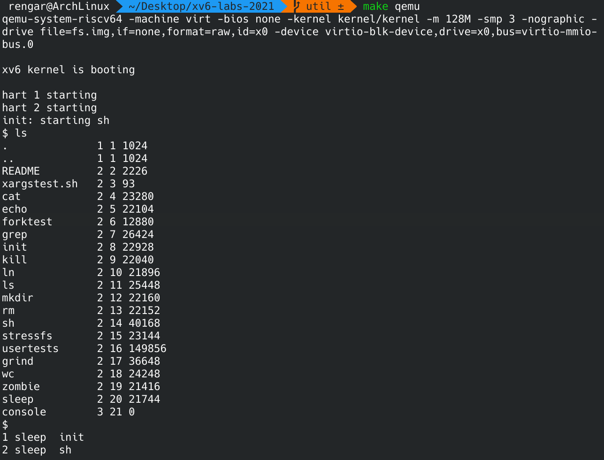
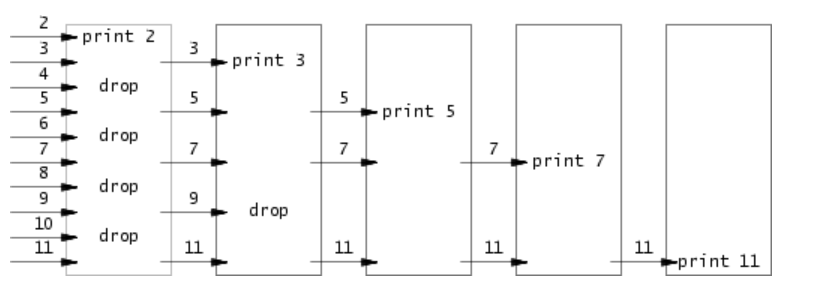
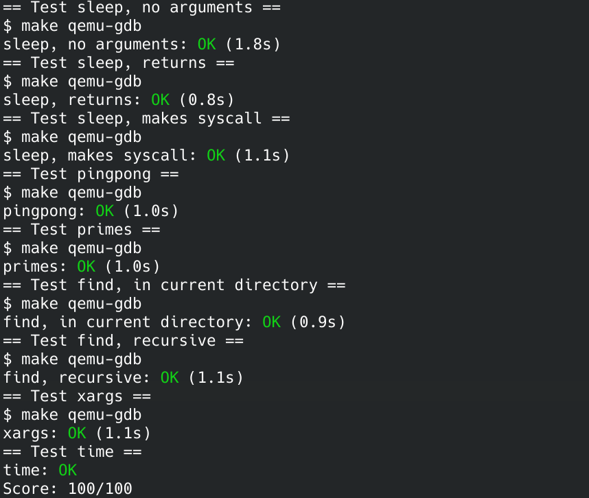

## OP
这天，小摩尔来到了城堡与他的伙伴们共度这美好的时刻。派对、烟花、喷泉、合影，真是令人难以忘记的一晚。


接下来，请尽情 燃烧我的 OS ！

<!--more-->

## 实验环境
> 操作系统：Arch Linux
> 内核版本：5.17.1-arch1-1（64-位）

这是 [课程官网](https://pdos.csail.mit.edu/6.S081/2021/)，以下内容都可以在课程官网找到。

1. 首先需要安装一些 [tools](https://pdos.csail.mit.edu/6.S081/2021/tools.html)
2. 阅读 [实验指导](https://pdos.csail.mit.edu/6.S081/2021/labs/guidance.html)
3. 还有一些 [阅读材料](https://pdos.csail.mit.edu/6.S081/2021/reference.html)，包括 Unix、Qemu、RISC-V
4. [xv6](https://pdos.csail.mit.edu/6.S081/2021/xv6.html)，[书](https://pdos.csail.mit.edu/6.S081/2021/xv6/book-riscv-rev2.pdf)

## 简介
本次实验可以让我们熟悉 xv6 以及系统调用。

## Boot xv6 (easy)
``` sh
git clone git://g.csail.mit.edu/xv6-labs-2021
cd xv6-labs-2021
git checkout util
make qemu
```
这样就启动了 xv6，可以输入 ls 查看当前文件，ctrl-p 查看进程。输入 ctrl-a x 退出。



## sleep (easy)
> Implement the UNIX program sleep for xv6; your sleep should pause for a user-specified number of ticks. A tick is a notion of time defined by the xv6 kernel, namely the time between two interrupts from the timer chip. Your solution should be in the file user/sleep.c.

``` c
// sleep.c
#include "kernel/types.h"
#include "kernel/stat.h"
#include "user/user.h"

int main(int argc, char **argv)
{
    if (argc < 2)
    {
        printf("usage: sleep <ticks>\n");
    }
    sleep(atoi(argv[1]));
    exit(0);
}
```
注意这里的 sleep 的参数单位不是秒，具体实现在 `kernel/sysproc.c` 中的 `sys_sleep`。然后把 sleep 加入 Makefile 中就可以 make qemu 运行使用 sleep 系统调用了。
``` Makefile
UPROGS=\
	$U/_cat\
	$U/_echo\
	$U/_forktest\
	$U/_grep\
	$U/_init\
	$U/_kill\
	$U/_ln\
	$U/_ls\
	$U/_mkdir\
	$U/_rm\
	$U/_sh\
	$U/_stressfs\
	$U/_usertests\
	$U/_grind\
	$U/_wc\
	$U/_zombie\
	$U/_sleep\
```

## pingpong (easy)
> Write a program that uses UNIX system calls to ''ping-pong'' a byte between two processes over a pair of pipes, one for each direction. The parent should send a byte to the child; the child should print "<pid>: received ping", where <pid> is its process ID, write the byte on the pipe to the parent, and exit; the parent should read the byte from the child, print "<pid>: received pong", and exit. Your solution should be in the file user/pingpong.c.

``` c
// pingpong.c
#include "kernel/types.h"
#include "kernel/stat.h"
#include "user/user.h"

int main(int argc, char **argv)
{
    int p2c[2], c2p[2];
    pipe(p2c); // 父进程 -> 子进程
    pipe(c2p); // 子进程 -> 父进程

    if (fork() != 0) // parent
    {
        write(p2c[1], "hello child!", 13);
        char buf[14];
        read(c2p[0], &buf, 14);
        printf("%d: received pong\n", getpid());
        wait(0);
    }
    else // child
    {
        char buf[13];
        read(p2c[0], &buf, 13);
        printf("%d: received ping\n", getpid());
        write(c2p[1], "hello parent!", 14);
    }
    exit(0);
}
```
使用了两个管道进行通信，如果使用一个管道的话一定要保证父进程写完管道后不能自己直接读取了，要让子进程先读取管道。

## primes (moderate)/(hard)
> Write a concurrent version of prime sieve using pipes. This idea is due to Doug McIlroy, inventor of Unix pipes. The picture halfway down this page and the surrounding text explain how to do it. Your solution should be in the file user/primes.c.

多进程求素数，思想来源于 [这篇文章](https://swtch.com/~rsc/thread/)。

每个进程读出从父进程通过管道写来的第一个数并打印，然后在取出其余的所有数的同时，把第一个数的倍数给筛除掉，然后把这些数再发给下一个进程。



``` c
// primes.c
#include "kernel/types.h"
#include "kernel/stat.h"
#include "user/user.h"

void seive(int left[])
{
    int prime;
    read(left[0], &prime, sizeof(prime));
    if (prime == -1) // 结束标志
    {
        exit(0);
    }
    printf("prime %d\n", prime);

    int right[2];
    pipe(right);
    if (fork != 0) // parent
    {
        close(right[0]); // 关闭读
        int num;
        while (read(left[0], &num, sizeof(num)) && num != -1)
        {
            if (num % prime != 0)
            {
                write(right[1], &num, sizeof(num));
            }
        }
        num = -1;                           // 结束标志
        write(right[1], &num, sizeof(num)); // 写入标志
        wait(0);
        exit(0);
    }
    else // child
    {
        close(right[1]);
        sieve(right);
        exit(0);
    }
}

int main(int argc, char **argv)
{
    int fd[2];
    pipe(fd);

    if (fork() != 0) // parent
    {
        close(fd[0]); // 关闭读
        int i;
        for (i = 2; i <= 35; i++)
        {
            write(fd[1], &i, sizeof(i));
        }
        i = -1;                      // 结束标志
        write(fd[1], &i, sizeof(i)); // 写入结束标志
    }
    else // child
    {
        close(fd[1]); // 关闭写
        sieve(fd);
        exit(0);
    }
    wait(0); // 等待直接子进程，无法等待间接子进程。在 sieve() 中会再各自执行 wait(0)，形成等待链。
    exit(0);
}
```
xv6 中进程能打开的文件描述符有限，所以进程对不需要用的描述符应该关闭，因为子进程会复制父进程的所有描述符，导致后面描述符不够。

## find (moderate)
> Write a simple version of the UNIX find program: find all the files in a directory tree with a specific name. Your solution should be in the file user/find.c.

按名字查找文件，只需要在 `user/ls.c` 的基础上稍微做点修改即可。注意的是如果要得到一个干净的文件系统，需要 make clean 之后再 make qemu 重新编译。
``` c
// find.c
#include "kernel/types.h"
#include "kernel/stat.h"
#include "user/user.h"
#include "kernel/fs.h"

char *fmtname(char *path)
{
    static char buf[DIRSIZ + 1];
    char *p;

    // Find first character after last slash.
    for (p = path + strlen(path); p >= path && *p != '/'; p--)
        ;
    p++;

    memmove(buf, p, strlen(p) + 1);
    return buf;
}

void find(char *path, char *target)
{
    char buf[512], *p;
    int fd;
    struct dirent de;
    struct stat st;

    if ((fd = open(path, 0)) < 0)
    {
        fprintf(2, "find: cannot open %s\n", path);
        return;
    }

    if (fstat(fd, &st) < 0)
    {
        fprintf(2, "find: cannot stat %s\n", path);
        close(fd);
        return;
    }

    switch (st.type)
    {
    case T_FILE: // 文件
        if (strcmp(fmtname(path), target) == 0)
        {
            printf("%s\n", path);
        }
        break;
    case T_DIR: // 目录
        if (strlen(path) + 1 + DIRSIZ + 1 > sizeof buf)
        {
            printf("find: path too long\n");
            break;
        }
        strcpy(buf, path);
        p = buf + strlen(buf);
        *p++ = '/';
        while (read(fd, &de, sizeof(de)) == sizeof(de))
        {
            if (de.inum == 0)
                continue;
            memmove(p, de.name, DIRSIZ);
            p[DIRSIZ] = 0;
            if (stat(buf, &st) < 0)
            {
                printf("find: cannot stat %s\n", buf);
                continue;
            }
            // 不要进入 `.` 和 `..`
            if (strcmp(de.name, ".") != 0 && strcmp(de.name, "..") != 0)
            {
                find(buf, target); // 递归查找
            }
        }
        break;
    }
    close(fd);
}

int main(int argc, char *argv[])
{
    if (argc < 3)
    {
        exit(0);
    }
    find(argv[1], argv[2]);
    exit(0);
}
```

## xargs (moderate)
> Write a simple version of the UNIX xargs program: read lines from the standard input and run a command for each line, supplying the line as arguments to the command. Your solution should be in the file user/xargs.c.

循环从标准输入读取一行，每一行单独作为 xargs 执行命令的参数。只需要先 fork 然后子进程 exec 执行命令即可。
``` c
// xargs.c
#include "kernel/types.h"
#include "kernel/stat.h"
#include "user/user.h"
#include "kernel/param.h"

void run(char *program, char **args)
{
    if (fork() == 0) // child
    {
        exec(program, args);
        exit(0);
    }
    return;
}

int main(int argc, char *argv[])
{
    char buf[2048];
    char *buf_end = buf, *buf_start = buf; // 当前参数的结束、开始指针
    char *argsbuf[MAXARG];                    // 全部参数列表
    char **args_start = argsbuf, **args_end = argsbuf;

    for (int i = 1; i < argc; i++)
    {
        *args_start++ = argv[i];
    }
    args_end = args_start; // 开始读入参数

    int stat = 1;
    while (stat) // 标准输入还有数据
    {
        while (1)         // 读取一行
        {
            stat = read(0, buf_end, 1);
            if (stat == 0)
                break;

            if (*buf_end == ' ')
            {
                *buf_end = '\0'; // 将空格替换为 \0 分割开各个参数，这样可以直接使用 buf 字符串作为参数字符串
                *args_end++ = buf_start;
                buf_start = buf_end + 1;
            }
            else if (*buf_end == '\n')
            {
                *buf_end = '\0';
                *args_end++ = buf_start;
                *args_end = 0;
                buf_start = buf_end + 1;
                break;
            }
            buf_end++;
        }
        
        if (args_start != args_end) run(argsbuf[0], argsbuf);
        args_end = args_start;

        wait(0);
    }

    exit(0);
}
```
这里参考别人的做法的时候给我最大的感觉的就是指针，我觉得真的太妙了，通过添加 \0，减少了内存的开销，直接让二维指针指向字符串。

## 实验测试
添加文件 `time.txt`，输入一个整数，表示你本次 lab 所花费的时间，然后 make grade。完成 lab 记得 git commit 提交。



## 实验总结
实验总体比较容易，理解起来也不费劲。通过实验熟悉了系统调用，多进程，希望能渐渐走入内核。喊出我们的口号：燃烧我的 OS ！