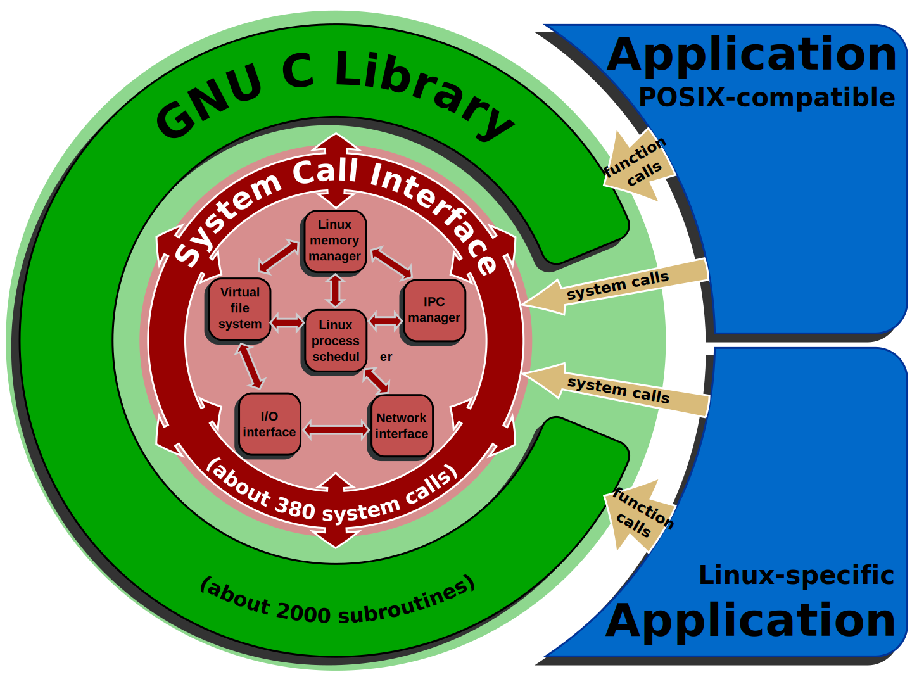
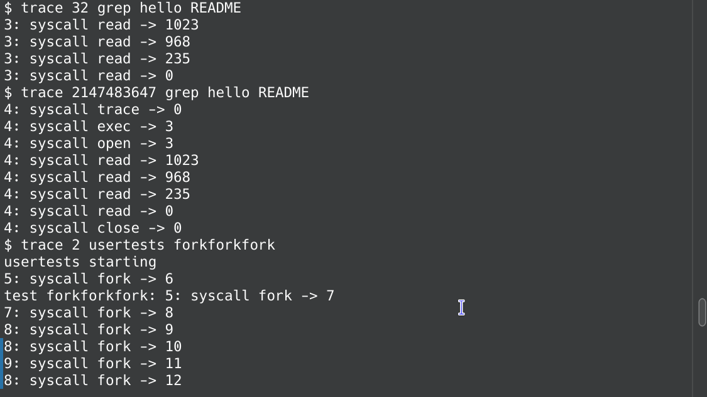
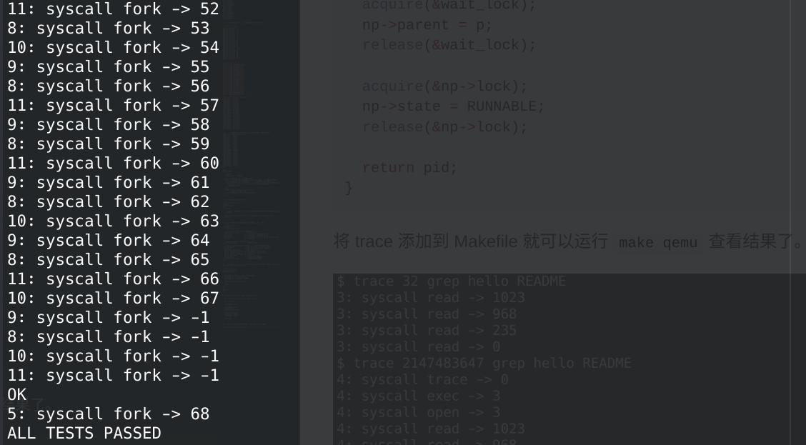
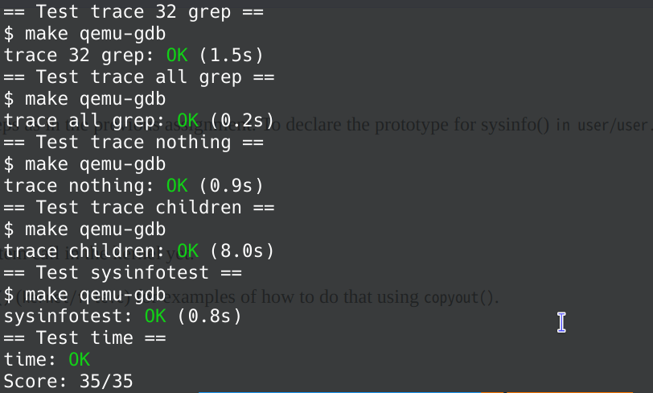

## OP
> 能源之城是机车族的重要战略地点，城主通过令牌控制守护城池，城池易守难攻，成为机车族抗击猛兽族的主要战场。
> --------------------------------------------《百变机兽之洛洛历险记》

洛洛，机车族机战王，是一名来自人类世界的小学六年级学生。充满热情、思绪奔放。聪明可爱的游戏高手，曾是校际电子竞技赛的第二名。起初只将机战战争看作游戏，但进入了游戏世界后，种种磨练让他变得更加勇敢和有正义感，最终成为机车族机器人的绝对领袖，多次策划计谋带领同伴度过难关。


能源之城的防御力是最高的，有中央导弹系统，可自动定位攻击敌人，城池下面的火龙山谷里有珍贵的能源紫水晶，可在短时间内恢复满能量和生命值。


守城令牌是圆形、水蓝色的。名叫“闪电令牌”，可调动能源之城一半的兵力。可以启动令牌绝招中央导弹系统。


在计算机体系中，用户程序可以通过系统调用向操作系统内核请求服务，就像兵队向城池中央请求服务那样。


<center style="font-size:16px;color:#C0C0C0;text-decoration:underline">系统调用（system calls）, Linux内核, GNU C库（glibc）.</center>
</br>

这是本次 [lab 指引](https://pdos.csail.mit.edu/6.S081/2021/labs/syscall.html)，关于实验环境和实验资料等更加详细的内容请查看 **我的第一个 lab** -- **Lab Utilities**。

<!--more-->

## 简介
> In the last lab you used systems calls to write a few utilities. In this lab you will add some new system calls to xv6, which will help you understand how they work and will expose you to some of the internals of the xv6 kernel. You will add more system calls in later labs.

本次 lab 需要我们向 xv6 添加一些系统调用。进行实验前，请先阅读 xv6 book 的第二章和第四章的三四节。

> Before you start coding, read Chapter 2 of the xv6 book, and Sections 4.3 and 4.4 of Chapter 4, and related source files:
> - The user-space code for systems calls is in user/user.h and user/usys.pl.
> - The kernel-space code is kernel/syscall.h, kernel/syscall.c.
> - The process-related code is kernel/proc.h and kernel/proc.c.

首先切换到 syscall 分支。
``` sh
git fetch
git checkout syscall
make clean
```

## System call tracing (moderate)
> In this assignment you will add a system call tracing feature that may help you when debugging later labs. You'll create a new trace system call that will control tracing. It should take one argument, an integer "mask", whose bits specify which system calls to trace. For example, to trace the fork system call, a program calls trace(1 << SYS_fork), where SYS_fork is a syscall number from kernel/syscall.h. You have to modify the xv6 kernel to print out a line when each system call is about to return, if the system call's number is set in the mask. The line should contain the process id, the name of the system call and the return value; you don't need to print the system call arguments. The trace system call should enable tracing for the process that calls it and any children that it subsequently forks, but should not affect other processes.

添加一个系统调用跟踪功能。采用一个参数，一个整数“掩码”，其位指定要跟踪的系统调用。例如，为了跟踪 fork 系统调用，程序调用 trace(1 << SYS_fork)，其中 SYS_fork 是来自 kernel/syscall.h 的系统调用号。如果掩码中设置了系统调用的编号，则必须修改 xv6 内核以在每个系统调用即将返回时打印出一行。该行应包含进程id、系统调用的名称和返回值；您不需要打印系统调用参数。跟踪系统调用应该启用对调用它的进程以及它随后派生的任何子进程的跟踪，但不应影响其他进程。

比如 `read` 的系统调用编号是 5，那么 1 << 5，即 32 可设置为 mask，如果调用 trace(32) 的话那么将会输出 `read` 系统调用的信息。在内核中就是让 (32 >> 5) & 1，如果结果不为 0 的话就输出进程信息。

系统调用流程：
``` txt
user/user.h:                  用户态程序调用 trace()
user/usys.S:(usys.pl产生的)   trace() 使用 risc-v CPU 提供的 ecall 指令，进入内核态
kernel/syscall.c              内核态统一系统调用处理函数 syscall()，所有系统调用都会跳到这里来处理。
kernel/sysproc.c              到达 sys_trace() 函数，执行具体内核操作
```

比较关键的 a0 和 a7 寄存器，其中 a7 寄存器保存着系统调用编号从用户态传递至内核态，a0 寄存器用了两次，一次保存 mask，另一次保存系统调用的返回值。

1. 在 `user/user.h` 中添加 `trace()`。
``` c
// user/user.h
// system calls
int fork(void);
int exit(int) __attribute__((noreturn));
int wait(int*);
int pipe(int*);
int write(int, const void*, int);
int read(int, void*, int);
int close(int);
int kill(int);
int exec(char*, char**);
int open(const char*, int);
int mknod(const char*, short, short);
int unlink(const char*);
int fstat(int fd, struct stat*);
int link(const char*, const char*);
int mkdir(const char*);
int chdir(const char*);
int dup(int);
int getpid(void);
char* sbrk(int);
int sleep(int);
int uptime(void);
int trace(int);		// 添加
```

2. 在 `user/usys.pl` 中添加 entry。
``` perl
# user/usys.pl
entry("fork");
entry("exit");
entry("wait");
entry("pipe");
entry("read");
entry("write");
entry("close");
entry("kill");
entry("exec");
entry("open");
entry("mknod");
entry("unlink");
entry("fstat");
entry("link");
entry("mkdir");
entry("chdir");
entry("dup");
entry("getpid");
entry("sbrk");
entry("sleep");
entry("uptime");
entry("trace");  # 添加
```

3. 在 `kernel/syscall.h` 和 `kernel/syscall.c` 中添加。
``` c
// kernel/syscall.h
// System call numbers
#define SYS_fork    1
#define SYS_exit    2
#define SYS_wait    3
#define SYS_pipe    4
#define SYS_read    5
#define SYS_kill    6
#define SYS_exec    7
#define SYS_fstat   8
#define SYS_chdir   9
#define SYS_dup    10
#define SYS_getpid 11
#define SYS_sbrk   12
#define SYS_sleep  13
#define SYS_uptime 14
#define SYS_open   15
#define SYS_write  16
#define SYS_mknod  17
#define SYS_unlink 18
#define SYS_link   19
#define SYS_mkdir  20
#define SYS_close  21
#define SYS_trace  22 // 添加
```
``` c
// kernel/syscall.c
extern uint64 sys_chdir(void);
extern uint64 sys_close(void);
extern uint64 sys_dup(void);
extern uint64 sys_exec(void);
extern uint64 sys_exit(void);
extern uint64 sys_fork(void);
extern uint64 sys_fstat(void);
extern uint64 sys_getpid(void);
extern uint64 sys_kill(void);
extern uint64 sys_link(void);
extern uint64 sys_mkdir(void);
extern uint64 sys_mknod(void);
extern uint64 sys_open(void);
extern uint64 sys_pipe(void);
extern uint64 sys_read(void);
extern uint64 sys_sbrk(void);
extern uint64 sys_sleep(void);
extern uint64 sys_unlink(void);
extern uint64 sys_wait(void);
extern uint64 sys_write(void);
extern uint64 sys_uptime(void);
extern uint64 sys_trace(void);   // 添加

static uint64 (*syscalls[])(void) = {
[SYS_fork]    sys_fork,
[SYS_exit]    sys_exit,
[SYS_wait]    sys_wait,
[SYS_pipe]    sys_pipe,
[SYS_read]    sys_read,
[SYS_kill]    sys_kill,
[SYS_exec]    sys_exec,
[SYS_fstat]   sys_fstat,
[SYS_chdir]   sys_chdir,
[SYS_dup]     sys_dup,
[SYS_getpid]  sys_getpid,
[SYS_sbrk]    sys_sbrk,
[SYS_sleep]   sys_sleep,
[SYS_uptime]  sys_uptime,
[SYS_open]    sys_open,
[SYS_write]   sys_write,
[SYS_mknod]   sys_mknod,
[SYS_unlink]  sys_unlink,
[SYS_link]    sys_link,
[SYS_mkdir]   sys_mkdir,
[SYS_close]   sys_close,
[SYS_trace]   sys_trace,  // 添加
};

// 添加一个系统调用名字映射表，用于 trace 跟踪时输出系统调用的名字
const char *syscall_names[] = {
[SYS_fork]    "fork",
[SYS_exit]    "exit",
[SYS_wait]    "wait",
[SYS_pipe]    "pipe",
[SYS_read]    "read",
[SYS_kill]    "kill",
[SYS_exec]    "exec",
[SYS_fstat]   "fstat",
[SYS_chdir]   "chdir",
[SYS_dup]     "dup",
[SYS_getpid]  "getpid",
[SYS_sbrk]    "sbrk",
[SYS_sleep]   "sleep",
[SYS_uptime]  "uptime",
[SYS_open]    "open",
[SYS_write]   "write",
[SYS_mknod]   "mknod",
[SYS_unlink]  "unlink",
[SYS_link]    "link",
[SYS_mkdir]   "mkdir",
[SYS_close]   "close",
[SYS_trace]   "trace",
};

void
syscall(void)
{
  int num;
  struct proc *p = myproc();

  num = p->trapframe->a7; // 系统调用编号
  if(num > 0 && num < NELEM(syscalls) && syscalls[num]) { // 系统调用编号有效
    p->trapframe->a0 = syscalls[num](); // 执行系统调用，a0 保存返回值
    if((p->syscall_trace >> num) & 1) { // syscall_trace 就是 mask，后面会定义
      printf("%d: syscall %s -> %d\n",p->pid, syscall_names[num], p->trapframe->a0);
    }
  } else {
    printf("%d %s: unknown sys call %d\n",
            p->pid, p->name, num);
    p->trapframe->a0 = -1; // 调用失败，返回值 -1
  }
}
```

4. 在 `kernel/sysproc.c` 添加。
``` c
// kernel/sysproc.c
uint64
sys_trace(void)
{
  int mask;

  if (argint(0, &mask) < 0) // mask = p->trapframe->a0，a0 保存着用户态的 mask
    return -1;

  myproc()->syscall_trace = mask; // 将 mask 赋值给进程的 syscall_trace
  return 0;
}
```

5. 本来进程是没有 `syscall_trace` 的，在最后一行添加一下。
``` c
// kernel/proc.h
struct proc {
  struct spinlock lock;

  // p->lock must be held when using these:
  enum procstate state;        // Process state
  void *chan;                  // If non-zero, sleeping on chan
  int killed;                  // If non-zero, have been killed
  int xstate;                  // Exit status to be returned to parent's wait
  int pid;                     // Process ID

  // wait_lock must be held when using this:
  struct proc *parent;         // Parent process

  // these are private to the process, so p->lock need not be held.
  uint64 kstack;               // Virtual address of kernel stack
  uint64 sz;                   // Size of process memory (bytes)
  pagetable_t pagetable;       // User page table
  struct trapframe *trapframe; // data page for trampoline.S
  struct context context;      // swtch() here to run process
  struct file *ofile[NOFILE];  // Open files
  struct inode *cwd;           // Current directory
  char name[16];               // Process name (debugging)
  uint64 syscall_trace;        // ！！！！！！！！Mask
};
```

6. 为 `syscall_trace` 提供初始值，最后根据 lab 提示，还需要在 fork 中让子进程能够继承父进程的 `syscall_trace`。
``` c
// kernel/proc.c
static struct proc*
allocproc(void)
{
                ...............
  memset(&p->context, 0, sizeof(p->context));
  p->context.ra = (uint64)forkret;
  p->context.sp = p->kstack + PGSIZE;

  p->syscall_trace = 0; // 添加！

  return p;
}

int
fork(void)
{
                .............

  safestrcpy(np->name, p->name, sizeof(p->name));

  np->syscall_trace = p->syscall_trace; // 添加！

  pid = np->pid;

  release(&np->lock);

  acquire(&wait_lock);
  np->parent = p;
  release(&wait_lock);

  acquire(&np->lock);
  np->state = RUNNABLE;
  release(&np->lock);

  return pid;
}
```

将 trace 添加到 Makefile 就可以运行 `make qemu` 查看结果了。




## Sysinfo (moderate)
> In this assignment you will add a system call, sysinfo, that collects information about the running system. The system call takes one argument: a pointer to a struct sysinfo (see kernel/sysinfo.h). The kernel should fill out the fields of this struct: the freemem field should be set to the number of bytes of free memory, and the nproc field should be set to the number of processes whose state is not UNUSED. We provide a test program sysinfotest; you pass this assignment if it prints "sysinfotest: OK".

添加一个系统调用，返回空闲的内存、以及已创建的进程数量。

1. 在 `user/user.h` 中添加 `sysinfo()`。
``` c
// user/user.h
struct stat;
struct rtcdate;
struct sysinfo;  // 添加

int fork(void);
int exit(int) __attribute__((noreturn));
int wait(int*);
int pipe(int*);
int write(int, const void*, int);
int read(int, void*, int);
int close(int);
int kill(int);
int exec(char*, char**);
int open(const char*, int);
int mknod(const char*, short, short);
int unlink(const char*);
int fstat(int fd, struct stat*);
int link(const char*, const char*);
int mkdir(const char*);
int chdir(const char*);
int dup(int);
int getpid(void);
char* sbrk(int);
int sleep(int);
int uptime(void);
int trace(int);
int sysinfo(struct sysinfo *); // 添加
```

2. 在 `user/usys.pl` 中添加 entry。
``` perl
# user/usys.pl
entry("fork");
entry("exit");
entry("wait");
entry("pipe");
entry("read");
entry("write");
entry("close");
entry("kill");
entry("exec");
entry("open");
entry("mknod");
entry("unlink");
entry("fstat");
entry("link");
entry("mkdir");
entry("chdir");
entry("dup");
entry("getpid");
entry("sbrk");
entry("sleep");
entry("uptime");
entry("trace");
entry("sysinfo"); # 添加
```

3. 在 `kernel/syscall.h` 和 `kernel/syscall.c` 中添加。
``` c
// kernel/syscall.h
// System call numbers
#define SYS_fork    1
#define SYS_exit    2
#define SYS_wait    3
#define SYS_pipe    4
#define SYS_read    5
#define SYS_kill    6
#define SYS_exec    7
#define SYS_fstat   8
#define SYS_chdir   9
#define SYS_dup    10
#define SYS_getpid 11
#define SYS_sbrk   12
#define SYS_sleep  13
#define SYS_uptime 14
#define SYS_open   15
#define SYS_write  16
#define SYS_mknod  17
#define SYS_unlink 18
#define SYS_link   19
#define SYS_mkdir  20
#define SYS_close  21
#define SYS_trace  22
#define SYS_sysinfo 23 // 添加
```
``` c
// kernel/syscall.c
extern uint64 sys_chdir(void);
extern uint64 sys_close(void);
extern uint64 sys_dup(void);
extern uint64 sys_exec(void);
extern uint64 sys_exit(void);
extern uint64 sys_fork(void);
extern uint64 sys_fstat(void);
extern uint64 sys_getpid(void);
extern uint64 sys_kill(void);
extern uint64 sys_link(void);
extern uint64 sys_mkdir(void);
extern uint64 sys_mknod(void);
extern uint64 sys_open(void);
extern uint64 sys_pipe(void);
extern uint64 sys_read(void);
extern uint64 sys_sbrk(void);
extern uint64 sys_sleep(void);
extern uint64 sys_unlink(void);
extern uint64 sys_wait(void);
extern uint64 sys_write(void);
extern uint64 sys_uptime(void);
extern uint64 sys_trace(void);
extern uint64 sys_sysinfo(void);   // 添加

static uint64 (*syscalls[])(void) = {
[SYS_fork]    sys_fork,
[SYS_exit]    sys_exit,
[SYS_wait]    sys_wait,
[SYS_pipe]    sys_pipe,
[SYS_read]    sys_read,
[SYS_kill]    sys_kill,
[SYS_exec]    sys_exec,
[SYS_fstat]   sys_fstat,
[SYS_chdir]   sys_chdir,
[SYS_dup]     sys_dup,
[SYS_getpid]  sys_getpid,
[SYS_sbrk]    sys_sbrk,
[SYS_sleep]   sys_sleep,
[SYS_uptime]  sys_uptime,
[SYS_open]    sys_open,
[SYS_write]   sys_write,
[SYS_mknod]   sys_mknod,
[SYS_unlink]  sys_unlink,
[SYS_link]    sys_link,
[SYS_mkdir]   sys_mkdir,
[SYS_close]   sys_close,
[SYS_trace]   sys_trace,
[SYS_sysinfo] sys_sysinfo,  // 添加
};

// 添加一个系统调用名字映射表，用于 trace 跟踪时输出系统调用的名字
const char *syscall_names[] = {
[SYS_fork]    "fork",
[SYS_exit]    "exit",
[SYS_wait]    "wait",
[SYS_pipe]    "pipe",
[SYS_read]    "read",
[SYS_kill]    "kill",
[SYS_exec]    "exec",
[SYS_fstat]   "fstat",
[SYS_chdir]   "chdir",
[SYS_dup]     "dup",
[SYS_getpid]  "getpid",
[SYS_sbrk]    "sbrk",
[SYS_sleep]   "sleep",
[SYS_uptime]  "uptime",
[SYS_open]    "open",
[SYS_write]   "write",
[SYS_mknod]   "mknod",
[SYS_unlink]  "unlink",
[SYS_link]    "link",
[SYS_mkdir]   "mkdir",
[SYS_close]   "close",
[SYS_trace]   "trace",
[SYS_sysinfo] "sysinfo", // 添加
};
```

4. 在 `kernel/sysproc.c` 添加。
``` c
// kernel/sysproc.c
#include "sysinfo.h" // 添加

uint64
sys_sysinfo(void)
{
  uint64 addr;
  if(argaddr(0, &addr) < 0)
    return -1;
  
  struct sysinfo info;
  info.freemem = count_free_mem();
  info.nproc = count_process();
  
  // 将 info 写入用户空间地址(addr)
  if(copyout(myproc()->pagetable, addr, (char *)&info, sizeof(info)) < 0)
    return -1;
  return 0;
}
```

5. 在 `kernel/defs.h` 中声明 `count_free_mem()` 和 `count_process()`。
``` c
// kernel/defs.h
// kalloc.c
void*           kalloc(void);
void            kfree(void *);
void            kinit(void);
uint64          count_free_mem(void); // 添加

// proc.c
int             cpuid(void);
void            exit(int);
int             fork(void);
int             growproc(int);
void            proc_mapstacks(pagetable_t);
pagetable_t     proc_pagetable(struct proc *);
void            proc_freepagetable(pagetable_t, uint64);
int             kill(int);
struct cpu*     mycpu(void);
struct cpu*     getmycpu(void);
struct proc*    myproc();
void            procinit(void);
void            scheduler(void) __attribute__((noreturn));
void            sched(void);
void            sleep(void*, struct spinlock*);
void            userinit(void);
int             wait(uint64);
void            wakeup(void*);
void            yield(void);
int             either_copyout(int user_dst, uint64 dst, void *src, uint64 len);
int             either_copyin(void *dst, int user_src, uint64 src, uint64 len);
void            procdump(void);
uint64          count_process(void); // 添加
```

6. 在 `kernel/kalloc.c` 中实现 `count_free_mem()`，在 `kernel/proc.c` 中实现 `count_process()`。
``` c
// kernel/kalloc.c
uint64
count_free_mem(void)
{
  acquire(&kmem.lock);
  
  uint64 free_mem = 0;
  struct run *r = kmem.freelist;
  while(r){
    free_mem++;
    r = r->next;
  }

  release(&kmem.lock);

  return free_mem * PGSIZE;
}
```
``` c
// kernel/proc.c
uint64
count_process(void) {
  uint64 cnt = 0;
  for(struct proc *p = proc; p < &proc[NPROC]; p++) {
    if(p->state != UNUSED) {
        cnt++;
    }
  }
  return cnt;
}
```
最后不要忘了加入 Makefile。

## 实验结果
添加 time.txt，输入一个数字后运行 make grade。完成 lab 记得 git commit 提交。



## 实验总结
通过这次实验了解了内核代码与用户代码之间的区别与联系，同时了解进程相关的代码。燃烧我的 OS！