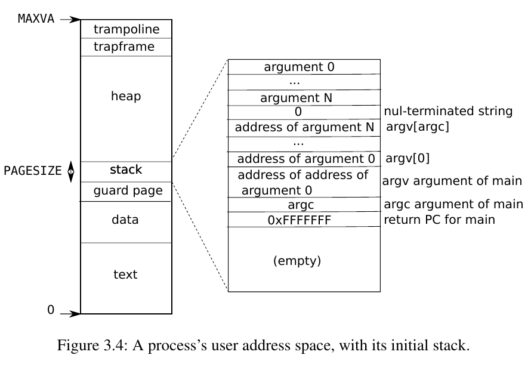
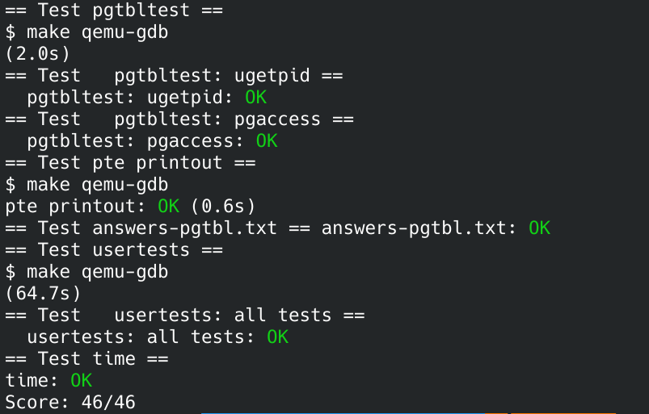

## OP
> 没有办法控制的事情太多了。
> 人家会常说你为什么要运动，因为跑步是一件很简单的事情，左脚比右脚往前，就这样而已，没有什么难的。
> 但是今天如果我们在开工前、上班前，能挪出时间，哪怕 20 分钟的做普拉提或者是半个小时的跑步，我设定的 plan，我做了 check，我冲了一杯咖啡，我做了 check。
> 那么我就会觉得，我今天有点不太一样，有点自信。我今天看到异性也有点自信，我看到老板，我也觉得你说什么我都没问题。
> 因为我已经很强大，我今天该做的都做了。
> 我练了四十分钟的健身，很重的训练，你的工作打击不到我，我规定自己的 40 分钟运动全部做到了。如果我能够做到，我就没有问题。
> 可是如果我规定我要做够 40 分钟，但我只坚持了 5 分钟就放弃了。那这个就是你的问题了，因为你自己都没办法控制你自己，那你怎么能够控制外界那些不定未知的东西呢？
> -----------------------------------------《一段来自彭于晏的采访》


人需要身材管理、时间管理... 操作系统需要内存管理，而内存管理中的一个重要结构就是页表。人可以通过一个 Schedule 管理自己，操作系统通过页表对内存进行管理。

<!--more-->

## 简介
这是本次 [lab 指引](https://pdos.csail.mit.edu/6.S081/2021/labs/pgtbl.html)，关于实验环境和实验资料等更加详细的内容请查看 **我的第一个 lab** -- **Lab Utilities**。

本次实验我们将探索内存管理的重要机制 -- 分页管理。
> 实验开始前需要阅读 xv6 book 第三章以及下列文件：
> 1. kern/memlayout.h, which captures the layout of memory.
> 2. kern/vm.c, which contains most virtual memory (VM) code.
> 3. kernel/kalloc.c, which contains code for allocating and freeing physical memory.

首先建立好实验环境。
``` sh
git fetch
git checkout pgtbl
make clean
```

## Speed up system calls (easy)
执行系统调用时，CPU 要在内核态与用户态之间切换，需要一定的开销，我们可以对系统调用进行加速，方法就是为每个进程多分配一个页面，在 `TRAPFRAME` 的下面，然后内核往这个页面地址写入内容即可。这样的话，执行系统调用的时候，就可以直接从用户空间取出数据来，不需要进入内核态了。



``` c
// user/ulib.c
#ifdef LAB_PGTBL
int
ugetpid(void)
{
  struct usyscall *u = (struct usyscall *)USYSCALL;
  return u->pid;
}
#endif
```
`ugetpid()` 系统调用直接从 `USYSCALL` 这个地址取数据。

kalloc() 内核在内存中找到一个空闲页面，为进程分配这个空闲页面，对于进程来说，这个页面在物理上大概率跟进程的其他页面是不连续的，所以需要映射到他自己的空间也就是 `trapframe` 的下面，使得在进程看来，这个页面是跟 `trapframe` 连续的，所以需要 `mappage`。这个页的内容是一个 `usyscall` 结构体：
``` c
// kernel/memlayout.h
// 这个是灰色的没关系，不用管。
#ifdef LAB_PGTBL
#define USYSCALL (TRAPFRAME - PGSIZE)  // USYSCALl = 3FFFFFD000

struct usyscall {
    int pid;  // Process ID
};
#endif
```

1. 首先为进程添加 `usyscall` 指针：
``` c
// kernel/proc.h
struct proc {
  struct spinlock lock;

  // p->lock must be held when using these:
  enum procstate state;        // Process state
  void *chan;                  // If non-zero, sleeping on chan
  int killed;                  // If non-zero, have been killed
  int xstate;                  // Exit status to be returned to parent's wait
  int pid;                     // Process ID

  // wait_lock must be held when using this:
  struct proc *parent;         // Parent process

  // these are private to the process, so p->lock need not be held.
  uint64 kstack;               // Virtual address of kernel stack
  uint64 sz;                   // Size of process memory (bytes)
  pagetable_t pagetable;       // User page table
  struct trapframe *trapframe; // data page for trampoline.S
  struct usyscall *usyscall;   // ！添加！
  struct context context;      // swtch() here to run process
  struct file *ofile[NOFILE];  // Open files
  struct inode *cwd;           // Current directory
  char name[16];               // Process name (debugging)
};
```

2. 然后在为进程分配这个页面：
``` c
// kernel/proc.c
static struct proc*
allocproc(void)
{
  ................

  // Allocate a trapframe page.
  if((p->trapframe = (struct trapframe *)kalloc()) == 0){
    freeproc(p);
    release(&p->lock);
    return 0;
  }

  // 添加：分配一个 usyscall 页面
  if((p->usyscall = (struct usyscall *)kalloc()) == 0){
    freeproc(p);
    release(&p->lock);
    return 0;
  }

  // An empty user page table.
  p->pagetable = proc_pagetable(p);
  
  ..............
}
```

3. 然后在 `proc_pagetable()` 中进行映射：
``` c
// kernel/proc.c
pagetable_t
proc_pagetable(struct proc *p)
{
  ......

  // 添加！！！
  if (mappages(pagetable, USYSCALL, PGSIZE,
              (uint64)(p->usyscall), PTE_R | PTE_U) < 0){
    uvmunmap(pagetable, TRAMPOLINE, 1, 0); // 映射失败需要释放
    uvmunmap(pagetable, TRAPFRAME, 1, 0);  // 映射失败需要释放
    uvmfree(pagetable, 0);                 // 映射失败需要释放
    return 0;
  }

  return pagetable;
}
```

4. 映射完成，初始化即可，将进程的 pid 写入到映射的页面：
``` c
// kernel/proc.c
static struct proc*
allocproc(void)
{
  ............

  p->usyscall->pid = p->pid;
  return p;
}
```

5. 然后进程回收的时候需要解除映射和回收页面：
``` c
// kernel/proc.c
static void
freeproc(struct proc *p)
{
  ........

  if(p->usyscall)
    kfree((void*)p->usyscall);
  p->usyscall = 0;
}
```
``` c
// kernel/proc.c
void
proc_freepagetable(pagetable_t pagetable, uint64 sz)
{
  uvmunmap(pagetable, TRAMPOLINE, 1, 0);
  uvmunmap(pagetable, TRAPFRAME, 1, 0);
  uvmunmap(pagetable, USYSCALL, 1, 0);
  uvmfree(pagetable, sz);
}
```

> 可以忽略掉上述过程中产生的报错信息，因为是没有 #define LAB_PGTBL，编译的时候会自动加上的，所以不用理。

## Print a page table (easy)

三层 for 循环打印三级页表内容即可：
``` c
// kernel/vm.c
void vmprint(pagetable_t pagetable)
{
  printf("page table %p\n", pagetable);

  // 一级页表
  for (int i = 0; i < 512; ++i)
  {
    pte_t top_pte = pagetable[i];
    if (top_pte & PTE_V)
    {
      printf("..%d: pte %p pa %p\n", i, top_pte, PTE2PA(top_pte));

      // 二级页表
      pagetable_t mid_table = (pagetable_t)PTE2PA(top_pte);
      for (int j = 0; j < 512; ++j)
      {
        pte_t mid_pte = mid_table[j];
        if (mid_pte & PTE_V)
        {
          printf(".. ..%d: pte %p pa %p\n", j, mid_pte, PTE2PA(mid_pte));

          // 三级页表
          pagetable_t bot_table = (pagetable_t)PTE2PA(mid_pte);
          for (int k = 0; k < 512; ++k)
          {
            pte_t bot_pte = bot_table[k];
            if (bot_pte & PTE_V)
            {
              printf(".. .. ..%d: pte %p pa %p\n", k, bot_pte, PTE2PA(bot_pte));
            }
          }
        }
      }
    }
  }
}
```
然后在 kernel/defs.h 中声明：
``` c
// kernel/defs.h
.............
// vm.c
void            kvminit(void);
void            kvminithart(void);
void            kvmmap(pagetable_t, uint64, uint64, uint64, int);
int             mappages(pagetable_t, uint64, uint64, uint64, int);
pagetable_t     uvmcreate(void);
void            uvminit(pagetable_t, uchar *, uint);
uint64          uvmalloc(pagetable_t, uint64, uint64);
uint64          uvmdealloc(pagetable_t, uint64, uint64);
int             uvmcopy(pagetable_t, pagetable_t, uint64);
void            uvmfree(pagetable_t, uint64);
void            uvmunmap(pagetable_t, uint64, uint64, int);
void            uvmclear(pagetable_t, uint64);
uint64          walkaddr(pagetable_t, uint64);
int             copyout(pagetable_t, uint64, char *, uint64);
int             copyin(pagetable_t, char *, uint64, uint64);
int             copyinstr(pagetable_t, char *, uint64, uint64);

void            vmprint(pagetable_t pagetable); // 添加
.............
```

在 `kernel/exec.c` 中的 return argc 之前插入 if(p->pid==1) vmprint(p->pagetable)：
``` c
// kernel/exec.c
........
if(p->pid == 1) vmprint(p->pagetable);
  return argc; // this ends up in a0, the first argument to main(argc, argv)
........
```

## Detecting which pages have been accessed (hard)

通过 PTE_A，检测哪些页面已被访问。

> 添加一个新功能，该功能通过检查 RISC-V 页表中的访问位来检测并向用户空间报告此信息。RISC-V 硬件页面遍历器在解决 TLB 未命中时在 PTE 中标记这些位。

> Your job is to implement pgaccess(), a system call that reports which pages have been accessed. The system call takes three arguments. First, it takes the starting virtual address of the first user page to check. Second, it takes the number of pages to check. Finally, it takes a user address to a buffer to store the results into a bitmask (a datastructure that uses one bit per page and where the first page corresponds to the least significant bit). You will receive full credit for this part of the lab if the pgaccess test case passes when running pgtbltest.

在 `kernel/sysproc.c` 中定义 `sys_pgaccess()`，返回一个整数，整数的第 0 位为 1 就代表页面 0 已被访问，第 1 位为 1 就代表页面 1 已被访问...
``` c
// kernel/sysproc.c
#ifdef LAB_PGTBL
int sys_pgaccess(void)
{
  // lab pgtbl: your code here.
  uint64 page_start;  // 页表起始指针
  int page_num;       // 页表个数
  uint64 user_addr;   // 稍后会通过 copyout 写入用户内存
  if (argaddr(0, &page_start) < 0) return -1;
  if (argint (1, &page_num)   < 0) return -1;
  if (argaddr(2, &user_addr)  < 0) return -1;
  
  uint64 bitmap = 0;
  struct proc *p = myproc();
  pagetable_t pagetable = p->pagetable;
  for (int i = 0; i < page_num; i++)
  {
    pte_t *pte = walk(pagetable, ((uint64)page_start) + (uint64)PGSIZE * i, 0);
    if (pte != 0 && ((*pte) & PTE_A))
    {
      bitmap |= 1 << i;
      *pte ^= PTE_A; // 清除 PTE_A
    }
  }
  return copyout(p->pagetable, user_addr, (char *)&bitmap, sizeof(bitmap));
}
#endif
```

在 `kernel/defs.h` 中添加 `walk()` 声明：
``` c
// kernel/defs.h
.........
// vm.c
void            kvminit(void);
void            kvminithart(void);
void            kvmmap(pagetable_t, uint64, uint64, uint64, int);
int             mappages(pagetable_t, uint64, uint64, uint64, int);
pagetable_t     uvmcreate(void);
void            uvminit(pagetable_t, uchar *, uint);
uint64          uvmalloc(pagetable_t, uint64, uint64);
uint64          uvmdealloc(pagetable_t, uint64, uint64);
int             uvmcopy(pagetable_t, pagetable_t, uint64);
void            uvmfree(pagetable_t, uint64);
void            uvmunmap(pagetable_t, uint64, uint64, int);
void            uvmclear(pagetable_t, uint64);
uint64          walkaddr(pagetable_t, uint64);
int             copyout(pagetable_t, uint64, char *, uint64);
int             copyin(pagetable_t, char *, uint64, uint64);
int             copyinstr(pagetable_t, char *, uint64, uint64);

void            vmprint(pagetable_t pagetable); // 添加
pte_t *         walk(pagetable_t pagetable, uint64 va, int alloc); // 添加
..........
```

在 `kernel/riscv.h` 中定义 `PTE_A`：
``` c
// kernel/riscv.h
.........
#define PTE_A	(1L << 6)
```

## 实验结果
创建文件 `answers-pgtbl.txt` 写下实验问题的答案（如果字数太少会被检测出来，哈哈不要问我为什么知道），创建文件 `time.txt` 写入实验时间。make grade 评分：



`Test usertests` 的时候要等一段时间，不要忘记 git commit 提交。

## 实验总结
总算是对进程和页表有更深的了解了，实验还在继续... 燃烧我的 OS！