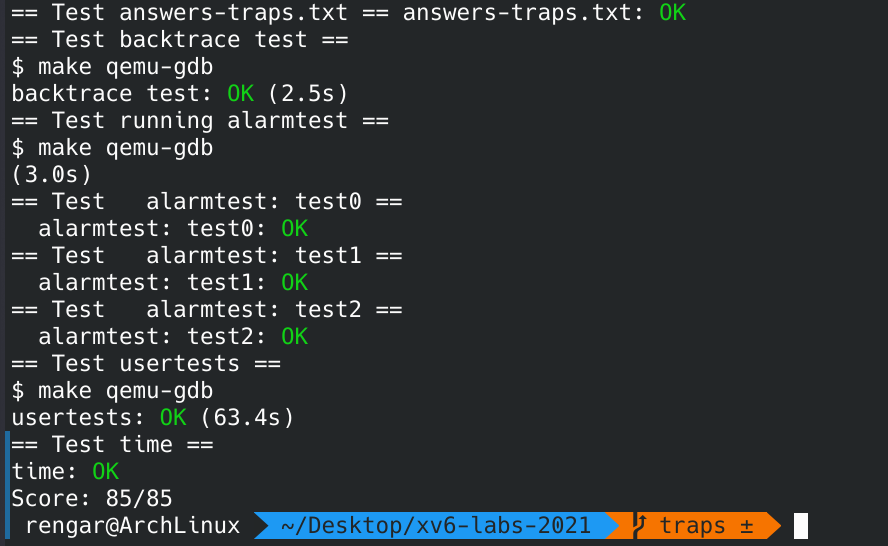

## OP
> They're my past, Martin. Everybody's haunted by their past.
> 他们是我的过去，其实每个人都被过去所缠绕。
> ----------电影《美丽心灵》


影片男主 John Nash 患有精神分裂症，与脑海中想象的朋友共同生活了几十年，曾经也住院治疗过，不过还是复发了，在妻子的支持下，他决定回到普林斯顿大学这个熟悉的地方重新开始群居生活，主动战胜精神分裂症，然而脑海中那些人依然在他的周围喋喋不休。在他的老年时期，他说出了这样的话，这些脑海中的人是我的过去，其实每个人都会被过去所缠绕。他的做法是忽略那些脑海中的人，即使他们一直存在并缠绕着他。

是啊，我们也许不会有精神分裂症，不会有脑海中的人影响我们，但是我们又是怎么面对自己的过去的呢？我们也会被过去所缠绕吗？

<!--more-->

在操作系统中，中断/异常 发生时，需要跳转到内核执行处理，然而内核也会被过去所“缠绕”，内核也需要保存一些跳转前的信息如寄存器和状态等。

## 简介
这是本次 [lab 指引](https://pdos.csail.mit.edu/6.S081/2021/labs/traps.html)，关于实验环境和实验资料等更加详细的内容请查看 **我的第一个 lab** -- **Lab Utilities**。

This lab explores how system calls are implemented using traps.
> 实验开始前需要阅读 xv6 book 第四章以及下列文件：
> 1. kernel/trampoline.S: the assembly involved in changing from user space to kernel space and back 用户空间和内核空间的转换
> 2. kernel/trap.c: code handling all interrupts 中断处理代码

实验环境：
``` sh
git fetch
git checkout traps
make clean
```

## RISC-V assembly (easy)
`make fs.img` 编译出 `user/call.asm`，新建文件 `answers-traps.txt` 并回答下列问题：
``` txt
Q: 函数参数保存在哪些寄存器？ main 调用 printf 时 13 被保存在哪个寄存器？
A: a0-a7；a2。

Q: main 函数调用 f 函数的汇编代码在哪，调用 g 函数的呢？
A: 没有调用的代码，直接被内联了。

Q: printf 函数的地址？
A: 0x628。

Q: main 函数中 jalr 跳转到 printf 之后 ra 寄存器的值是？
A: 0x38, 也就是下一条指令的地址。

Q: 运行下面代码：
	unsigned int i = 0x00646c72;
	printf("H%x Wo%s", 57616, &i);
      
输出是什么？如果 RISC-V 是大端序的，要实现同样的效果，需要将 i 设置为什么？需要将 57616 修改为别的值吗？
A: "He110 World"; 0x726c6400; 不需要，57616 的十六进制是 e110，与端序无关。

Q: y = ? Why ?
	printf("x=%d y=%d", 3);
A: 输出的是一个不确定的值，3 对应 a1 寄存器，而 a2 寄存器没有被修改，所以会输出 a2 寄存器的值（不确定的值）。
```

## Backtrace (moderate)
对于调试来说，回溯通常很有用：堆栈上发生错误的点上方的函数调用列表。接下来我们来实现这个回溯（backtrace）。

首先在 `kernel/defs.h` 中加入声明：
``` c
// kernel/defs.h
// printf.c
void            printf(char*, ...);
void            panic(char*) __attribute__((noreturn));
void            printfinit(void);
void            backtrace(void); // 添加！
```

然后在 `kernel/riscv.h` 中添加获取当前 fp（frame pointer）寄存器的方法：
``` c
// kernel/riscv.h
static inline uint64
r_fp()
{
  uint64 x;
  asm volatile("mv %0, s0" : "=r" (x) );
  return x;
}
```

实现 `backtrace` 函数：
``` c
// kernel/printf.c
void backtrace() {
  uint64 fp = r_fp(); // 获取当前栈帧
  while(fp >= PGROUNDDOWN(fp) && fp < PGROUNDUP(fp)) { // 没有到达栈底
    printf("%p\n", *(uint64*)(fp - 8)); // 打印返回地址
    fp = *(uint64*)(fp - 16); // 上一层
  }
}
```

在 `kernel/sysproc.c` 的 `sys_sleep()` 中调用 `backtrace()`：
``` c
// kernel/sysproc.c
uint64
sys_sleep(void)
{
  int n;
  uint ticks0;

  backtrace(); // 添加！

  if(argint(0, &n) < 0)
    return -1;
  acquire(&tickslock);
  ticks0 = ticks;
  while(ticks - ticks0 < n){
    if(myproc()->killed){
      release(&tickslock);
      return -1;
    }
    sleep(&ticks, &tickslock);
  }
  release(&tickslock);
  return 0;
}
```

`make qemu` 编译运行：
``` sh
xv6 kernel is booting

hart 1 starting
hart 2 starting
init: starting sh
$ bttest
0x00000000800020d2
0x0000000080001fac
0x0000000080001c96
```

退出后运行 `addr2line -e kernel/kernel`，复制粘贴上述地址：
``` sh
0x00000000800020d2
/home/rengar/Desktop/xv6-labs-2021/kernel/sysproc.c:63
0x0000000080001fac
/home/rengar/Desktop/xv6-labs-2021/kernel/syscall.c:140
0x0000000080001c96
/home/rengar/Desktop/xv6-labs-2021/kernel/trap.c:76
CTRL+D
```

## Alarm (hard)
> In this exercise you'll add a feature to xv6 that periodically alerts a process as it uses CPU time. This might be useful for compute-bound processes that want to limit how much CPU time they chew up, or for processes that want to compute but also want to take some periodic action. More generally, you'll be implementing a primitive form of user-level interrupt/fault handlers; you could use something similar to handle page faults in the application, for example. Your solution is correct if it passes alarmtest and usertests.

1. 为 `proc` 添加一些 `alarm` 相关信息字段：
``` c
// kernel/proc.h
struct proc {
  struct spinlock lock;

  // p->lock must be held when using these:
  enum procstate state;        // Process state
  void *chan;                  // If non-zero, sleeping on chan
  int killed;                  // If non-zero, have been killed
  int xstate;                  // Exit status to be returned to parent's wait
  int pid;                     // Process ID

  // wait_lock must be held when using this:
  struct proc *parent;         // Parent process

  // these are private to the process, so p->lock need not be held.
  uint64 kstack;               // Virtual address of kernel stack
  uint64 sz;                   // Size of process memory (bytes)
  pagetable_t pagetable;       // User page table
  struct trapframe *trapframe; // data page for trampoline.S
  struct context context;      // swtch() here to run process
  struct file *ofile[NOFILE];  // Open files
  struct inode *cwd;           // Current directory
  char name[16];               // Process name (debugging)

  int alarm_interval;     // ！时钟周期
  int alarm_ticks;        // ！还剩多少秒到时钟周期
  uint64 alarm_handler;   // ！alarm handler 地址
  struct trapframe etpfm; // ！用来保存 trapframe
};

```


2. 添加系统调用 `sigalarm` 和 `sigreturn`。

``` c
// user/user.h
int sigalarm(int ticks, void (*handler)()); // 添加！
int sigreturn(void); // 添加！
```
``` perl
# user/usys.pl
entry("fork");
entry("exit");
entry("wait");
entry("pipe");
entry("read");
entry("write");
entry("close");
entry("kill");
entry("exec");
entry("open");
entry("mknod");
entry("unlink");
entry("fstat");
entry("link");
entry("mkdir");
entry("chdir");
entry("dup");
entry("getpid");
entry("sbrk");
entry("sleep");
entry("uptime");
entry("sigalarm"); # 添加!!
entry("sigreturn");# 添加!!
```
``` c
// kernel/syscall.h
// System call numbers
#define SYS_fork    1
#define SYS_exit    2
#define SYS_wait    3
#define SYS_pipe    4
#define SYS_read    5
#define SYS_kill    6
#define SYS_exec    7
#define SYS_fstat   8
#define SYS_chdir   9
#define SYS_dup    10
#define SYS_getpid 11
#define SYS_sbrk   12
#define SYS_sleep  13
#define SYS_uptime 14
#define SYS_open   15
#define SYS_write  16
#define SYS_mknod  17
#define SYS_unlink 18
#define SYS_link   19
#define SYS_mkdir  20
#define SYS_close  21
#define SYS_sigalarm  22  // 添加！
#define SYS_sigreturn  23 // 添加！
```
``` c
// kernel/syscall.c
extern uint64 sys_chdir(void);
extern uint64 sys_close(void);
extern uint64 sys_dup(void);
extern uint64 sys_exec(void);
extern uint64 sys_exit(void);
extern uint64 sys_fork(void);
extern uint64 sys_fstat(void);
extern uint64 sys_getpid(void);
extern uint64 sys_kill(void);
extern uint64 sys_link(void);
extern uint64 sys_mkdir(void);
extern uint64 sys_mknod(void);
extern uint64 sys_open(void);
extern uint64 sys_pipe(void);
extern uint64 sys_read(void);
extern uint64 sys_sbrk(void);
extern uint64 sys_sleep(void);
extern uint64 sys_unlink(void);
extern uint64 sys_wait(void);
extern uint64 sys_write(void);
extern uint64 sys_uptime(void);
extern uint64 sys_sigalarm(void);  // 添加！
extern uint64 sys_sigreturn(void); // 添加！

static uint64 (*syscalls[])(void) = {
[SYS_fork]    sys_fork,
[SYS_exit]    sys_exit,
[SYS_wait]    sys_wait,
[SYS_pipe]    sys_pipe,
[SYS_read]    sys_read,
[SYS_kill]    sys_kill,
[SYS_exec]    sys_exec,
[SYS_fstat]   sys_fstat,
[SYS_chdir]   sys_chdir,
[SYS_dup]     sys_dup,
[SYS_getpid]  sys_getpid,
[SYS_sbrk]    sys_sbrk,
[SYS_sleep]   sys_sleep,
[SYS_uptime]  sys_uptime,
[SYS_open]    sys_open,
[SYS_write]   sys_write,
[SYS_mknod]   sys_mknod,
[SYS_unlink]  sys_unlink,
[SYS_link]    sys_link,
[SYS_mkdir]   sys_mkdir,
[SYS_close]   sys_close,
[SYS_sigalarm] sys_sigalarm,   // 添加！
[SYS_sigreturn] sys_sigreturn, // 添加！
};
```
实现系统调用：
``` c
// kernel/sysproc.c
uint64
sys_sigalarm(void)
{
  int interval;
  uint64 handler;

  if (argint(0, &interval) < 0)
    return -1;

  if (argaddr(1, &handler) < 0)
    return -1;

  struct proc *p = myproc();

  p->alarm_interval = interval;
  p->alarm_ticks = interval;
  p->alarm_handler = handler;

  return 0;
}

uint64
sys_sigreturn(void)
{
  struct proc *p = myproc();
  memmove(p->trapframe, &(p->etpfm), sizeof(struct trapframe)); // etpfm 数据移动到 trapframe
  p->alarm_ticks = p->alarm_interval; // 重置
  return 0;
}
```

3. 进程初始化时设置 `alarm` 相关字段，释放进程时重置 `alarm` 相关字段：
``` c
// kernel/proc.c
static struct proc*
allocproc(void)
{
  ............

  // 初始化
  p->alarm_interval = 0;
  p->alarm_ticks = 0;
  p->alarm_handler = 0;

  return p;
}

static void
freeproc(struct proc *p)
{
  ...........

  // 释放
  p->alarm_interval = 0;
  p->alarm_ticks = 0;
  p->alarm_handler = 0;
}
```
4. 实现时钟周期中断：
``` c
// kernel/trap.c
void
usertrap(void)
{
  ..........

  // give up the CPU if this is a timer interrupt.
  if (which_dev == 2)
  {
    if (p->alarm_interval) // 设置了时钟周期(不为 0)
    {
      if (--p->alarm_ticks == 0) // 周期到，需要执行 alarm handler
      {
        memmove(&(p->etpfm), p->trapframe, sizeof(struct trapframe)); // 保存
        p->trapframe->epc = p->alarm_handler; // return to alarm handler: call p->alarm_handler();
      }
    }
    yield();
  }

  usertrapret();
}
```

5. 修改 `Makefile` 加入 `$U/_alarmtest\`。

## 实验结果
创建文件 `answers-traps.txt` 写下第一题的答案，创建文件 `time.txt` 写入实验时间。make grade 评分：



`Test usertests` 的时候要等一段时间，不要忘记 git commit 提交。


## 实验总结
操作系统发生中断会保存上下文、寄存器等内容，发生 `traps` 后可以顺利返回到原来的环境继续执行，而我们在遇到困难，发生 `traps` 的时候，也需要能够重新站起来，面对人生。燃烧我的 OS!