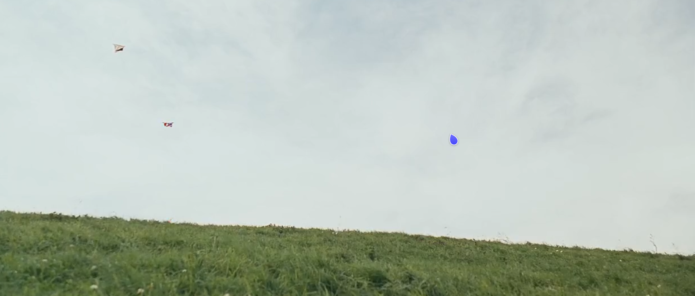
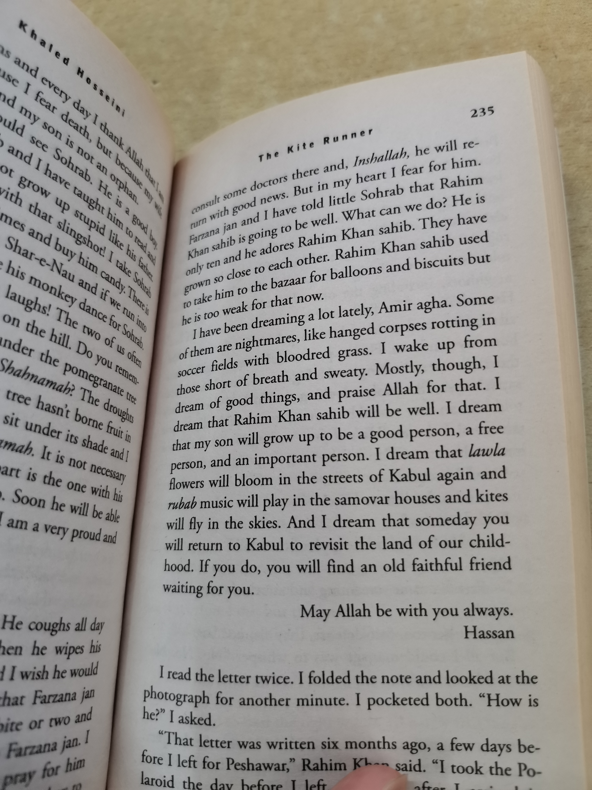
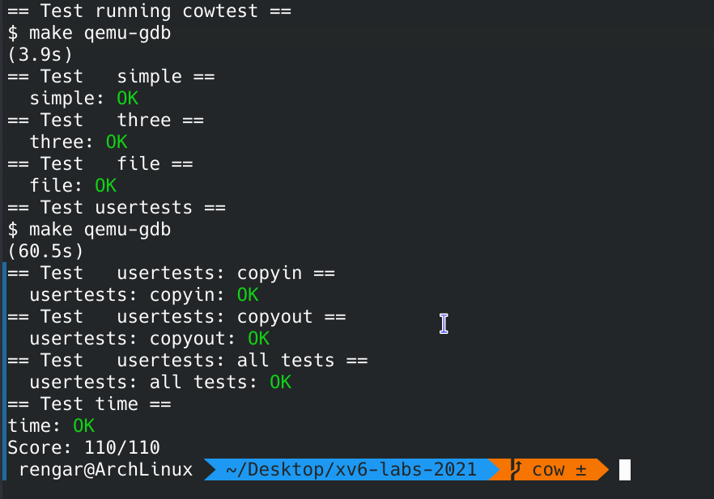

## OP





> I have been dreaming a lot lately, Amir agha. Some of them are nightmares, like hanged corpses rotting in soccer fields with bloodred grass. I wake up from those short of breath and sweaty. Mostly, though, I dream of good things, and praise Allah for that. I dream that my son will grow up to be a good person. **I dream that lawla flowers will bloom in the streets of Kabul again and rubab music will play in the samovar houses and kites will fly in the skies. And I dream that someday you will return to Kabul to revisit the land of our childhood. If you do, you will find an old faithful friend waiting for you.**
> ---------------------------- THE KITE RUNNER

哈桑死前写下了给主人阿米尔的第一封信：我梦到花儿再次在喀布尔街头盛开，音乐再次在差屋响起，风筝再次在天空飞翔。

我最喜欢哈桑的忠诚，即使知道主人并不把自己当作真正的好朋友，依旧把阿米尔当作自己的主人。一句 **For you, a thousand times over.** 彻底让我喜欢上了哈桑。

我还喜欢阿米尔的父亲的勇敢，在逃跑的路上他遇到士兵想要侮辱女人，他无惧枪支炮弹的威胁也要阻止士兵，与幼年的阿米尔形成了强烈鲜明的对比。

我喜欢阿米尔最后的救赎。虽然小时候胆小懦弱，犯下了许多错事，但是长大后冒着危险救下了侄子索拉博完成了救赎。

不过我希望不要有救赎这个词，即使阿米尔改变了自己，但他改变不了过去，改变不了那个美好的童年了。一定要珍惜身边人，特别是对你好的人。




<!--more-->

## 简介
这是本次 [lab 指引](https://pdos.csail.mit.edu/6.S081/2021/labs/cow.html)，关于实验环境和实验资料等更加详细的内容请查看 **我的第一个 lab** -- **Lab Utilities**。

实验环境：
``` sh
git fetch
git checkout cow
make clean
```

本实验需要实现 `copy-on-write` 写时复制，也就是 `fork` 创建子进程时，并不实际复制内存空间，当子进程需要对内存进行修改时，才真正的复制空间。

`Solution` 告诉我们 `fork` 时，让子进程的 `PTE` 指向父进程的物理页面，父进程和子进程都将 `PTE` 标记为不可写，当写时会触发页面错误，然后内核再开始复制内存空间，将 `PTE` 标记为可写。

页面释放需要使用一个计数器，当引用为 `0` 时，页面需要释放。

## Implement copy-on write(hard)

1. 首先修改 `uvmcopy()` 以将父进程的物理页面映射到子进程，而不是分配新页面。在子进程和父进程的 `PTE` 中清除 `PTE_W`：

``` c
// kernel/vm.c
int
uvmcopy(pagetable_t old, pagetable_t new, uint64 sz)
{
  pte_t *pte;
  uint64 pa, i;
  uint flags;

  for (i = 0; i < sz; i += PGSIZE) {
    if ((pte = walk(old, i, 0)) == 0)
      panic("uvmcopy: pte should exist");
    if ((*pte & PTE_V) == 0)
      panic("uvmcopy: page not present");
    pa = PTE2PA(*pte);

    *pte = (*pte & ~PTE_W) | PTE_COW;   // 清除 PTE_W，添加 PTE_COW 标记

    flags = PTE_FLAGS(*pte);
    if (mappages(new, i, PGSIZE, pa, flags) != 0) {
      goto err;
    }
    refCntHelper(pa, '+'); // 页面引用次数 + 1，这个函数后面会定义
  }
  return 0;

err:
  uvmunmap(new, 0, i / PGSIZE, 1);
  return -1;
}
```

需要在 `kernel/riscv.h` 中添加 `PTE_COW` 标志：
``` c
// kernel/riscv.h
#define PTE_V (1L << 0) // valid
#define PTE_R (1L << 1)
#define PTE_W (1L << 2)
#define PTE_X (1L << 3)
#define PTE_U (1L << 4) // 1 -> user can access
#define PTE_COW (1L << 8) // 添加！！！
```

2. 修改 `usertrap()` 以识别页面错误。当 COW 页面发生缺页时，使用 `kalloc()` 分配新页面，将旧页面复制到新页面，并将新页面安装到 `PTE` 中并设置 `PTE_W`：

``` c
// kernel/trap.c
void
usertrap(void)
{
  ......

  } else if((which_dev = devintr()) != 0){
    // ok
  } else if((r_scause() == 13 || r_scause() == 15) && uvmcheckcowpage(r_stval())) {  // 页面为写时复制页
    uint64 va = PGROUNDDOWN(r_stval());
    if (uvmcowcopy(p->pagetable, va, 1) == -1)  // 实复制
      exit(-1);
  } else {
    printf("usertrap(): unexpected scause %p pid=%d\n", r_scause(), p->pid);
    printf("            sepc=%p stval=%p\n", r_sepc(), r_stval());
    p->killed = 1;
  }

  ......
}
```

在 `kernel/vm.c` 中实现这两个 `uvm` 函数：

``` c
// kernel/vm.c
// 检查一个地址指向的页是否是写时复制页
int uvmcheckcowpage(uint64 va)
{
  pte_t *pte;
  struct proc *p = myproc();

  return va < p->sz                                                    // 在进程内存范围内
         && ((pte = walk(p->pagetable, va, 0)) != 0) && (*pte & PTE_V) // 页表项存在
         && (*pte & PTE_COW);                                          // 页是一个写时复制页
}

// 实复制
int uvmcowcopy(pagetable_t pagetable, uint64 va, int usertrap)
{
  if (va > MAXVA)
    return -1;
  pte_t *pte;

  if ((pte = walk(pagetable, va, 0)) == 0)
    return -1;

  if (*pte & PTE_COW)
  {
    uint64 old_pa = PTE2PA(*pte);
    uint64 flag = PTE_FLAGS(*pte) & (~PTE_COW); // 清空 PTE_COW

    char *new_pa = kalloc(); // new_pa的ref cnt=1

    if (new_pa == 0) // 新页面分配失败
    {
      return -1;
    }
    memmove(new_pa, (char *)old_pa, PGSIZE);
    uvmunmap(pagetable, va, 1, 1); // 最后一个参数设置为1 会对 old_pa 进行 kfree，导致 old_pa 的 refCnt--

    if (mappages(pagetable, va, PGSIZE, (uint64)new_pa, flag | PTE_W) < 0)
    {
      uvmunmap(pagetable, va, 1, 1);
      return -1;
    }
  }
  else if (usertrap) // 如果是 usertrap 中遇到页面错误，同时不是写时复制页，那么需要按照普通页面错误处理
  {
    return -1;
  }

  return 0;
}
```

3. 为每个物理页保留一个“引用计数”，该“引用计数”是指引用该页的用户页表的数量。当`kalloc()` 分配页面时，将页面的引用计数设置为 1 。当 `fork` 导致子共享页面时增加页面的引用计数，并在每次任何进程从其页表中删除页面时减少页面的计数。 `kfree()` 如果其引用计数为零，则应仅将页面放回空闲列表中。可以将这些计数保存在固定大小的整数数组中。

定义 `refCnt`，定义 `refCntHelper()` 函数 实现对 `refCnt` 的操作：

``` c
// kernel/kalloc.c
uint64 refCnt[(PHYSTOP - KERNBASE) / PGSIZE]; // 计数数组
int refCntHelper(uint64 pa, char func)
{
  if (pa >= (uint64)end && pa <= PHYSTOP)
  {
    int offset = pa - (uint64)end;
    int idx = offset / PGSIZE;
    if (func == '+')
      refCnt[idx]++;
    else if (func == '-')
      refCnt[idx] == 0 ? refCnt[idx] : refCnt[idx]--;
    else if (func == '1')
      refCnt[idx] = 1;
    else if (func == 'v')
      return refCnt[idx]; // get value
    return -1;
  }
  return 0;
}
```

在 `kfree()` 中修改操作：
``` c
// kernel/kalloc.c
void
kfree(void *pa)
{
  struct run *r;

  if(((uint64)pa % PGSIZE) != 0 || (char*)pa < end || (uint64)pa >= PHYSTOP)
    panic("kfree");

  refCntHelper((uint64)pa, '-');   // 计数减 1
  if (refCntHelper((uint64)pa, 'v') != 0) // 如果不为 0 就不要释放
    return;
  // Fill with junk to catch dangling refs.
  memset(pa, 1, PGSIZE);

  r = (struct run*)pa;

  acquire(&kmem.lock);
  r->next = kmem.freelist;
  kmem.freelist = r;
  release(&kmem.lock);
}
```

在 `kalloc()` 中初始化计数为 1：
``` c
// kernel/kalloc.c
void *
kalloc(void)
{
  struct run *r;

  acquire(&kmem.lock);
  r = kmem.freelist;
  if(r)
    kmem.freelist = r->next;
  release(&kmem.lock);

  if(r) {
    memset((char*)r, 5, PGSIZE); // fill with junk
    refCntHelper((uint64)r,'1'); // 计数设为 1
  }
  return (void*)r;
}
```

4. 修改 copyout() 以在遇到 COW 页面时使用与页面错误相同的方案。
``` c
// kernel/vm.c
int
copyout(pagetable_t pagetable, uint64 dstva, char *src, uint64 len)
{
  uint64 n, va0, pa0;

  while(len > 0){
    va0 = PGROUNDDOWN(dstva);

    // 实复制
    if (uvmcowcopy(pagetable, va0, 0) == -1)
      return -1;

    pa0 = walkaddr(pagetable, va0);
    if(pa0 == 0)
      return -1;
    n = PGSIZE - (dstva - va0);
    if(n > len)
      n = len;
    memmove((void *)(pa0 + (dstva - va0)), src, n);

    len -= n;
    src += n;
    dstva = va0 + PGSIZE;
  }
  return 0;
}
```


5. 在 `kernel/defs.h` 中声明函数原型，以及在 `kernel/vm.c` 中 `#include` 所需头文件：

``` c
// kernel/defs.h

// kalloc.c
void*           kalloc(void);
void            kfree(void *);
void            kinit(void);
int             refCntHelper(uint64 pa, char func);  // 添加！！

// vm.c
void            kvminit(void);
void            kvminithart(void);
void            kvmmap(pagetable_t, uint64, uint64, uint64, int);
int             mappages(pagetable_t, uint64, uint64, uint64, int);
pagetable_t     uvmcreate(void);
void            uvminit(pagetable_t, uchar *, uint);
uint64          uvmalloc(pagetable_t, uint64, uint64);
uint64          uvmdealloc(pagetable_t, uint64, uint64);
int             uvmcopy(pagetable_t, pagetable_t, uint64);
void            uvmfree(pagetable_t, uint64);
void            uvmunmap(pagetable_t, uint64, uint64, int);
void            uvmclear(pagetable_t, uint64);
uint64          walkaddr(pagetable_t, uint64);
int             copyout(pagetable_t, uint64, char *, uint64);
int             copyin(pagetable_t, char *, uint64, uint64);
int             copyinstr(pagetable_t, char *, uint64, uint64);
int             uvmcheckcowpage(uint64 va);                                 // 添加！！
int             uvmcowcopy(pagetable_t pagetable, uint64 va, int usertrap); // 添加！！
```

``` c
// kernel/vm.c
#include "param.h"
#include "types.h"
#include "memlayout.h"
#include "elf.h"
#include "riscv.h"
#include "defs.h"
#include "fs.h"

#include "spinlock.h" // ！必须以这个顺序添加，因为有依赖关系
#include "proc.h"     // ！
```

## 实验结果
创建文件 `time.txt` 写入实验时间。`make grade` 评分：



`Test usertests` 的时候要等一段时间，不要忘记 git commit 提交。


## 实验总结
这样一种写时复制策略是一种非常好的想法，除了 `fork`，在很多地方其实也可以用的到，甚至不一定要在 OS 中，希望将来可以将这种思想运用到其他需要的地方。