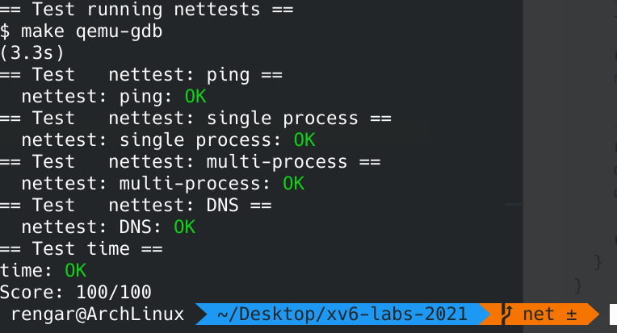

## OP


<!--more-->

## 简介
这是本次 [lab 指引](https://pdos.csail.mit.edu/6.S081/2021/labs/net.html)，关于实验环境和实验资料等更加详细的内容请查看 **我的第一个 lab** -- **Lab Utilities**。

本次实验，我们需要为 NIC 编写设备驱动程序。
> In this lab you will write an xv6 device driver for a network interface card (NIC). 

实验环境：
``` sh
git fetch
git checkout net
make clean
```

## 背景

xv6 的 IP 地址为 `10.0.2.15`，本机的 IP 地址为 `10.0.2.2`，当 xv6 向 `10.0.2.2` 发送数据包时，将会发送到运行 qemu 的真实的计算机上。

所有传入和传出的数据包记录在文件 `packets.pcap` 中。显示:
``` sh
tcpdump -XXnr packets.pcap
```

## Lab: networking(Hard)

完善 `int e1000_transmit(struct mbuf *m)` 和 `static void
e1000_recv(void)` 两个函数即可。

重点难点在于需要阅读驱动的手册和文档，不过给的提示已经大概告诉我们需要做什么了，我们可以直接参考网上的别人的做法来理解，结合 lab 的提示我们就可以完成这两个函数了。

> 当 net.c 中的网络堆栈需要发送数据包时，它会调用 e1000_transmit() 并使用 mbuf 保存要发送的数据包。您的传输代码必须在 TX（传输）环的描述符中放置一个指向数据包数据的指针。struct tx_desc 描述描述符格式。您需要确保每个 mbuf 最终都被释放，但只有在 E1000 完成数据包传输之后（E1000 设置描述符中的E1000_TXD_STAT_DD位来指示这一点）。

``` c
// kernel/e1000.c
int
e1000_transmit(struct mbuf *m)
{
  acquire(&e1000_lock); // 加锁

  uint32 index = regs[E1000_TDT]; // 获取下一个可用的 buffer 的索引
  struct tx_desc *desc = &tx_ring[index]; // 获取 buffer 的描述符，其中存储关于该 buffer 的各种信息

  if(!(desc->status & E1000_TXD_STAT_DD)) { // buffer 中数据未传输完，则代表环形 buffer 列表全部用完，缓冲区不足，返回错误
    release(&e1000_lock); // 解锁
    return -1;
  }

  // 如果缓冲区有之前发送完毕但未释放的 mbuf，则释放
  if(tx_mbufs[index]) {
    mbuffree(tx_mbufs[index]);
    tx_mbufs[index] = 0;
  }

  // 设置描述符
  desc->addr = (uint64)(m->head);
  desc->length = m->len;
  desc->cmd = E1000_TXD_CMD_EOP | E1000_TXD_CMD_RS;

  // 保留新 mbuf 的指针，方便后续再次用到同一下标时释放。
  tx_mbufs[index] = m;

  // 环形缓冲区内下标增加一。
  regs[E1000_TDT] = (regs[E1000_TDT] + 1) % TX_RING_SIZE;

  release(&e1000_lock); // 解锁

  return 0;
}
```

> 当 E1000 从以太网接收到每个数据包时，它首先将数据包 DMA 到下一个 RX（接收）环描述符指向的 mbuf，然后产生中断。您的 e1000_recv() 代码必须扫描 RX 环并通过调用 net_rx() 将每个新数据包的 mbuf 传送到网络堆栈（在 net.c 中）。然后，您需要分配一个新的 mbuf 并将其放入描述符中，以便当 E1000 再次到达 RX 环中的那个点时，它会找到一个新的缓冲区来 DMA 一个新的数据包。

``` c
// kernel/e1000.c
static void
e1000_recv(void)
{
  while(1) {
    uint32 index = (regs[E1000_RDT] + 1) % RX_RING_SIZE;
    struct rx_desc *desc = &rx_ring[index];

    // 所有包接收完毕，退出
    if(!(desc->status & E1000_RXD_STAT_DD)) {
      return;
    }

    rx_mbufs[index]->len = desc->length;
    net_rx(rx_mbufs[index]); // 传递给上层网络栈，上层负责释放 mbuf

    // 分配新 mbuf
    rx_mbufs[index] = mbufalloc(0); 
    desc->addr = (uint64)(rx_mbufs[index]->head);
    desc->status = 0;

    regs[E1000_RDT] = index;
  }
}
```

## 实验结果

创建文件 `time.txt` 写入实验时间，`make grade` 评分：



不要忘记 `git commit` 提交。

## 实验总结
正如 xv6-book：

> 驱动程序是操作系统用来管理特定设备的程序代码，它配置设备硬件，告诉设备执行操作，处理产生的中断，并与可能正在等待来自设备的 I/O 的进程交互。驱动程序代码可能很棘手，因为驱动程序与其管理的设备同时执行。此外，驱动程序必须了解设备的硬件接口，这可能很复杂且文档记录不充分。

所以，编写驱动是一件不容易的事情，需要处理好软硬件的交互，查阅文档资料。不过让肉眼可见的设备以你自己想要的方式运行也是一件特别酷的事情呢。