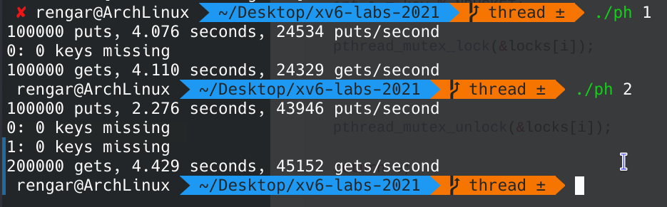
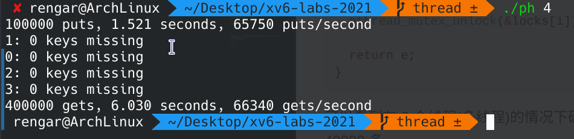
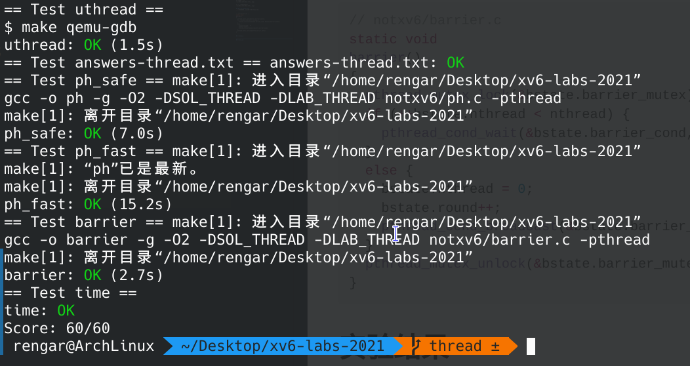

## OP


<!--more-->

## 简介
这是本次 [lab 指引](https://pdos.csail.mit.edu/6.S081/2021/labs/thread.html)，关于实验环境和实验资料等更加详细的内容请查看 **我的第一个 lab** -- **Lab Utilities**。

实验环境：
``` sh
git fetch
git checkout thread
make clean
```

本实验我们将在用户级线程包中实现线程之间的切换，使用多个线程来加速程序，并实现屏障。(机器翻译)

## Uthread: switching between threads(moderate)
> Your job is to come up with a plan to create threads and save/restore registers to switch between threads, and implement that plan. 

通过创建线程、保存寄存器，实现线程间的切换。

首先在 `user/uthread_switch.S` 中保存当前线程寄存器，恢复即将要切换到的线程的寄存器：
``` S
# user/uthread_switch.S
	.text

	/*
         * save the old thread's registers,
         * restore the new thread's registers.
         */

	.globl thread_switch
thread_switch:
	sd ra, 0(a0)
	sd sp, 8(a0)
	sd s0, 16(a0)
	sd s1, 24(a0)
	sd s2, 32(a0)
	sd s3, 40(a0)
	sd s4, 48(a0)
	sd s5, 56(a0)
	sd s6, 64(a0)
	sd s7, 72(a0)
	sd s8, 80(a0)
	sd s9, 88(a0)
	sd s10, 96(a0)
	sd s11, 104(a0)

	ld ra, 0(a1)
	ld sp, 8(a1)
	ld s0, 16(a1)
	ld s1, 24(a1)
	ld s2, 32(a1)
	ld s3, 40(a1)
	ld s4, 48(a1)
	ld s5, 56(a1)
	ld s6, 64(a1)
	ld s7, 72(a1)
	ld s8, 80(a1)
	ld s9, 88(a1)
	ld s10, 96(a1)
	ld s11, 104(a1)
	ret    /* return to ra */

```

在结构体 `thread` 中添加寄存器字段：
``` c
// user/uthread.c
struct thread {
  uint64 ra;
  uint64 sp;

  uint64 s0;
  uint64 s1;
  uint64 s2;
  uint64 s3;
  uint64 s4;
  uint64 s5;
  uint64 s6;
  uint64 s7;
  uint64 s8;
  uint64 s9;
  uint64 s10;
  uint64 s11;

  char       stack[STACK_SIZE]; /* the thread's stack */
  int        state;             /* FREE, RUNNING, RUNNABLE */
};
```

在 `thread_create()` 中添加代码设置 `ra` 和 `sp`：
``` c
// user/uthread.c
void 
thread_create(void (*func)())
{
  struct thread *t;

  for (t = all_thread; t < all_thread + MAX_THREAD; t++) {
    if (t->state == FREE) break;
  }
  t->state = RUNNABLE;

  t->ra = (uint64)func;                      // 返回地址
  t->sp = (uint64)&t->stack[STACK_SIZE - 1]; // 栈指针
}
```

在 `thread_schedule()` 中添加线程切换代码：
``` c
// user/uthread.c
void 
thread_schedule(void)
{
  ......

  if (current_thread != next_thread) {         /* switch threads?  */
    next_thread->state = RUNNING;
    t = current_thread;
    current_thread = next_thread;

    thread_switch((uint64)t, (uint64)next_thread); // 线程切换
  } else
    next_thread = 0;
}
```

`make qemu` 后输入命令 `uthread`，可以看到 c、a、b 交替运行：

``` sh
xv6 kernel is booting

hart 2 starting
hart 1 starting
init: starting sh
$ uthread
thread_a started
thread_b started
thread_c started
thread_c 0
thread_a 0
thread_b 0
thread_c 1
thread_a 1
thread_b 1
thread_c 2
thread_a 2
thread_b 2
......
thread_c 97
thread_a 97
thread_b 97
thread_c 98
thread_a 98
thread_b 98
thread_c 99
thread_a 99
thread_b 99
thread_c: exit after 100
thread_a: exit after 100
thread_b: exit after 100
thread_schedule: no runnable threads
```


## Using threads(moderate)
> In this assignment you will explore parallel programming with threads and locks using a hash table. 

使用多线程和锁对哈希表进行操作。

在对哈希表进行操作时，需要上锁，操作完成后释放锁，但问题是这样会导致性能的降低，多线程因为锁的竞争而阻塞，解决办法是降低锁的粒度，对哈希表的每一个桶都添加一个锁，而不是对一整个哈希表创建一个锁。

定义锁：
``` c
// notxv6/ph.c
struct entry *table[NBUCKET];
int keys[NKEYS];
int nthread = 1;

pthread_mutex_t locks[NBUCKET];         // declare locks
```

初始化：
``` c
// notxv6/ph.c
int
main(int argc, char *argv[])
{
  pthread_t *tha;
  void *value;
  double t1, t0;

  for (int i = 0; i < NBUCKET; i++) {
    pthread_mutex_init(&locks[i], NULL);
  }

  ......
}
```

加锁：
``` c
// notxv6/ph.c
static 
void put(int key, int value)
{
  int i = key % NBUCKET;

  pthread_mutex_lock(&locks[i]);

  ......

  pthread_mutex_unlock(&locks[i]);

}

static struct entry*
get(int key)
{
  int i = key % NBUCKET;

  pthread_mutex_lock(&locks[i]);

  ......

  pthread_mutex_unlock(&locks[i]);

  return e;
}
```

可以看到在 2 个线程(多线程)的情况下确实提高了操作效率，从单线程的 20000 多提高到了 40000 多：


4 个线程就更快了：


## Barrier(moderate)
使用条件变量和互斥量实现同步屏障。

``` c
// notxv6/barrier.c
static void 
barrier()
{
  pthread_mutex_lock(&bstate.barrier_mutex);
  if (++bstate.nthread < nthread) {
    pthread_cond_wait(&bstate.barrier_cond, &bstate.barrier_mutex);
  }
  else {
    bstate.nthread = 0;
    bstate.round++;
    pthread_cond_broadcast(&bstate.barrier_cond);
  }
  pthread_mutex_unlock(&bstate.barrier_mutex);
}
```

## 实验结果
创建文件 `time.txt` 写入实验时间，`answers-thread.txt` 写下实验问题的答案，`make grade` 评分：



不要忘记 `git commit` 提交。

## 实验总结
本次实验总体都比较简单，不过我第 2、3 个实验是 5 月 28 号 做的，距离第一个实验比较久远，然后平时会有 `paru -Syyu` 的习惯导致编译器等等都更新到了最新版本，在做第二个实验时编译出了问题，说是检测到 `user/sh.c` 的 `void runcmd(struct cmd *cmd)` 存在无限递归，然后我用 `downgrade` 工具把 `riscv64-linux-gnu-gcc` 编译器版本进行了回滚，才最终编译通过的。

最近我用的 `ArchLinux` 系统 bug 真的是让我有点难受，这次的 bug 主要是音频和视频方面，希望快点修复吧。所以，以后真的要慎用 `paru -Syyu`，最新版本很容易出现各种 bug。