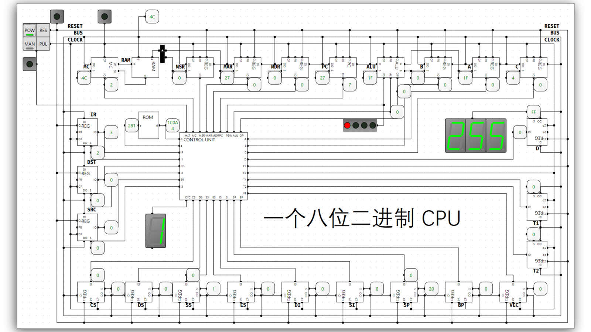

## 简介

项目 Github 地址：https://github.com/StevenBaby/computer

B站教程：https://www.bilibili.com/video/BV1aP4y1s7Vf?p=1&vd_source=4cd843729291716e7925dd71908caac0

一位大佬根据仿真软件 logic circuit 设计了一个 8 位的二进制 CPU。

我之前一直对 CPU 的设计比较好奇，刚好在 B 站刷到了这个视频，就收藏了下来进行学习。

## 项目介绍
左上角的四个开关分别是：
- POW: 电源
- RES: 重置
- MAN: 手动调试
- PUL: 一次脉冲

下面那个灯用来监测系统是否终止，连接到控制单元 Control Unit 的 HLT 端口。

上面的线分别是：
- 第一行：重置线
- 第二行：数据总线
- 第三行：时钟控制线

然后就是一些比较重要的部件：
- ALU (Arithmetic logic unit) 算术逻辑单元：这里支持加法、减法、与、或、非、异或运算，输出端口有 PSW (程序状态字)，可以保存一些状态，比如结果的奇偶，是否溢出等。
- PC 寄存器：保存指令的地址，可以自动 + 1，执行下一条指令，输入端输入数据时可以实现跳转。
- MDR 内存数据寄存器：比如向内存写入数据时，需要先写入这个寄存器，然后这个寄存器再写入内存。
- MAR 内存地址寄存器：存放要访问的内存地址。
- MSR 寄存器：一系列用于控制 CPU 运行、功能开关、调试、跟踪程序执行、监测CPU性能等方面的寄存器。（这个寄存器我暂时也不太了解具体作用，可能跟中断和系统调用有关）
- MC 内存控制器：这里主要控制内存的数据是否传输进总线。
- IR 指令寄存器：存储要执行的指令。
- SRC 源操作数寄存器：存储源操作数。
- DST 目的操作数寄存器：存储目的操作数。
- A、B、C、D 临时寄存器。

控制单元 Control Unit 采用微程序控制方法，通过数据位的 0/1 来控制各种部件的读、写、使能等端口。

系统启动前将程序写进 RAM 中就可以使我们的程序运行在这个 CPU 上了，或者写入只读存储器 ROM 中，启动后将 ROM 的内容加载进 RAM 中也可以。

本项目的程序是将立即数 0 放入寄存器 A 中，然后 A 自增，如果 A 小于 5，则跳转回自增指令，直到 A 大于等于 5，然后继续执行下一条指令，让 A 自减，循环减到 0，则 hult 系统终止，CPU 停止运行。

## 总结
虽然我也没有完全掌握，尤其是后面的指令部分没有深入学习，不过通过 logic circuit 的仿真和大佬的教程，我还是对 CPU 有了更深的认识，觉得原来 CPU 也是挺有意思挺有趣的一个东西，不愧是计算机的“大脑”啊。